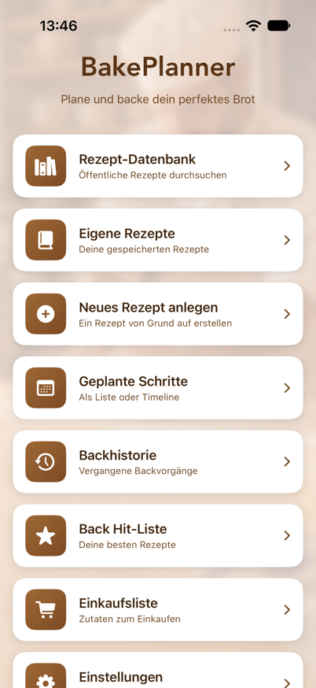
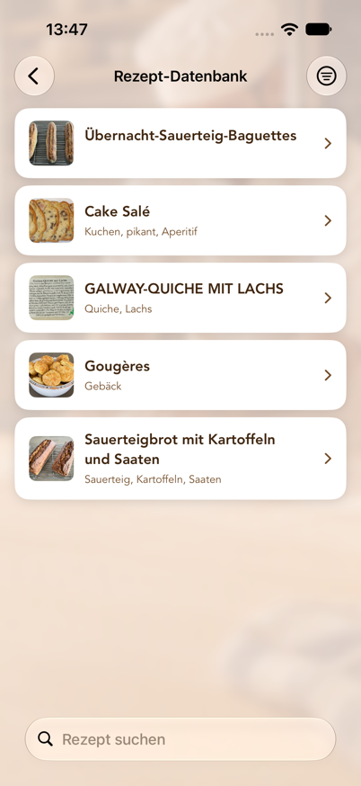
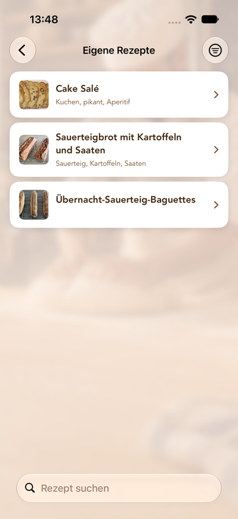
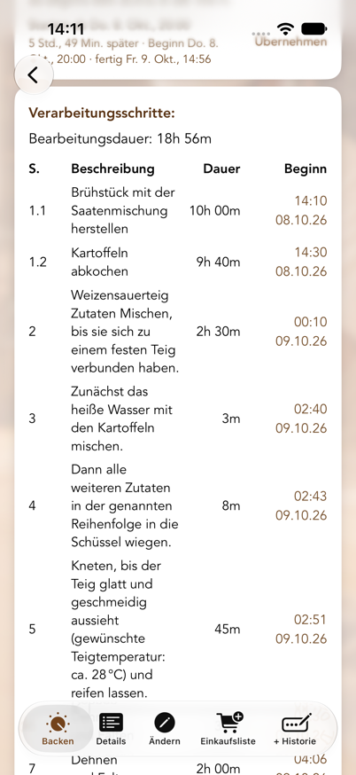
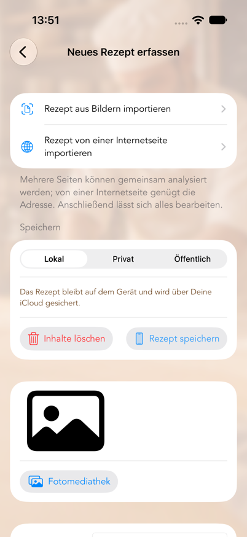
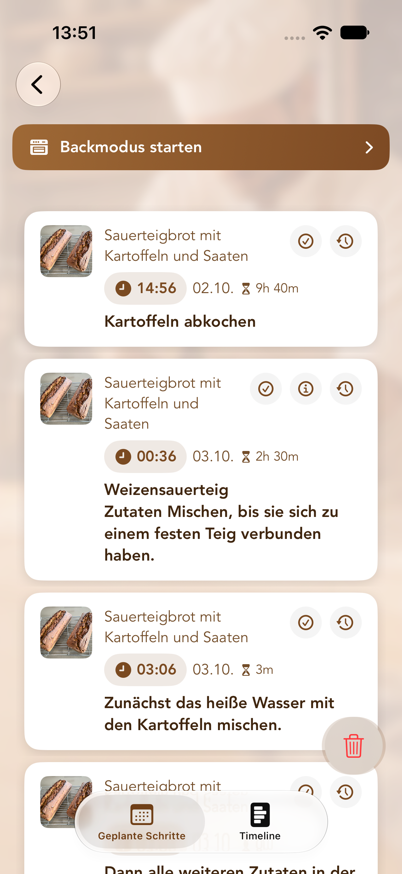
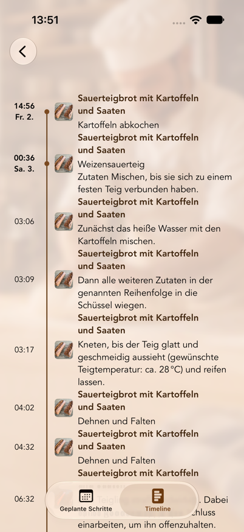
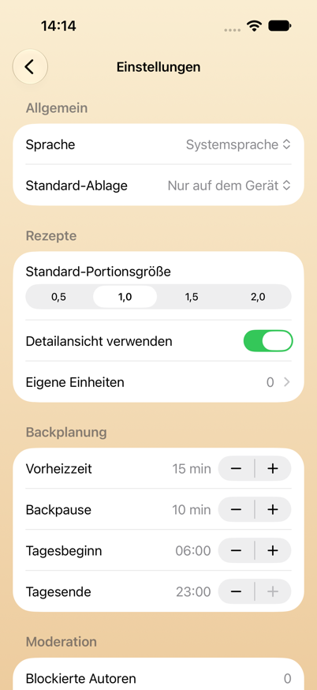

# BakePlanner – Benutzerhandbuch

Stand: 05.10.2026 · App-Version 1.2

---

## Inhalt

1. [Was BakePlanner macht](#1-was-bakeplanner-macht)
2. [Systemvoraussetzungen](#2-systemvoraussetzungen)
3. [Grundbegriffe](#3-grundbegriffe)
4. [Das Hauptmenü](#4-das-hauptmenü)
5. [Rezept-Datenbank (öffentliche und private Cloud-Rezepte)](#5-rezept-datenbank-öffentliche-und-private-cloud-rezepte)
6. [Eigene Rezepte](#6-eigene-rezepte)
7. [Backanleitung und Reminder](#7-backanleitung-und-reminder)
8. [Neues Rezept anlegen](#8-neues-rezept-anlegen)
9. [Rezept bearbeiten](#9-rezept-bearbeiten)
10. [Geplante Schritte (Liste und Timeline)](#10-geplante-schritte-liste-und-timeline)
11. [Erinnerungen auf dem Sperrbildschirm](#11-erinnerungen-auf-dem-sperrbildschirm)
12. [Backhistorie und Back Hit-Liste](#12-backhistorie-und-back-hit-liste)
13. [Einkaufsliste](#13-einkaufsliste)
14. [Einstellungen](#14-einstellungen)
15. [Einheiten, Mengen und Portionsgrößen](#15-einheiten-mengen-und-portionsgrößen)
16. [Datenschutz, Moderation und Nutzungsbedingungen](#16-datenschutz-moderation-und-nutzungsbedingungen)
17. [Häufige Fragen und Fehlerbehebung](#17-häufige-fragen-und-fehlerbehebung)
18. [Bekannte Einschränkungen](#18-bekannte-einschränkungen)

---

## 1. Was BakePlanner macht

BakePlanner ist eine Backplanungs-App für Brot, Brötchen und Gebäck. Sie unterscheidet sich von einer reinen Rezept-Sammlung dadurch, dass sie **die Zeitplanung übernimmt**:

- Ein Rezept besteht nicht nur aus Zutaten, sondern aus **Verarbeitungsschritten mit Dauern**.
- Aus diesen Dauern berechnet die App die **Startzeit jedes einzelnen Schritts**.
- Du kannst rückwärts planen: „Das Brot soll um 18:00 Uhr fertig sein“ – die App sagt Dir, wann Du den Sauerteig ansetzen musst.
- Für jeden Schritt wird eine **lokale Erinnerung** gesetzt, inklusive automatisch eingefügtem Schritt „Backofen anstellen“ und „Backvorgang ist beendet“.

Dazu kommen: eine gemeinsame öffentliche Rezept-Datenbank, eigene Rezepte auf dem Gerät, private Rezepte in der Cloud, Zutaten-Import aus Fotos, Einkaufslisten, eine Backhistorie mit Fotos und Bewertungen sowie eine On-Device-Übersetzung öffentlicher Rezepte.

### Schnellstart: In fünf Schritten zum ersten Backplan

1. Öffne **Rezept-Datenbank** und wähle ein Rezept – oder lege unter **Neues Rezept anlegen** ein eigenes an.
2. Öffne im Rezept den Tab **Backen** beziehungsweise **Rezept backen**.
3. Wähle **Starten ab** oder **Fertig bis** und stelle Datum und Uhrzeit ein.
4. Prüfe die berechneten Beginnzeiten und tippe auf **Reminder setzen**.
5. Öffne **Geplante Schritte**, um alle Termine als Liste oder Timeline zu kontrollieren.

Für Erinnerungen muss BakePlanner Mitteilungen senden dürfen. Die ausführlichen Erklärungen findest Du in [Kapitel 7](#7-backanleitung-und-reminder), [Kapitel 10](#10-geplante-schritte-liste-und-timeline) und [Kapitel 17](#17-häufige-fragen-und-fehlerbehebung).

---

## 2. Systemvoraussetzungen

| Punkt | Wert |
|-------|------|
| Geräte | iPhone und iPad |
| Betriebssystem | iOS/iPadOS 26.0 oder neuer |
| Ausrichtung | iPhone: Hoch- und Querformat · iPad: alle Ausrichtungen |
| Sprachen | Deutsch, Englisch, Französisch (umschaltbar in den Einstellungen) |
| Darstellung | Hell- und Dunkelmodus, Dynamische Schriftgrößen |
| Internet | Für die öffentliche Rezept-Datenbank und die iCloud-Synchronisierung. Eigene Rezepte, Planung und Erinnerungen funktionieren auch vollständig offline; Änderungen werden später abgeglichen. |
| iCloud | Eigene Rezepte, geplante Schritte, Einkaufslisten und Backhistorien werden über iCloud zwischen allen Geräten mit demselben Apple-Account synchronisiert, sofern iCloud aktiviert ist. Die Erinnerungen selbst sind pro Gerät lokal. |
| Berechtigungen | Mitteilungen (für Erinnerungen), Fotomediathek und Kamera (für Rezeptbilder) |
| Anmeldung | Für das Backen, die eigenen Rezepte und die öffentliche Datenbank **nicht** nötig. Nur wer Rezepte **privat in der Cloud** ablegen will, meldet sich mit Apple an (siehe [Kapitel 14](#14-einstellungen)). |

Die App fragt die Erlaubnis für Mitteilungen beim ersten Start ab. Ohne diese Erlaubnis werden Backschritte weiterhin berechnet und in der Liste „Geplante Schritte“ angezeigt, es erscheinen aber **keine Erinnerungen**.

---

## 3. Grundbegriffe

Diese sechs Begriffe tauchen überall in der App auf:

**Rezept**
Die oberste Einheit: Name, Beschreibung, Bild, Bewertung, Tags, optionaler Link zur Quelle, Gesamtgewicht und Bearbeitungsdauer.

**Komponente**
Ein Teilansatz innerhalb eines Rezepts – zum Beispiel „Sauerteig“, „Vorteig“, „Hauptteig“, „Brühstück“. Jede Komponente hat eine Nummer (Sortierreihenfolge) und ihre eigene Zutatenliste. Das ist der Kern des Datenmodells: BakePlanner ist für mehrstufige Teigführungen gebaut.

**Zutat**
Gehört immer zu einer Komponente. Besteht aus Nummer, Menge, Einheit, Name und optional einem Bruch (Zähler/Nenner, in der App als **Z / N** bezeichnet).

**Verarbeitungsschritt**
Eine Arbeitsanweisung mit Schrittnummer und Dauer in Minuten. Die Schrittnummer ist eine Dezimalzahl und hat eine besondere Bedeutung:

- **Ganze Zahlen (1, 2, 3 …) sind Hauptschritte.** Sie laufen zeitlich nacheinander.
- **Nachkommastellen (2.1, 2.2, 2.3) sind Parallelschritte innerhalb eines Hauptschritts.** Sie laufen gleichzeitig; für die Gesamtdauer zählt nur die *längste* Dauer der Gruppe. Schritte, die eine Komponente herstellen (Sauerteig, Vorteig, Quellstück …), starten dabei im Abstand von 5 Minuten nacheinander, in der Reihenfolge ihrer Schrittnummern: Niemand wiegt vier Vorstufen zur selben Minute ab, und die Erinnerungen kommen entsprechend versetzt. Alle anderen Parallelschritte enden gemeinsam mit ihrer Gruppe.

Beispiel: Wenn Du Sauerteig (12 h) und Brühstück (2 h) gleichzeitig ansetzt, gib beiden Schritt 1.1 und 1.2. Der nächste Hauptschritt 2 beginnt nach gut 12 Stunden, nicht nach 14.

**Portionsgröße**
Ein Skalierungsfaktor für alle Mengen: 0,5 / 1,0 / 1,5 / 2,0. **1,0 entspricht dem Rezept, wie es gespeichert ist.** 2,0 verdoppelt alle Mengen und das angezeigte Gesamtgewicht.

**Ablage**
Wo ein Rezept liegt. Es gibt drei Möglichkeiten, und die Wahl entscheidet, wer das Rezept sehen kann:

| Ablage | Wer sieht es? | Wo liegt es? | Änderbar? |
|--------|---------------|--------------|-----------|
| **Nur auf dem Gerät** | nur Du | auf dem Gerät, gesichert über Deine iCloud | ja, jederzeit |
| **Privat in der Cloud** | nur Du | in der Rezept-Datenbank, aber für andere gesperrt | nein |
| **Öffentlich für alle** | alle Nutzer der App | in der Rezept-Datenbank | nein |

„Privat in der Cloud“ ist für Rezepte gedacht, die Du **nicht veröffentlichen darfst** – etwa aus einem Buch –, aber trotzdem nicht nur auf dem Gerät haben willst. Dafür ist eine Anmeldung mit Apple nötig, weil das Rezept an Dein Konto gebunden wird; ohne Konto wäre es nach einer Neuinstallation nicht mehr erreichbar.

---

## 4. Das Hauptmenü

Nach dem Start erscheint das Hauptmenü mit acht Karten:

*Das Hauptmenü ist der Ausgangspunkt für Rezepte, Planung, Historie und Einstellungen.*

| Karte | Zweck |
|-------|-------|
| **Rezept-Datenbank** | Öffentliche, von allen Nutzern geteilte Rezepte durchsuchen – dazu Deine privaten Cloud-Rezepte, wenn Du angemeldet bist |
| **Eigene Rezepte** | Deine lokal gespeicherten Rezepte |
| **Neues Rezept anlegen** | Rezept von Grund auf erstellen oder aus Fotos importieren |
| **Geplante Schritte** | Alle terminierten Backschritte als Liste oder Timeline |
| **Backhistorie** | Vergangene Backvorgänge mit Kommentaren und Fotos |
| **Back Hit-Liste** | Rezepte, sortiert nach Anzahl der Backvorgänge |
| **Einkaufsliste** | Alle angelegten Einkaufslisten |
| **Einstellungen** | Sprache, Standardwerte, Backplanung, Konto |

**Die Karte „Als Nächstes“.** Sobald ein Backplan läuft, erscheint über den acht Karten eine zusätzliche Karte mit dem Schritt, der als Nächstes ansteht: Schritttext, Rezeptname, Uhrzeit und ein Countdown in Minuten („in 42 Min.“). Ist die Zeit eines Schritts gekommen, wechselt die Karte für eine Stunde auf **„Jetzt fällig“** mit der verstrichenen Zeit („seit 5 Min.“) – so lange, bis Du den Schritt in der Mitteilung als erledigt markierst oder der nächste Schritt fällig wird. Ein Tippen auf die Karte öffnet „Geplante Schritte“. Ohne anstehenden Schritt bleibt die Karte verborgen, und das Menü sieht aus wie oben abgebildet.

Mit dem Zurück-Pfeil oben links kommst Du aus jedem Bereich wieder ins Hauptmenü.

---

## 5. Rezept-Datenbank (öffentliche und private Cloud-Rezepte)

Die Rezept-Datenbank ist die gemeinsame Sammlung: Rezepte, die Du oder andere Nutzer öffentlich gespeichert haben.

Bist Du mit Apple angemeldet, stehen in derselben Liste zusätzlich **Deine privaten Cloud-Rezepte**. Sie sind mit einem **Schloss-Symbol** vor dem Namen gekennzeichnet und für andere Nutzer nicht sichtbar. Meldest Du Dich ab, verschwinden sie aus der Liste – gelöscht sind sie damit nicht, sie kommen bei der nächsten Anmeldung mit demselben Apple-Konto wieder.

*In der Rezept-Datenbank kannst Du öffentliche Rezepte suchen und öffnen.*

### Suchen und filtern

- **Suchfeld** oben: durchsucht Rezeptnamen.
- **Suchbereich umschalten**: Unter dem Suchfeld kannst Du zwischen **Name** und **Tags** wählen. Bei „Tags“ wird in den Schlagworten gesucht (z. B. „Roggen“, „Vollkorn“, „Sauerteig“).
- **Filter-Symbol** oben rechts: **Alle Rezepte** oder **Nur meine**. „Nur meine“ zeigt ausschließlich Rezepte, die von Deinem Konto stammen – Deine privaten und Deine veröffentlichten. Ist der Filter aktiv, ändert sich das Symbol.
- **Nach unten ziehen** aktualisiert die Liste aus der Cloud.

Steht „Keine Rezepte geladen“, bestand beim Start keine Internetverbindung – zieh die Liste einmal nach unten. Steht dort „Keine passenden Rezepte“, ist ein Filter aktiv.

### Ein öffentliches Rezept öffnen

Ein Rezept öffnet sich mit zwei Tabs am unteren Rand:

- **Rezept backen** – die Backanleitung mit Zeitplanung (siehe [Kapitel 7](#7-backanleitung-und-reminder))
- **Details** – Übersicht über Zutaten, Komponenten und Schritte

### Rezept übersetzen

Oben rechts findest Du das **Globus-Symbol**. Darüber wählst Du Deutsch, English oder Français. Die Übersetzung läuft **vollständig auf dem Gerät** (Apple Übersetzung) und betrifft Rezeptname, Beschreibung, Tags, Komponenten-, Zutatennamen und Schritttexte.

Hinweise:

- **Einheiten** übersetzt die Rezeptübersetzung nicht. Die App zeigt sie ohnehin in der eingestellten Sprache an (siehe [Kapitel 15](#15-einheiten-mengen-und-portionsgrößen)).
- Die erste Übersetzung einer Sprache dauert einen Moment (Fortschrittsanzeige statt Globus). Danach ist sie zwischengespeichert und sofort verfügbar.
- Beim ersten Öffnen zeigt die App das Rezept automatisch in Deiner Sprache, wenn dafür schon eine Übersetzung vorliegt.
- **Das Original wird nie überschrieben.** Als Original gilt die Sprache, in der das Rezept geschrieben ist – nicht die Sprache, auf die Deine App eingestellt war. Die App liest das am Rezepttext ab, sodass ein französisches Rezept auch dann als französisches Original geführt wird, wenn es jemand in einer deutschsprachigen App eingegeben hat.
- Der Haken zeigt Dir im Menü, welche Sprache gerade angezeigt wird. Wähle sie erneut, kommst Du ohne Umweg zum Original zurück.

### Ein Rezept übernehmen

Im Tab **Rezept backen** gibt es die Schaltfläche **„Als eigenes Rezept speichern“**. Damit landet eine vollständige Kopie – samt Bild, Komponenten, Zutaten und Schritten – in „Eigene Rezepte“. Erst diese Kopie kannst Du bearbeiten.

Die App bestätigt das mit **„Rezept wurde gespeichert“** und dem Hinweis, dass Du die Kopie bearbeiten kannst, ohne das öffentliche Rezept zu verändern. Schlägt das Speichern fehl, erscheint stattdessen eine Fehlermeldung – ein stilles Verschwinden gibt es nicht.

### Ein privates Rezept veröffentlichen

Bei Deinen **privaten** Cloud-Rezepten steht im Tab **Rezept backen** zusätzlich **„Als öffentliches Rezept speichern“**. Damit machst Du das Rezept für alle Nutzer sichtbar. Vorher erscheint die Rückfrage, dass es danach nicht mehr geändert werden kann und nur Rezepte ohne Urheberrechtsverletzung veröffentlicht werden dürfen; beim ersten Mal musst Du die Nutzungsbedingungen akzeptieren.

**Deine private Fassung bleibt dabei erhalten** – das Rezept liegt danach zweimal in der Liste, einmal mit Schloss. Willst Du das nicht, lösche die private Fassung anschließend über „…“ → **Mein Rezept löschen**.

Bei Rezepten, die schon öffentlich sind, erscheint die Schaltfläche nicht.

### Melden, blockieren, löschen

Über das **Menü „…“** oben rechts:

- **Rezept melden** – Du wählst einen Grund (anstößig/beleidigend, Spam, Urheberrechtsverletzung, Sonstiges). Die Meldung geht zur Prüfung an den Betreiber, und das Rezept wird **sofort für alle Nutzer** ausgeblendet, nicht erst nach der Prüfung. Sichtbar wird es nur wieder, wenn ein Administrator es freigibt.
- **Autor blockieren** – alle Rezepte dieses Autors verschwinden aus Deiner Liste. Das wirkt **nur auf Deinem Gerät**; andere Nutzer sehen sie weiter.
- **Mein Rezept löschen** – erscheint nur bei Rezepten, die von *Deinem* Konto stammen. Das Rezept wird endgültig aus der Datenbank entfernt.

Bei **privaten** Rezepten fehlen „Rezept melden“ und „Autor blockieren“ – es sieht sie ohnehin niemand außer Dir. Nur „Mein Rezept löschen“ steht dort.

Die beiden unterscheiden sich also in der Reichweite: **Blockieren wirkt lokal, Melden wirkt für alle.** Beides lässt sich zurücknehmen – unter *Einstellungen → Moderation* (siehe [Kapitel 14](#14-einstellungen)).

### Administrator-Funktion

Bist Du als Administrator angemeldet (siehe [Kapitel 14](#14-einstellungen)), kannst Du jedes öffentliche Rezept entfernen – gedacht für die Moderation gemeldeter Inhalte. Dafür gibt es drei Wege: den Eintrag **„Rezept löschen (Admin)“** im ⋯-Menü des Rezepts, die gleichnamige Schaltfläche unten im Tab **Details**, und in der Rezept-Datenbank ein Wischen nach links über die Zeile. Jeder Weg fragt vor dem Löschen nach; in der Liste nennt die Rückfrage den Rezeptnamen. Mit dem Rezept verschwindet auch sein Bild aus dem Speicher. Auf **private** Rezepte anderer Nutzer hat ein Administrator keinen Zugriff; sie sind nicht geteilt und damit auch kein Fall für die Moderation.

**Gemeldete Rezepte** bleiben für Administratoren in der Liste sichtbar, während sie für alle anderen ausgeblendet sind. Unten im Tab **Details** steht dann „Dieses Rezept wurde gemeldet und ist für alle anderen Nutzer ausgeblendet.“ Ist die Meldung berechtigt, löschst Du das Rezept. Ist sie es nicht, macht **„Rezept wieder freigeben“** es sofort wieder für alle sichtbar.

---

## 6. Eigene Rezepte

Hier liegen alle Rezepte, die lokal auf dem Gerät gespeichert sind: selbst angelegte und aus der Datenbank übernommene.

Solange die Liste leer ist, bietet sie die zwei Wege zum ersten Rezept direkt an: **Rezept-Datenbank öffnen** und **Neues Rezept anlegen**.

### Suchen und filtern

- **Suchfeld** mit Umschaltung **Name / Tags**.
- **Filter-Symbol** oben rechts: Mindestbewertung wählen (Alle Bewertungen, 1–5 Sterne und mehr). Ist ein Filter aktiv, wird das Symbol gefüllt dargestellt.

Die Suche ignoriert Groß- und Kleinschreibung und findet auch Wortteile: „roggen“ findet „Roggenbrot“, und bei Tags genügt ein Teil des Schlagworts. Such- und Bewertungsfilter lassen sich kombinieren.

### Rezept löschen

Zeile nach links wischen → **Löschen**. Es folgt eine Sicherheitsabfrage mit dem Rezeptnamen, damit ein versehentliches Wischen kein Rezept vernichtet. Mit dem Rezept werden auch seine Komponenten, Zutaten, Verarbeitungsschritte und Backhistorien-Einträge gelöscht.

Bereits geplante Schritte dieses Rezepts bleiben allerdings in „Geplante Schritte“ stehen – lösche sie dort separat, wenn Du sie nicht mehr brauchst.

### Die fünf Tabs eines eigenen Rezepts

| Tab | Inhalt |
|-----|--------|
| **Backen** | Backanleitung mit Zeitplanung und „Reminder setzen“ |
| **Details** | Bewertung, Beschreibung, Gesamtzutaten, Komponenten, Schrittübersicht, **Rezept teilen** als PDF |
| **Ändern** | Rezept bearbeiten (siehe [Kapitel 9](#9-rezept-bearbeiten)) |
| **Einkaufsliste** | Zutaten dieses Rezepts auf eine Einkaufsliste setzen |
| **+ Historie** | Einen Backvorgang mit Datum, Kommentar und Fotos nachtragen |

Im Tab **Details** kannst Du das Rezeptbild antippen, um es groß anzuzeigen.

---

## 7. Backanleitung und Reminder

Das ist der Kern der App. Der Aufbau ist bei eigenen und öffentlichen Rezepten gleich.

*Die Backansicht stellt Dauer und berechneten Beginn jedes Verarbeitungsschritts gegenüber.*

### Von oben nach unten

1. **Bild und Name** – Bild antippen zeigt es groß.
2. **Portionsgröße** (0,5 / 1,0 / 1,5 / 2,0) oder **Teiggewicht**, das daraus berechnete **Gesamtgewicht in Gramm**, – falls hinterlegt – der **Link zum Rezept** und **Rezept teilen**: Letzteres erzeugt ein PDF mit Bild, Komponenten samt Zutaten, Gesamtzutaten und Verarbeitungsschritten in der gerade gewählten Portionsgröße und bietet es im Teilen-Blatt an, zum Beispiel für Nachrichten, Mail, Drucken oder „In Dateien sichern“. Das gibt es ebenso bei den eigenen Rezepten im Tab „Details“.
3. **Gesamtzutaten** – alle Zutaten über alle Komponenten hinweg zusammengefasst. Diese Liste ist zum Einkaufen und Abwiegen gedacht. Wasser wird bewusst weggelassen, ebenso Zutaten, die selbst ein Zwischenprodukt einer Komponente sind (z. B. „Sauerteig“ als Zutat des Hauptteigs) – sonst würden Mengen doppelt zählen.
4. **Komponenten** – nach Nummer sortiert, jede mit ihren Zutaten in der gewählten Portionsgröße.
5. **Steuerleiste** – siehe unten.
6. **Verarbeitungsschritte** – Tabelle mit Schritt, Beschreibung, Dauer und berechnetem **Beginn**. Als letzte Zeile erscheint „Fertig“ mit dem Endzeitpunkt.
7. **Back-Kommentare** (nur eigene Rezepte) – frühere Backhistorien-Einträge.
8. **Reminder setzen**.

### Die Steuerleiste

| Element | Funktion |
|---------|----------|
| **Dauer ändern** | Schalter. Aktiv erscheint pro Schritt ein Eingabefeld „Dauer [Min]“. |
| **Starten ab / Fertig bis** | Legt fest, wie das Datum unten interpretiert wird. Auf dem iPhone im Hochformat abgekürzt als **Ab / Bis**. |
| **Datum und Uhrzeit** | Der Bezugszeitpunkt der Planung, wählbar von heute bis ein Jahr im Voraus. |

**Starten ab** bedeutet: Ich fange zu diesem Zeitpunkt an – wann bin ich fertig?
**Fertig bis** bedeutet: Ich will zu diesem Zeitpunkt fertig sein – wann muss ich anfangen? Die Spalte „Beginn“ rechnet dann rückwärts.

Ändere den Zeitpunkt und beobachte, wie sich die Spalte „Beginn“ sofort anpasst. Es wird noch nichts gespeichert.

### Dauern anpassen

1. **Dauer ändern** einschalten.
2. In den Feldern der rechten Spalte neue Minutenwerte eintragen. Leere Felder und Werte ≤ 0 werden ignoriert, der bisherige Wert bleibt.
3. **Dauer übernehmen** tippen.

Die App berechnet daraufhin alle Startzeiten und die Gesamt-Bearbeitungsdauer neu. Bei eigenen Rezepten werden die neuen Dauern dauerhaft gespeichert; bei öffentlichen Rezepten gelten sie nur für die aktuelle Planung.

### Was die App am Plan bemängelt

Über der Schritttabelle erscheinen Hinweise, sobald der eingestellte Zeitpunkt zu einem unpraktischen Plan führt. Sie aktualisieren sich mit jeder Änderung an Datum, Uhrzeit oder Dauern – noch bevor Du „Reminder setzen“ tippst.

| Zeichen | Bedeutung |
|---------|-----------|
| ⚠️ orange | **Hinweis.** Der Plan funktioniert, aber Du solltest ihn kennen. |
| ⛔️ rot | **Fehler.** Es würden mehr Backvorgänge gleichzeitig laufen, als Du Backöfen hast. |

Geprüft wird dreierlei:

- **Schritte außerhalb Deines Tages.** Liegt ein Schritt vor dem **Tagesbeginn** oder nach dem **Tagesende** aus den Einstellungen, wird er benannt: „‚Dehnen und Falten‘ beginnt am 11.09.26, 03:07 und damit vor dem Tagesbeginn (06:00 Uhr).“ Bei langen Teigführungen ist das normal und kein Grund zur Sorge – es zeigt Dir nur, wofür Du nachts aufstehen müsstest.
- **Überschneidende Backzeiten.** Jeder Ofen nimmt einen Backvorgang auf einmal. Mit einem Backofen (Standard) ist jede Überschneidung mit einem anderen geplanten Rezept ein Fehler: Zwei Brote passen nicht gleichzeitig bei zwei verschiedenen Temperaturen hinein. Hast Du in den Einstellungen mehrere **Backöfen** eingetragen, dürfen entsprechend viele Backvorgänge parallel laufen. Eine Überschneidung, die noch in einen freien Ofen passt, wird dann nur als Hinweis gemeldet („… und braucht deshalb einen weiteren Backofen“); erst der Backvorgang, für den kein Ofen mehr frei ist, ist ein Fehler.
- **Zu kurze Backpause.** Liegt zwischen zwei Backvorgängen im selben Ofen weniger Zeit als die eingestellte **Backpause**, kommt ein Hinweis. Der Ofen braucht die Zeit zum Umheizen. Mit mehreren Backöfen entfällt der Hinweis, solange ein anderer Ofen in dieser Zeit frei ist – das Brot kommt dann einfach in den kalten.

Die Hinweise verhindern nichts – Du kannst den Plan trotzdem setzen. Sie ersparen Dir nur die Überraschung um drei Uhr morgens.

**Vorschläge gegen die Nacht.** Beginnt ein Schritt vor dem Tagesbeginn oder nach dem Tagesende, sucht die App den nächstfrüheren und den nächstspäteren Zeitpunkt, zu dem alle Schritte in Deinen Tag fallen, und zeigt sie unter den Hinweisen an, zum Beispiel:

> **Fertig bis Sa., 10.10., 13:45**
> 1 Std., 45 Min. später · Beginn Fr., 9.10., 18:05 · fertig Sa., 10.10., 13:45

**Übernehmen** stellt Datum und Uhrzeit oben entsprechend ein; das Rezept bleibt, wie es ist. Gesucht wird in Viertelstunden-Schritten bis zu einem Tag früher oder später, nie vor jetzt und nie so, dass der Backvorgang mehr Backöfen bräuchte, als Du hast. Gibt es keinen solchen Zeitpunkt – etwa weil die Teigführung länger dauert als Dein Tag –, sagt die App das.

### Reminder setzen

Ein Tippen auf **Reminder setzen** löst mehrere Dinge gleichzeitig aus:

1. Für **jeden Verarbeitungsschritt** wird eine lokale Erinnerung zur berechneten Startzeit gesetzt.
2. Zusätzlich wird automatisch der Schritt **„Backofen anstellen“** eingefügt – um die eingestellte **Vorheizzeit** vor dem **Backschritt** (Standard 15 Minuten, änderbar in den Einstellungen). Backschritt ist der Schritt, der das Backen beschreibt, nicht unbedingt der letzte: Folgt noch „Auskühlen lassen“, wird trotzdem vor dem Backen vorgeheizt.
   - Nennt das Rezept eine **Ofentemperatur**, steht sie dabei, etwa „Backofen anstellen (250 °C)“. Bei „Bei 250 °C fallend auf 220 °C backen“ ist es die erste. Die Temperatur darf auch im Schritt davor stehen („Brot einschießen, Ofen 250 °C“).
   - Hat das Rezept schon einen **eigenen Schritt zum Vorheizen**, fügt die App keinen zweiten ein. Der eigene Schritt erinnert dann an das Vorheizen und bekommt die Temperatur angehängt, wenn sie dort noch fehlt.
   - Beginnt das Backen im **kalten Ofen** („in den kalten Backofen schieben“), entfällt die Vorheizzeit.
3. Ebenso wird **„Backvorgang ist beendet“** zum Endzeitpunkt eingeplant.
4. Alle Schritte landen in **„Geplante Schritte“**.
5. Bei eigenen Rezepten wird ein **Backhistorien-Eintrag** mit dem Enddatum und dem Platzhalter-Kommentar „kein Kommentar erfasst“ angelegt, den Du später ergänzen kannst.

Anschließend erscheint eine Bestätigung, zum Beispiel:

> **Reminder wurden gesetzt**
> 12 Erinnerungen gesetzt.
> Backofen anstellen um 16:45 Uhr (250 °C).
> Fertig um 18:10 Uhr.

Die Texte „Backofen anstellen“ und „Backvorgang ist beendet“ erscheinen in der gerade aktiven Sprache (bei öffentlichen Rezepten in der Sprache, in der Du das Rezept ansiehst).

> **Ein Rezept, ein Plan – oder mehrere.** Tippst Du auf „Reminder setzen“, während für dieses Rezept schon ein Plan läuft, fragt die App: **Bestehenden Plan ersetzen** verwirft die alten Schritte samt Erinnerungen und setzt den neuen Plan an ihre Stelle – das ist der Weg, wenn Du das Brot auf einen anderen Tag verschieben willst. **Zusätzlich planen** behält den bestehenden Plan und legt den neuen daneben, etwa für Samstag und Sonntag. In „Geplante Schritte“ bekommt dann jeder Plan einen eigenen Filter-Chip mit seinem Startzeitpunkt, und „Verschieben“ sowie „Löschen“ wirken immer nur auf den gewählten Plan.

> **Für die Apple Watch: setze die Reminder auf dem iPhone.** Die Erinnerungen werden auf dem Gerät erzeugt, auf dem Du „Reminder setzen“ tippst, und bleiben auch dort. Nur ein iPhone gibt seine Mitteilungen an eine gekoppelte Apple Watch weiter – ein iPad ist mit der Uhr nicht gekoppelt und kann das nicht. Planst Du also auf dem iPad, erscheinen die Backhinweise ausschließlich auf dem iPad, selbst wenn Du eine Apple Watch trägst.
>
> Ein bereits gesetzter Plan lässt sich nicht nachträglich auf ein anderes Gerät umziehen – setz die Reminder in diesem Fall einfach noch einmal auf dem iPhone. Das Rezept selbst liegt über iCloud ohnehin auf beiden Geräten.

---

## 8. Neues Rezept anlegen

Über **Hauptmenü → Neues Rezept anlegen**. Das Formular ist von oben nach unten aufgebaut.

*Im Rezeptformular kannst Du Bilder importieren oder alle Angaben manuell erfassen.*

### Rezept aus Bildern importieren

Ganz oben: **„Rezept aus Bildern importieren“**. Damit lässt sich ein gedrucktes oder abfotografiertes Rezept einlesen.

1. **Bilder auswählen** (bis zu 10 Seiten, die Reihenfolge der Auswahl wird übernommen) oder **Aufnehmen** für ein neues Foto.
2. Die gewählten Seiten erscheinen als Liste „Ausgewählte Seiten“; einzelne lassen sich über das Papierkorb-Symbol entfernen.
3. **„… Bild(er) analysieren“** startet die Texterkennung. Sie läuft auf dem Gerät, zeigt „Bild x von y wird gelesen …“ und kann jederzeit abgebrochen werden.
4. Danach zeigt die App eine **Zusammenfassung**: erkannter Name, Anzahl Komponenten, Zutaten und Arbeitsschritte, dazu die erkannten Komponenten mit Zutaten sowie die erkannte Zeitplanung.
5. **„Daten im Rezeptformular prüfen“** übernimmt alles ins normale Rezeptformular. **„Andere Bilder auswählen“** startet neu.

Die App liest die Bilder mit jeder bekannten Vorlage und behält das Ergebnis, das zu den Angaben der Seite passt. Gerade, gut lesbare Fotos liefern die besten Ergebnisse.

#### Den Namen selbst auswählen

Welche Zeile die Überschrift ist, lässt sich einer Seite nicht immer ansehen: Ein Logo, eine Druck-Kopfzeile und eine Spaltenüberschrift sehen alle aus wie ein Titel. Stimmt der erkannte Name nicht, **tippe in der Zusammenfassung auf die Zeile „Name“**. Die Seite erscheint dann so, wie Du sie fotografiert hast, mit einem Rahmen um jede erkannte Zeile:

- **Antippen** wählt eine Zeile als Rezeptnamen.
- **Aufziehen mit zwei Fingern** vergrößert die Seite bis auf das Sechsfache, falls die Zeilen eng stehen.
- Bei mehrseitigen Rezepten schaltet eine Leiste oben zwischen den **Seiten** um.
- Steht der Name gar nicht auf der Seite, tippe ihn unten ins Feld **Rezeptname** ein.

**Achte auf den Bildausschnitt.** Schneide alles weg, was nicht zum Rezept gehört: Logos, Kopf- und Fußzeilen, Seitenzahlen, Web-Adressen und Textreste benachbarter Artikel. Das erspart Dir die Korrektur von vornherein. **Handschriftliche Rezepte** kann die Texterkennung nicht zuverlässig lesen.

Prüfe anschließend unbedingt **Mengen, Einheiten, Temperaturen und Zeiten** – gespeichert wird erst, wenn Du im Formular „Rezept speichern“ wählst.

#### Analyseart: geschützte Cloud-KI oder nur auf diesem Gerät

Über der Bildauswahl wählst Du, wie die Seiten ausgewertet werden:

- **Geschützte Cloud-KI** – die Bilder werden verschlüsselt über den BackPlaner-Server an Google Vertex AI (Gemini) geschickt und dort strukturiert. Das liefert in der Regel die vollständigsten Ergebnisse, auch bei Komponenten wie Vorteig und Sauerteig. Vor der ersten Nutzung erklärt die App die Datenübertragung und bittet um Deine Einwilligung; sie lässt sich unter Einstellungen › Datenschutz & KI widerrufen.
- **Nur auf diesem Gerät** – nichts verlässt das Gerät. Je nach Verfügbarkeit nutzt die App Apple Intelligence oder die lokale Texterkennung; die Erkennung kann ungenauer sein.

Die Auswahl merkt sich die App für beide Importwege.

### Rezept von einer Internetseite importieren

Darunter: **„Rezept von einer Internetseite importieren“**. Damit liest BakePlanner ein Rezept direkt von einer Rezeptseite im Internet ein, zum Beispiel aus einem Backblog.

1. **Adresse einfügen**: Kopiere die Adresse der Rezeptseite in Safari und füge sie über die Einfügen-Schaltfläche neben dem Feld ein oder tippe sie ein. „https://“ darf fehlen; die App ergänzt es.

   **Kürzer geht es direkt aus Safari:** Tippe auf der Rezeptseite auf **Teilen** und wähle **BakePlanner**. Ein kleines Blatt zeigt die Seite an; **„Importieren“** wechselt zu BakePlanner, wo die Adresse schon eingetragen ist und die Analyse von selbst startet. Das funktioniert aus jedem Browser und aus jeder App, die eine Internetadresse teilt. Erscheint BakePlanner nicht in der Reihe der Apps, tippe auf **„Mehr“** und schalte BakePlanner dort ein.
2. **Analyseart** wählen wie beim Bild-Import. Bei „Nur auf diesem Gerät“ wird der Seitentext nicht übertragen; ohne Apple Intelligence übernimmt die App dann nur die strukturierten Rezeptdaten, die die Seite selbst mitliefert.
3. **„Seite laden und analysieren“** lädt die Seite auf dem Gerät, liest die Rezeptdaten und den sichtbaren Text aus und übergibt sie der gewählten Analyse. Das Rezeptfoto der Seite wird mit übernommen.
4. Danach erscheint dieselbe **Zusammenfassung** wie beim Bild-Import; statt der erkannten Vorlage steht dort die Quelle (die Internetadresse). **„Andere Seite laden“** startet neu.
5. **„Daten im Rezeptformular prüfen“** übernimmt alles ins Rezeptformular. Die Adresse der Seite landet automatisch im Feld „Link“ des Rezepts.

**Was gut funktioniert:** Die meisten Rezeptseiten und Backblogs liefern strukturierte Rezeptdaten mit; dann stimmen Zutaten und Schritte fast immer. Die Cloud-KI trennt daraus auch Vorteig, Sauerteig und Hauptteig in eigene Komponenten.

**Schrittnummern:** Komponenten, die in den Hauptteig eingehen (Sauerteig, Vorteige, Quell- und Brühstücke), fasst der Import je zu einem Parallelschritt 1.1, 1.2, 1.3 … zusammen, der Herstellung und Reifung umfasst. Die Schritte des Hauptteigs folgen als 2, 3, 4 …. So dauert ein Rezept mit vier Vorstufen über Nacht zwölf Stunden und nicht zwei Tage. Die Vorstufen werden im Plan im Abstand von fünf Minuten nacheinander angesetzt; die früher angesetzten bekommen entsprechend mehr Dauer, sodass alle zusammen für den Hauptteig fertig sind. Schritte ohne erkannte Dauer erhalten eine Minute.

**Was nicht geht:** Seiten mit Anmeldung, Bezahlschranke oder reinem Cookie-Hinweis liefern keinen lesbaren Text, und manche Seiten sperren den Abruf durch Apps. Dann meldet BakePlanner „Import nicht möglich“ mit dem Grund. In solchen Fällen hilft der Bild-Import über einen Screenshot der Seite.

> **Urheberrecht:** Für den eigenen Gebrauch darfst Du jedes Rezept importieren. Die Ablage steht deshalb zunächst auf „Lokal“. Veröffentliche fremde Rezepte nur mit Erlaubnis der Urheber.

### Ablage: lokal, privat in der Cloud oder öffentlich

Im Abschnitt **Speichern** wählst Du zwischen drei Ablagen (siehe auch die Übersicht in [Kapitel 3](#3-grundbegriffe)). Unter der Auswahl steht jeweils ein Satz, was sie bedeutet. Die Vorbelegung kommt aus den Einstellungen (Standard-Ablage).

- **Lokal** – das Rezept bleibt auf dem Gerät, wird über Deine iCloud gesichert und ist jederzeit änderbar.
- **Privat** – das Rezept wird in der Rezept-Datenbank gesichert, ist aber nur für Dich sichtbar. Dafür ist eine **Anmeldung mit Apple** nötig; bist Du nicht angemeldet, erscheint zuerst das Blatt „Anmeldung erforderlich“ und danach läuft das Speichern weiter. Vorher weist die App darauf hin, dass ein Rezept in der Datenbank nach dem Speichern nicht mehr geändert werden kann.
- **Öffentlich** – das Rezept wird für alle Nutzer sichtbar. Vorher erscheint der Hinweis: **„Ein öffentliches Rezept kann nach dem Speichern nicht mehr geändert werden.“** Beim ersten Mal musst Du außerdem die Nutzungsbedingungen akzeptieren (siehe [Kapitel 16](#16-datenschutz-moderation-und-nutzungsbedingungen)). Für private Rezepte werden sie nicht verlangt – Du teilst ja nichts.

Beim Import aus Bildern oder von einer Internetseite ist die Ablage zunächst immer auf „Lokal“ gesetzt. Das Symbol auf der Schaltfläche „Rezept speichern“ wechselt mit der Auswahl mit.

### Rezeptbild

**Fotomediathek** oder **Kamera** (Kamera-Schaltfläche nur auf Geräten mit Kamera).

> **Ein Bild ist Pflicht.** Ohne Rezeptbild erscheint beim Speichern die Meldung „Bild erforderlich“.

### Stammdaten und Tags

- **Name** – Pflichtfeld. Solange er leer ist, bleibt „Rezept speichern“ deaktiviert.
- **Beschreibung** – mehrzeiliges Textfeld.
- **Url Link** – optionaler Link zur Quelle, erscheint später als „Link zum Rezept“.
- **Tags** – Schlagwort eintippen, **+** tippen. Tags sind später durchsuchbar.

### Komponenten und Zutaten

Erst die Komponente, dann ihre Zutaten:

1. Nummer und Namen der Komponente eingeben (z. B. `1` / `Sauerteig`), **+** tippen. Die Nummer zählt automatisch hoch.
2. Unter jeder Komponente erscheint die Zutaten-Eingabezeile mit den Spalten:

| Spalte | Bedeutung |
|--------|-----------|
| **Nr.** | Sortierreihenfolge innerhalb der Komponente |
| **Menge / Gewicht** | Zahlenwert der Menge |
| **Einheit** | Auswahlmenü, siehe [Kapitel 15](#15-einheiten-mengen-und-portionsgrößen) |
| **Zutat** | Name der Zutat |
| **Z / N** | Bruchangabe – Zähler und Nenner, z. B. 1 / 2 für „½“ |

3. **+** fügt die Zutat hinzu, das Papierkorb-Symbol entfernt sie wieder. Bereits eingetragene Zeilen sind direkt editierbar.

Nur der **Name** ist zwingend – eine Zutat ohne Menge und Einheit ist erlaubt (etwa „Salz nach Geschmack“). Nutze entweder Menge/Gewicht **oder** die Bruchfelder, nicht beides für dieselbe Angabe.

### Verarbeitungsschritte

Spalten **Schritt**, **Beschreibung**, **Dauer** (Minuten). Nach dem Hinzufügen zählt die Schrittnummer automatisch weiter: von einer ganzen Zahl auf die nächste ganze Zahl, von einer Nachkommazahl in 0,1-Schritten. So legst Du parallele Teilschritte bequem als 2.1, 2.2, 2.3 an.

Denk an die Regel aus [Kapitel 3](#3-grundbegriffe): Nachkommaschritte laufen parallel, ganze Zahlen nacheinander.

### Speichern

- **Rezept speichern** – speichert lokal bzw. lädt in die Datenbank hoch. Beim Upload erscheint „Rezept wird hochgeladen …“; danach entweder „Rezept wurde gespeichert“ oder eine konkrete Fehlermeldung.
- **Inhalte löschen** – leert das Formular komplett (ohne Rückfrage).

---

## 9. Rezept bearbeiten

Erreichbar über **Eigene Rezepte → Rezept → Tab „Ändern“**.

### Automatisches Speichern

Änderungen an **Name, Beschreibung, Url Link, Tags und Bewertung** werden automatisch gespeichert – kurz nach dem Tippen und spätestens beim Verlassen des Bildschirms. Es gibt dafür keine Bestätigungsmeldung.

Ein neues **Rezeptbild** wird sofort beim Auswählen gespeichert.

### Bewertung

Rechts oben die Sterne antippen: 1 bis 5 Sterne. Nochmaliges Tippen auf den ersten Stern setzt die Bewertung auf 0 zurück. Die Bewertung ist die Grundlage für den Bewertungsfilter in den Listen.

### Komponenten ändern

- **Hinzufügen**: Nummer und Name eingeben, **+**.
- **Bearbeiten**: Komponentenzeile antippen. Es öffnet sich „Komponente ändern“ mit Nummer, Name und der vollständigen Zutatenliste. Dort kannst Du Zutaten hinzufügen (**+**), löschen (Papierkorb) und durch Antippen einer Zutat im Dialog „Zutat ändern“ bearbeiten. Mit **Fertig** übernehmen, mit **Abbrechen** verwerfen.
- **Löschen**: Papierkorb neben der Komponente. Das Gesamtgewicht des Rezepts wird danach neu berechnet.

### Verarbeitungsschritte ändern

- **Hinzufügen**: Schritt, Beschreibung, Dauer eingeben, **+**. Startzeiten werden automatisch neu berechnet.
- **Bearbeiten**: Schrittzeile antippen → „Verarbeitungsschritt ändern“. Nach **Fertig** rechnet die App alle Startzeiten und die Bearbeitungsdauer neu.
- **Löschen**: Papierkorb neben der Zeile.

### Manuell speichern

Im Abschnitt **Speichern** stehen drei Schaltflächen – dieselben drei Ablagen wie beim Anlegen. Oben rechts in der Navigationsleiste findest Du sie außerdem im Menü hinter dem Speichern-Symbol.

- **Lokal** – speichert alles inklusive Bild, berechnet das Gesamtgewicht neu und bestätigt mit „Rezept wurde gespeichert“.
- **Privat** – legt das Rezept privat in der Rezept-Datenbank ab; nötig ist dafür eine Anmeldung mit Apple. Nur für Dich sichtbar, danach nicht mehr änderbar.
- **Öffentlich** – lädt das Rezept für alle Nutzer sichtbar hoch. Der Hinweis, dass es danach nicht mehr geändert werden kann, erscheint auch hier.
- **Löschen** (oben links) – leert die Rezeptinhalte.

Nach einem erfolgreichen Upload sind **beide Cloud-Schaltflächen deaktiviert**, weil das Rezept jetzt eine Kopie in der Datenbank besitzt – ein Rezept kann nur einmal hochgeladen werden, privat *oder* öffentlich.

Wurde diese Kopie später gelöscht (durch Dich oder die Moderation), erkennt die App das beim nächsten Öffnen und gibt die Schaltflächen wieder frei. Das setzt voraus, dass Du angemeldet bist – abgemeldet kann die App nicht prüfen, ob noch eine private Kopie existiert, und lässt die Schaltflächen vorsichtshalber gesperrt.

---

## 10. Geplante Schritte (Liste und Timeline)

**Hauptmenü → Geplante Schritte.** Hier stehen alle Backschritte aus allen Rezepten, für die Du Reminder gesetzt hast – chronologisch, rezeptübergreifend. Unten wechselst Du zwischen zwei Ansichten.

*Die Listenansicht zeigt im Leerzustand zugleich, wo neue Planungen angelegt werden.*

### Ansicht „Geplante Schritte“ (Liste)

Jeder Schritt ist eine Karte mit Rezeptbild, Rezeptname, Startzeit, Datum, Dauer und Anweisung. Antippen öffnet die Detailansicht mit Rezept, Beginn, Schrittnummer, Dauer und vollständiger Beschreibung.

**Zutaten einer Komponente nachschlagen** – über das **i-Symbol** auf der Karte. Es erscheint nur bei Schritten, die eine Komponente des Rezepts anmischen, etwa „Vorteig A herstellen“ oder „Hauptteig herstellen“. Ein Tippen öffnet die Zutaten genau dieser Komponente mit ihren Mengen, sodass Du direkt aus dem Plan heraus abwiegen kannst, ohne das Rezept zu öffnen. Die Mengen beziehen sich auf die in den Einstellungen hinterlegte Standard-Portionsgröße.

Die App erkennt einen solchen Mischschritt daran, dass der Name einer Rezeptkomponente im Schritttext vorkommt. Bei Rezepten aus dem Bildimport weiß der Schritt ohnehin, zu welcher Komponente er gehört. Ein Schritt wie „Teig falten“ ohne Komponentennamen bekommt kein i-Symbol.

**Einen Schritt zeitlich verschieben** – über das Uhr-Symbol auf der Karte:

1. Minuten eingeben (maximal 1440, also 24 Stunden).
2. Richtung wählen: **Früher** oder **Später**.
3. Umfang wählen: **Nur dieser Schritt** oder **Alle nachfolgenden** (alle späteren Schritte desselben Rezepts wandern um denselben Betrag mit).
4. **Übernehmen**.

Die zugehörigen Erinnerungen werden automatisch mitverschoben. Liegt der neue Zeitpunkt in der Vergangenheit, lehnt die App das mit „Verschieben nicht möglich“ ab.

**Einen Schritt als erledigt abhaken** – über das **Häkchen-Symbol** auf der Karte oder durch Wischen der Zeile **nach rechts** und Tippen auf „Erledigt“. Der Schritt verschwindet aus dem Plan, seine Erinnerung wird mit entfernt, und die Karte „Als Nächstes“ im Hauptmenü sowie das Widget rücken zum nächsten Schritt weiter. Das ist dieselbe Aktion wie „Erledigt“ in der Mitteilung, nur direkt in der Liste.

**Löschen:**

- **Einzelner Schritt**: Zeile nach links wischen. Die zugehörige Erinnerung wird mit entfernt.
- **Alle Schritte**: Papierkorb-Schaltfläche unten rechts, dann „Alle löschen“. Das entfernt alle geplanten Schritte **und** alle anstehenden Erinnerungen – auch die von Rezepten, die Du nicht mehr backen willst.

### Ansicht „Timeline“

Dieselben Schritte als senkrechte Zeitachse. Links steht der Zeitstempel – beim ersten Schritt eines Tages mit Wochentag und Datum, bei den folgenden nur die Uhrzeit. Punkte und Verbindungslinien machen sichtbar, welche Schritte zusammen an einem Tag liegen und wo größere Pausen sind. Praktisch für den Überblick über eine mehrtägige Teigführung.

*Über den unteren Tab wechselst Du zwischen Liste und Timeline.*

Sind keine Schritte geplant, steht in beiden Ansichten: „Keine geplanten Schritte – Setze einen Reminder in der Backanleitung eines Rezepts.“

### Backmodus

Für die Arbeit in der Küche gibt es über der Liste die Schaltfläche **Backmodus starten**. Sie öffnet den aktuellen Schritt bildschirmfüllend in großer Schrift: oben Rezeptname und „Schritt 3 von 12“, darunter die Uhrzeit mit Countdown („in 42 Min.“) beziehungsweise „seit 5 Min.“, sobald der Schritt fällig ist, dann der Schritttext. Mischt der Schritt eine Komponente an, stehen deren Zutaten mit Mengen direkt darunter – dieselben wie hinter dem i-Symbol.

Unten liegen große Tasten, die sich auch mit Mehl an den Händen treffen lassen:

- **Zurück** und **Weiter** blättern durch alle Schritte des Plans.
- **Vorlesen** liest den Schritt und gegebenenfalls die Zutaten über den Lautsprecher vor, in der eingestellten App-Sprache. Ein zweiter Tipp (**Stopp**) bricht ab. Die Sprachausgabe ertönt auch bei stummgeschaltetem Gerät. Wer sie nicht möchte, schaltet sie unter *Einstellungen → Backplanung → Sprachausgabe im Backmodus* aus; die Taste verschwindet dann.
- **Erledigt** entfernt den Schritt samt Erinnerung aus dem Plan und springt zum nächsten.

Der Backmodus öffnet mit dem Schritt, der gerade dran ist, und respektiert den Rezeptfilter der Liste. Solange er geöffnet ist, bleibt der Bildschirm an. **Schließen** oben rechts führt zurück zur Liste.

### Widget „Nächster Backschritt“

Den nächsten Schritt siehst Du auch ohne die App zu öffnen: BakePlanner bringt ein Widget für den Homescreen und den Sperrbildschirm mit. Es zeigt dieselbe Information wie die Karte „Als Nächstes“ im Hauptmenü – den anstehenden Schritt mit Uhrzeit und einem laufenden Countdown („in 1:42:10“), oder nach Ablauf der Zeit **„Jetzt fällig“** mit der verstrichenen Zeit. Ein Tippen öffnet direkt „Geplante Schritte“.

- **Klein**: Schritttext, Tag und Uhrzeit, Countdown.
- **Mittel**: zusätzlich der Rezeptname.
- **Sperrbildschirm**: als rechteckiges Widget mit Schritttext und Countdown oder als einzeilige Anzeige neben der Uhr.

So fügst Du es hinzu: Homescreen lange gedrückt halten → **Bearbeiten** → **Widget hinzufügen** → **BakePlanner** auswählen → Größe wählen → **Widget hinzufügen**. Das Widget aktualisiert sich von selbst, sobald ein Schritt beginnt oder fällig wird, und bei jeder Änderung am Plan in der App. Ohne geplante Schritte zeigt es „Kein Schritt geplant“.

Das Widget verwendet die **Systemsprache** des Geräts, nicht die in den Einstellungen gewählte App-Sprache.

---

## 11. Erinnerungen auf dem Sperrbildschirm

Jede Erinnerung erscheint als Mitteilung mit dem Titel **„Backhinweis“**, dem Untertitel „Gedrückt halten für Erledigt oder Verschieben“ und dem Schritttext als Inhalt.

**Zutaten in der Erinnerung.** Gehört der Schritt zum Anmischen einer Komponente, stehen unter dem Schritttext die Zutaten dieser Komponente mit ihren Mengen – dieselben, die in „Geplante Schritte“ hinter dem i-Symbol liegen:

> **Backhinweis**
> Vorteig A herstellen
>
> Zutaten für „Vorteig A“:
> • 200 g Weizenmehl 550
> • 200 g Wasser
> • 2 g Hefe

Das Banner zeigt nur die ersten Zeilen. Halte die Mitteilung gedrückt oder klappe sie im Mitteilungszentrum auf, um die ganze Liste zu sehen. Die Mengen entsprechen der Portionsgröße, die beim Setzen der Reminder in der Backanleitung gewählt war.

**Halte die Mitteilung gedrückt**, um zwei Aktionen zu erhalten:

- **Erledigt** – der Schritt wird aus „Geplante Schritte“ entfernt.
- **Verschieben um …** – gib die Minuten direkt in der Mitteilung ein. Danach folgt eine Rückfrage: **„Sollen alle nachfolgenden Schritte dieses Rezepts ebenfalls verschoben werden?“** mit den Optionen **Nur diesen Schritt** und **Alle nachfolgenden**.

Beim Verschieben wird immer ab **jetzt** gerechnet: „30 Minuten“ heißt „in 30 Minuten von jetzt an“. Bei „Alle nachfolgenden“ wandern alle späteren Schritte desselben Rezepts um dieselbe Differenz mit – so bleibt eine Teigführung in sich schlüssig, auch wenn Du mal später dran bist.

Mitteilungen werden auch angezeigt, während die App im Vordergrund läuft.

### Live-Aktivität

Läuft ein Plan, zeigt BakePlanner den anstehenden Schritt zusätzlich als **Live-Aktivität**: auf dem Sperrbildschirm als eigene Kachel und auf iPhones mit Dynamic Island oben am Display. Zu sehen sind Schritttext, Rezeptname, Uhrzeit, der nächste Schritt danach („Danach 00:36 · Weizensauerteig …“) und ein laufender Countdown. Ist die Zeit gekommen, wechselt die Kachel auf **„Jetzt fällig“** und zählt die verstrichene Zeit hoch. Ein Tipp öffnet „Geplante Schritte“; auf der Dynamic Island klappt ein langer Druck die Ansicht auf.

Die Live-Aktivität erscheint, sobald ein Schritt weniger als acht Stunden entfernt ist – iOS beendet Live-Aktivitäten spätestens nach acht Stunden, deshalb nicht früher. Sie wird aktualisiert, wenn Du die App öffnest, einen Schritt als erledigt markierst oder verschiebst, und endet, wenn kein Schritt mehr in Reichweite ist. Beim ersten Mal fragt iOS, ob BakePlanner Live-Aktivitäten zeigen darf. Unter *Einstellungen → Backplanung → Live-Aktivität auf dem Sperrbildschirm* lässt sie sich ganz abschalten.

**Apple Watch.** Die Backhinweise erscheinen auf der Uhr, wenn Du die Reminder auf dem **iPhone** gesetzt hast – Mitteilungen des iPhones werden an die gekoppelte Uhr weitergereicht. Auf dem iPad gesetzte Reminder bleiben auf dem iPad. Mehr dazu in [Kapitel 7](#7-backanleitung-und-reminder).

---

## 12. Backhistorie und Back Hit-Liste

### Backhistorie

**Hauptmenü → Backhistorie.** Alle Backvorgänge, neueste zuerst, wahlweise als **Liste** mit Datum, Rezeptname, Kommentar und Fotos – oder als **Galerie**: Kacheln mit dem ersten Foto des Backvorgangs (ersatzweise dem Rezeptbild), Rezeptname, Datum, Bewertung und Kommentar, auf dem iPhone zwei nebeneinander, auf dem iPad mehr. Zwischen beiden wechselst Du mit dem Symbol oben rechts; die Wahl bleibt gespeichert. Solange noch kein Backvorgang vorliegt, erklärt die leere Ansicht, woher Einträge kommen, und führt zu Deinen Rezepten.

- **Eintrag antippen** (Zeile oder Kachel) → „Backanmerkungen- / hinweise“: Kommentar bearbeiten und über **Fotomediathek** Fotos hinzufügen. Fotos lassen sich antippen und groß durchblättern. **Speichern** bestätigt mit „Historie wurde gespeichert“.
- **Eintrag löschen**: Zeile nach links wischen.
- **Suchen und filtern**: Suchfeld (Name/Tags) und Bewertungsfilter oben rechts.

### Einen Backvorgang nachtragen

**Eigene Rezepte → Rezept → Tab „+ Historie“.** Backdatum wählen (bis zu 10 Jahre zurück), Kommentar schreiben, Fotos aus der Mediathek hinzufügen, **Speichern**.

Ein Eintrag entsteht außerdem automatisch, wenn Du in der Backanleitung Reminder setzt – zunächst mit dem Platzhalter „kein Kommentar erfasst“, den Du später ersetzen kannst.

### Back Hit-Liste

**Hauptmenü → Back Hit-Liste.** Zeigt alle Rezepte, die schon einmal gebacken wurden, sortiert nach der Anzahl der Backvorgänge – oben Deine Klassiker. Je Rezept erscheinen Name, Anzahl und die Fotos aus den Backhistorien. Suche und Bewertungsfilter funktionieren wie in den anderen Listen.

---

## 13. Einkaufsliste

### Zutaten auf eine Liste setzen

Gibt es noch keine Liste, erklärt die leere Ansicht unter „Einkaufsliste“ den Weg und führt mit **Eigene Rezepte öffnen** direkt zu den Rezepten.

**Eigene Rezepte → Rezept → Tab „Einkaufsliste“.**

- **Neue Liste**: Datum wählen, **Erstellen**. Existiert für dieses Datum schon eine Liste, werden die Zutaten dort ergänzt.
- **Bestehende Liste**: umschalten auf „Bestehende Liste“ und bei der gewünschten Liste **+** tippen. Zum Löschen die Zeile nach links wischen.

Bestätigt wird mit „Zutaten wurden auf die Einkaufsliste gesetzt“. Anschließend erscheint der Verweis **„Einkaufslisten anzeigen“**.

### Was auf die Liste kommt – und was nicht

Die App filtert bewusst:

- **Nicht aufgenommen** werden Zutaten, deren Name **Wasser, Salz, Anstellgut** oder **Sauerteig** enthält – das hat man im Haus bzw. es ist ein Zwischenprodukt.
- **Nicht aufgenommen** werden Zutaten ohne Einheit oder ohne verwertbare Menge.
- **Gleiche Zutaten werden zusammengefasst.** Dabei werden Temperaturangaben aus dem Namen entfernt: „Wasser (lauwarm)“, „Milch 30 °C“ und „Milch“ gelten als dieselbe Zutat. Groß-/Kleinschreibung und Umlaute spielen keine Rolle.
- **Einheiten werden umgerechnet**, wenn sie dieselbe Basiseinheit haben: 0,5 kg + 200 g werden zusammengerechnet, EL und ml ebenfalls. g und ml bleiben getrennt.

### Einkaufslisten ansehen

**Hauptmenü → Einkaufsliste.** Je Liste stehen das Datum („Einkaufsliste vom …“), die enthaltenen Rezepte und darunter alle Zutaten mit Menge und Einheit. **Löschen** entfernt die Liste nach Rückfrage.

---

## 14. Einstellungen

**Hauptmenü → Einstellungen.**

*Die Einstellungen bündeln Sprache, Standardwerte und Vorgaben für die Backplanung. Weiter unten folgen die Bereiche Datenschutz & KI, Moderation und Konto.*

### Allgemein

| Einstellung | Beschreibung |
|-------------|--------------|
| **Sprache** | Systemsprache, Deutsch, Englisch oder Französisch. Wirkt auf die Oberfläche sowie auf Datums- und Zeitformate. |
| **Standard-Ablage** | Vorbelegung für neue Rezepte: **Nur auf dem Gerät**, **Privat in der Cloud** oder **Öffentlich für alle**. Standard: Nur auf dem Gerät. |

### Rezepte

| Einstellung | Beschreibung |
|-------------|--------------|
| **Standard-Portionsgröße** | Wert, mit dem Rezepte geöffnet werden: 0,5 / 1,0 / 1,5 / 2,0. Standard: 1,0. |
| **Detailansicht verwenden** | Ein: Komponenten und Schritte aller öffentlichen Rezepte werden schon beim Laden der Liste mitgeladen – Rezepte öffnen sich schneller, der erste Ladevorgang dauert länger und braucht mehr Daten. Aus: Details werden erst beim Öffnen eines Rezepts geladen. Standard: ein. |
| **Bäckerprozente anzeigen** | Ergänzt in der Komponentenansicht hinter jeder gewogenen Zutat ihren Anteil am Mehl der Komponente (siehe [Kapitel 15](#15-einheiten-mengen-und-portionsgrößen)). Standard: aus. |
| **Eigene Einheiten** | Zeigt, wie viele Du angelegt hast, und führt zur Verwaltung. Siehe [Kapitel 15](#15-einheiten-mengen-und-portionsgrößen). |

### Backplanung

| Einstellung | Beschreibung |
|-------------|--------------|
| **Vorheizzeit** | 0–120 Minuten in 5er-Schritten. Wird beim Setzen der Reminder verwendet, um den automatischen Schritt „Backofen anstellen“ vor den letzten Schritt zu legen. Standard: 15 Minuten. |
| **Backpause** | 0–120 Minuten. Mindestabstand zwischen zwei Backvorgängen im selben Ofen. Standard: 10 Minuten. |
| **Backöfen** | 1–6. Wie viele Backvorgänge gleichzeitig laufen dürfen. Die Planprüfung meldet erst dann einen Fehler, wenn mehr Rezepte zur selben Zeit backen, als Öfen da sind; die Backpause gilt je Ofen. Standard: 1. |
| **Tagesbeginn** | 0–23 Uhr. Ab wann Du morgens ansprechbar bist. Standard: 6 Uhr. |
| **Tagesende** | Zwischen Tagesbeginn und 23 Uhr. Standard: 23 Uhr. |
| **Sprachausgabe im Backmodus** | Blendet die Taste „Vorlesen“ im Backmodus ein oder aus. Standard: an. |
| **Live-Aktivität auf dem Sperrbildschirm** | Zeigt den anstehenden Schritt als Live-Aktivität auf Sperrbildschirm und Dynamic Island. Aus beendet eine laufende sofort. Standard: an. |

> **Hinweis:** Nur die **Vorheizzeit** verschiebt tatsächlich Schritte. **Backpause, Backöfen, Tagesbeginn und Tagesende** verändern den Plan nicht – die App prüft ihn aber dagegen und warnt in der Backansicht, wenn ein Schritt in Deine Nachtruhe fällt oder mehr Backvorgänge zusammentreffen, als Öfen da sind (siehe [Kapitel 7](#7-backanleitung-und-reminder)).

### Datenschutz & KI

Hier steht, ob die **geschützte Cloud-KI** beim Rezeptimport benutzt werden darf (siehe [Kapitel 8](#8-neues-rezept-anlegen)).

| Eintrag | Wirkung |
|---------|---------|
| **KI-Analyse beim Rezeptimport** | **Zugelassen**, wenn Du der Cloud-KI zugestimmt hast, sonst **Nur lokal**. Ein Tippen öffnet die Seite **Datenschutz bei KI**. |
| **Einwilligung zur Cloud-KI widerrufen** | Erscheint nur nach einer Einwilligung. Nimmt sie zurück und stellt die Analyseart auf „Nur auf diesem Gerät“. |

Die Seite **Datenschutz bei KI** erklärt, welche Daten eine Cloud-Analyse überträgt, an wen, wozu und was davon gespeichert bleibt (Kurzfassung in [Kapitel 16](#16-datenschutz-moderation-und-nutzungsbedingungen)). Auch dort lässt sich die Einwilligung widerrufen. Erteilt wird sie nur beim Import selbst, nachdem die App die Übertragung erklärt hat. Ein Widerruf gilt für alle künftigen Analysen; bereits abgeschlossene bleiben davon unberührt.

### Konto

Hier meldest Du Dich mit Apple an. Die Anmeldung erfüllt zwei Zwecke:

- **Private Cloud-Rezepte.** Sie werden an Dein Apple-Konto gebunden. Nur so bleiben sie nach einer Neuinstallation oder auf einem zweiten Gerät erreichbar – eine anonyme Kennung geht mit der App verloren.
- **Moderationsrechte.** Ist Deine Kennung dafür freigeschaltet, erscheint zusätzlich der Hinweis **Administrator**, und öffentliche Rezepte lassen sich löschen – über das ⋯-Menü, den Tab Details oder ein Wischen in der Rezept-Datenbank.

Es werden **weder Name noch E-Mail-Adresse abgefragt** – die App braucht nur die Kennung selbst. War Deine bisherige Nutzung anonym, bleibt sie beim Anmelden erhalten: bereits von diesem Gerät veröffentlichte Rezepte gehören danach weiter Dir.

| Schaltfläche | Wirkung |
|--------------|---------|
| **Mit Apple anmelden** | Erzeugt bzw. verbindet Dein Konto. |
| **Abmelden** | Zurück zur anonymen Nutzung. Private Cloud-Rezepte verschwinden aus der Liste, bleiben aber gespeichert und sind nach der nächsten Anmeldung wieder da. Die App bestätigt mit **„Du bist abgemeldet“**; eine erneute Anmeldung zur Bestätigung verlangt sie **nicht** – die gehört allein zum Löschen des Kontos. |
| **Konto löschen** | Entfernt das Konto endgültig (siehe unten). |

**Konto löschen** fragt zuerst nach. Danach passiert Folgendes:

- Deine **privaten** Cloud-Rezepte werden mit ihren Bildern gelöscht.
- Die Anmeldung wird aufgehoben; die App läuft anonym weiter.
- **Veröffentlichte Rezepte bleiben** für alle Nutzer sichtbar. Sie gehören danach keinem Konto mehr, Du kannst sie also selbst nicht mehr löschen – tu das vorher, wenn Du sie nicht in der Datenbank lassen willst.
- **Rezepte auf dem Gerät bleiben erhalten.** Sie gehören dem Gerät und Deiner iCloud, nicht dem Konto.

Das lässt sich nicht widerrufen. Liegt Deine letzte Anmeldung länger zurück, verlangt Apple aus Sicherheitsgründen eine erneute Anmeldung – das Blatt „Erneut anmelden“ erscheint, danach läuft das Löschen von selbst weiter.

Für das normale Backen, die eigenen Rezepte und das Stöbern in der öffentlichen Datenbank ist **keine Anmeldung erforderlich**.

### Moderation

Hier nimmst Du zurück, was Du in der Rezept-Datenbank ausgeblendet hast.

| Eintrag | Wirkung |
|---------|---------|
| **Blockierte Autoren** | Anzahl der Autoren, die Du blockiert hast. |
| **Blockierungen aufheben** | Hebt alle Blockierungen auf. Die Rezepte dieser Autoren erscheinen **sofort** wieder in der Liste. |
| **Von Dir gemeldete Rezepte** | Anzahl der Rezepte, die Du gemeldet hast. |
| **Meldungen auf diesem Gerät zurücknehmen** | Entfernt die Ausblendung, die Dein Gerät sich gemerkt hat. |

**Der Unterschied ist wichtig:** Blockieren ist eine reine Geräteeinstellung, deshalb wirkt das Aufheben unmittelbar. Eine Meldung blendet das Rezept dagegen für alle Nutzer aus – zurücknehmen kann das nur ein Administrator. Dein Zurücknehmen hier greift also erst, *nachdem* das Rezept wieder freigegeben wurde; bis dahin bleibt es unsichtbar, auch für Dich.

Beide Listen gelten nur für dieses Gerät und werden nicht über iCloud abgeglichen.

### Hilfe

Von hier aus öffnest Du im Browser das **Benutzerhandbuch** (dieses Dokument) und die Seite **Hilfe und Kontakt** mit der E-Mail-Adresse für Fragen und Fehlermeldungen. Beide Seiten erscheinen in der Sprache, die in der App eingestellt ist.

---

## 15. Einheiten, Mengen und Portionsgrößen

### Portionsgröße oder Teiggewicht

Jede Rezeptansicht skaliert die Mengen auf zwei Arten:

- **Portionsgröße** – der Faktor 0,5 / 1,0 / 1,5 / 2,0 wie bisher; 1,0 ist das Rezept, wie es gespeichert ist.
- **Teiggewicht** – daneben steht ein Feld mit dem aktuellen Gesamtgewicht als Vorgabe. Tippst Du ein Zielgewicht in Gramm ein, etwa 2000, rechnet die App alle Zutaten auf dieses Teiggewicht um; der Portionsregler zeigt dann keine Auswahl mehr. Ein Tipp auf einen Faktor löscht das Feld wieder.

Umgerechnete Mengen werden so gerundet, wie man sie abwiegt: ab 10 g auf ganze Gramm, darunter auf eine Nachkommastelle („2,7 g Hefe“). Bruchangaben wie „1/2 Würfel“ bleiben bei den Faktoren 0,5 bis 2,0 Brüche („3/4 Würfel“) und werden bei einem freien Teiggewicht zu Dezimalzahlen („0,7 Würfel“). Das Teiggewicht gilt für die Anzeige und für die Zutaten in den Erinnerungen, die Du anschließend setzt.

### Bäckerprozente

Unter *Einstellungen → Rezepte → Bäckerprozente anzeigen* ergänzt die Komponentenansicht hinter jeder gewogenen Zutat ihren Anteil am Mehl der Komponente, etwa „319 g Wasser · 62 %“. Als Mehl zählt, was „Mehl“, „Schrot“, „Flour“ oder „Farine“ im Namen trägt. Eine Komponente ohne Mehl zeigt keine Prozente; Stückangaben und ganze Komponenten als Zutat („1 gesamtes Brühstück“) ebenfalls nicht. Die Prozente ändern sich nicht mit der Portionsgröße.

### Verfügbare Einheiten

Die Einheit wählst Du über ein **Auswahlmenü** (Kurzform – Langform). Eintippen kannst Du sie nicht: eine Einheit trägt eine Umrechnung und nicht bloß einen Namen, und die muss die App kennen. Fehlt Dir eine, legst Du sie als **eigene Einheit** an (siehe unten).

Steht in einem importierten oder aus der Datenbank übernommenen Rezept eine Einheit, die die App nicht kennt, zeigt das Feld ein **Warndreieck** und einen roten Rahmen. Dann fehlt die Umrechnung, und diese Zutat geht nicht ins Gesamtgewicht ein.

**In anderen Sprachen.** Gespeichert wird immer das deutsche Kürzel aus der Tabelle unten. Auf Englisch und Französisch zeigt die App dafür eigene Kürzel und Namen, etwa „tsp“ und „c. à c.“ für TL, „tbsp“ und „c. à s.“ für EL oder „cup“ und „tasse“ für Tas, mit Plural („2 cups“). Die Rezepte selbst ändern sich dabei nicht: Ein Wechsel der Sprache wirkt sofort auf alle Rezepte, auch auf öffentliche anderer Autoren.

**Beim Import** aus Bildern oder von einer Internetseite stellt die App englische und französische Einheiten auf die eigenen um: „tsp“, „teaspoon“ und „c. à c.“ werden TL, „tbsp“ und „c. à s.“ werden EL, „cup“ wird Tas, „pinch“ und „pincée“ werden Pr und so fort. Pfund- und Unzenangaben (lb, oz) rechnet sie gleich in Gramm um, weil das englische Pfund (454 g) nicht das deutsche (500 g) ist. Einheiten, die sie nicht kennt, übernimmt sie unverändert; sie tragen dann das Warndreieck.

**Gewichtsbasiert (Basis Gramm)**

| Kurz | Einheit | entspricht |
|---|---|---|
| g | Gramm | 1 g |
| kg | Kilogramm | 1000 g |
| mg | Milligramm | 0,001 g |
| pfd | Pfund | 500 g |
| Pr | Prise | 1 g |
| Msp | Messerspitze | 0,05 g |
| Bd | Bund | 10 g |
| Sc | Scheibe | 25 g |
| Rolle | Rolle | 275 g |
| Pck | Päckchen | 11 g |
| Handvoll | Handvoll | 25 g |
| ei | Ei | 60 g |
| ei(s) | Ei, Größe S | 50 g |
| ei(m) | Ei, Größe M | 60 g |
| ei(l) | Ei, Größe L | 70 g |
| ei(xl) | Ei, Größe XL | 80 g |

**Volumenbasiert (Basis Milliliter)**

| Kurz | Einheit | entspricht |
|---|---|---|
| ml | Milliliter | 1 ml |
| cl | Zentiliter | 10 ml |
| dl | Deziliter | 100 ml |
| l | Liter | 1000 ml |
| mass | Mass | 1000 ml |
| TL | Teelöffel | 5 ml |
| EL | Esslöffel | 15 ml |
| Tas | Tasse | 200 ml |
| Ss | Schuss | 10 ml |
| Sp | Spritzer | 0,27 ml |
| Tr | Tropfen | 0,067 ml |

**Gezählt**

| Kurz | Einheit | entspricht |
|---|---|---|
| St | Stück | gezählt |

### Eigene Einheiten

Fehlt eine Einheit – etwa „Becher“ oder „Würfel“ für Hefe – legst Du sie selbst an: **Einstellungen → Rezepte → Eigene Einheiten**.

| Feld | Bedeutung |
|------|-----------|
| **Name** | Die Langform, etwa „Becher“. |
| **Kürzel** | Was im Auswahlmenü und in den Zutatenlisten steht, etwa „Be“. Muss noch frei sein. |
| **Gemessen in** | **Gramm**, **Milliliter** oder **gezählt**. |
| **Umrechnung** | Wie viel eine Einheit davon enthält – bei einem Becher etwa 250 Milliliter. Bei „gezählt“ entfällt das Feld. |

Warum die Umrechnung Pflicht ist: davon leben die Gesamtzutaten, die Bäckerprozente und die Einkaufsliste. Ohne sie würde „2 Becher Mehl“ als 2 Gramm zählen.

Deine eigenen Einheiten stehen danach im Auswahlmenü neben den mitgelieferten. Zum Entfernen wischst Du den Eintrag nach links oder tippst oben rechts auf **Bearbeiten**. Sie gelten nur auf diesem Gerät und werden nicht über iCloud abgeglichen.

> **Vorsicht beim Löschen:** Rezepte, die eine gelöschte Einheit verwenden, behalten sie als Text – die App kennt sie dann aber nicht mehr und zeigt das Warndreieck. Lege sie in diesem Fall einfach wieder an.

### Umrechnung in Gewicht

Für das **Gesamtgewicht** des Rezepts rechnet die App Volumenangaben in Gramm um und berücksichtigt dabei die Dichte gängiger Backzutaten – zum Beispiel Mehl 0,66, Wasser 1,0, Öl 0,8, Honig 1,3, Zucker 1,0, Puderzucker 0,6, Butter 1,0, Kakao 0,6, Stärke 0,6, Nüsse und Mandeln 0,5, Grieß 0,5, Milch 1,0, Saft 1,0, Konfitüre 1,33. Der Faktor wird über den Zutatennamen erkannt: „Weizenmehl 550“ wird als Mehl behandelt.

Eine Tasse Mehl wird also als 200 ml × 0,66 = 132 g gewertet, eine Tasse Wasser als 200 g.

### Brüche (Z / N)

Für Angaben wie „½ Ei“ oder „¾ Würfel Hefe“ nutze die Felder **Z** (Zähler) und **N** (Nenner). Die App skaliert Brüche mit der Portionsgröße und kürzt sie automatisch; aus 2/2 wird 1, und der Rest wird als Bruch dargestellt („1 1/2“).

### Skalierung

Die Portionsgröße wirkt auf Gesamtzutaten, Komponenten-Zutatenlisten und das angezeigte Gesamtgewicht. Sie wirkt **nicht** auf Dauern – Teige gehen nicht schneller auf, nur weil man weniger davon macht.

**1,0 ist immer das gespeicherte Rezept.** Die Portionsgröße ist eine reine Anzeigeoption: Sie verändert das Rezept nicht.

---

## 16. Datenschutz, Moderation und Nutzungsbedingungen

### Wo Deine Daten liegen

- **Eigene Rezepte, geplante Schritte, Einkaufslisten und Backhistorien** liegen auf dem Gerät und in Deiner privaten iCloud-Datenbank. Sie sind nur für Dich und Deine eigenen Geräte sichtbar, nicht für andere Nutzer der App.
- **Öffentliche Rezepte** liegen in der gemeinsamen Cloud-Datenbank und sind für alle Nutzer der App sichtbar.
- **Private Cloud-Rezepte** liegen ebenfalls in der Cloud, aber in einem getrennten Bereich, den nur ihr Autor lesen darf – das wird serverseitig erzwungen, nicht bloß in der App ausgeblendet. Auch die Bilder liegen getrennt und sind nur für Dich abrufbar.
- **Übersetzungen** entstehen auf dem Gerät.
- **Rezeptimport:** Mit „Nur auf diesem Gerät“ bleiben Bilder und Seitentext auf dem Gerät. Nur wenn Du der **geschützten Cloud-KI** zugestimmt hast, gehen die gewählten Bilder bzw. der Rezepttext und die Adresse einer Internetseite verschlüsselt über eine Firebase-Funktion von BackPlaner (Region europe-west1) an Google Vertex AI (Gemini, Standort EU). Dort werden sie nur für den Rezeptentwurf verarbeitet und nicht gespeichert. Gespeichert bleibt allein ein Zähler für die stündliche Nutzungsbegrenzung mit Deiner pseudonymen Kennung. Widerrufen kannst Du die Einwilligung unter *Einstellungen → Datenschutz & KI*.
- Die App verwendet eine anonyme Kennung, damit Du eigene öffentliche Rezepte löschen kannst und andere Nutzer Autoren blockieren können. Ein Benutzerkonto ist für das Backen nicht erforderlich. Eine Anmeldung mit Apple brauchst Du nur für private Cloud-Rezepte und für Moderationsrechte; dabei werden weder Name noch E-Mail-Adresse abgefragt.
- **Dein Konto kannst Du jederzeit selbst löschen** – Einstellungen → Konto → „Konto löschen“. Details in [Kapitel 14](#14-einstellungen).

### Nutzungsbedingungen für öffentliche Rezepte

Bevor Du zum ersten Mal ein Rezept öffentlich speicherst, musst Du die Bedingungen akzeptieren. Kern:

- Ein öffentlich geteiltes Rezept ist für alle Nutzer der Rezept-Datenbank sichtbar.
- Es gilt **Null-Toleranz** gegenüber anstößigen, beleidigenden, rechtswidrigen oder urheberrechtsverletzenden Inhalten.
- Du bist allein verantwortlich für die von Dir geteilten Inhalte.
- Gemeldete Inhalte werden geprüft und **innerhalb von 24 Stunden** entfernt.
- Autoren, die wiederholt verstoßen, können ausgeschlossen werden.

Mit **Ablehnen** wird nichts hochgeladen; das Rezept bleibt im Formular und kann privat gespeichert werden.

### Was Du gegen unerwünschte Inhalte tun kannst

Über das Menü „…“ in einem öffentlichen Rezept: **Rezept melden** (mit Grund) oder **Autor blockieren**. Beides wirkt sofort – die Meldung blendet das Rezept **für alle Nutzer** aus, die Blockierung nur auf Deinem Gerät. Zurücknehmen kannst Du beides unter *Einstellungen → Moderation*. Details in [Kapitel 5](#5-rezept-datenbank-öffentliche-und-private-cloud-rezepte) und [Kapitel 14](#14-einstellungen).

---

## 17. Häufige Fragen und Fehlerbehebung

**Es kommen keine Erinnerungen.**
Prüfe in *Einstellungen → Mitteilungen → BakePlanner*, ob Mitteilungen erlaubt sind. Prüfe außerdem, ob unter „Geplante Schritte“ überhaupt Schritte stehen – nur ein Tippen auf „Reminder setzen“ erzeugt Erinnerungen. Und: Erinnerungen für Zeitpunkte in der Vergangenheit werden nicht ausgelöst.

**Auf der Apple Watch kommt nichts an.**
Die Erinnerungen bleiben auf dem Gerät, auf dem Du sie gesetzt hast. An die Uhr weitergereicht werden nur Mitteilungen des gekoppelten **iPhones** – hast Du auf dem iPad geplant, erscheinen die Backhinweise ausschließlich dort. Setz die Reminder in diesem Fall noch einmal auf dem iPhone.

**Die Rezept-Datenbank ist leer („Keine Rezepte geladen“).**
Beim Start bestand keine Internetverbindung. Zieh die Liste nach unten, um erneut zu laden.

**Ich habe mein Rezept in die Datenbank hochgeladen und will es korrigieren.**
Das ist nicht möglich – Rezepte in der Datenbank sind unveränderlich, private wie öffentliche. Lösche es über „…“ → **Mein Rezept löschen** und lade die korrigierte Fassung neu hoch. Die Fassung auf dem Gerät bleibt dabei erhalten und wird danach wieder als hochladbar erkannt.

**Meine privaten Rezepte sind nicht in der Liste.**
Sie erscheinen nur, wenn Du angemeldet bist: *Einstellungen → Konto → Mit Apple anmelden*. Achte darauf, dasselbe Apple-Konto zu verwenden wie beim Speichern – die Rezepte hängen daran. Zieh die Liste danach einmal nach unten.

**„Für private Cloud-Rezepte ist eine Anmeldung mit Apple erforderlich.“**
Du hast als Ablage „Privat“ gewählt, ohne angemeldet zu sein. Melde Dich über das erscheinende Blatt an, danach wird gespeichert. Ohne Konto wäre das Rezept nach einer Neuinstallation nicht mehr erreichbar – deshalb lässt die App es nicht anders zu.

**Ich habe versehentlich zweimal „Reminder setzen“ getippt.**
Beim zweiten Tippen fragt die App, ob der neue Plan den bestehenden ersetzen oder zusätzlich angelegt werden soll. Hast Du „Zusätzlich planen“ gewählt, obwohl Du nur einen Plan wolltest, wähle in „Geplante Schritte“ den überzähligen Plan über seinen Chip aus und lösche ihn mit dem Papierkorb über „Nur ‚…‘ löschen“.

**Ich will dasselbe Rezept für zwei verschiedene Termine einplanen.**
Das geht nicht – jedes Rezept hat einen Plan, der zweite ersetzt den ersten. Als Umweg kannst Du das Rezept unter einem anderen Namen duplizieren und beide getrennt planen: **privat in der Cloud** speichern, über „Als eigenes Rezept speichern“ zurückholen, umbenennen. So bleibt die Dublette aus der öffentlichen Datenbank heraus.

**Das Gesamtgewicht passt nicht.**
Meist liegt es an einer Einheit, die die App nicht kennt – das Einheitenfeld zeigt dann ein **Warndreieck** – oder an einer Zutat ohne Einheit. Prüfe die Zutaten im Tab „Ändern“ und wähle die Einheit aus dem Menü. Gibt es sie dort nicht, lege sie unter *Einstellungen → Rezepte → Eigene Einheiten* an (siehe [Kapitel 15](#15-einheiten-mengen-und-portionsgrößen)).

**Eine Zutat fehlt auf der Einkaufsliste.**
Wasser, Salz, Anstellgut und Sauerteig werden absichtlich weggelassen, ebenso Zutaten ohne Einheit oder ohne Menge. Siehe [Kapitel 13](#13-einkaufsliste).

**Eine Zutat fehlt in den „Gesamtzutaten“.**
Wasser wird dort nicht aufgeführt; ebenso Zutaten, die selbst das Erzeugnis einer Komponente sind (z. B. „Sauerteig“ als Zutat im Hauptteig), damit Mengen nicht doppelt zählen. In der Komponentenliste darunter stehen sie vollständig.

**Ein Schritt beginnt zu einem unplausiblen Zeitpunkt.**
Prüfe die Schrittnummern: Nachkommaschritte (2.1, 2.2) laufen parallel, ganze Zahlen nacheinander. Ein versehentliches „3“ statt „2.2“ verlängert die Gesamtdauer erheblich.

**Der Import aus Bildern erkennt kaum etwas.**
Fotografiere gerade, gut ausgeleuchtet, eine Seite pro Bild und ohne starke Schatten. Die Erkennung ist auf ein zweispaltiges Layout mit Planungsbeispiel optimiert. Bei ungeeigneter Vorlage ist das manuelle Anlegen schneller.

**Die Übersetzung schlägt fehl.**
Die Übersetzung nutzt Apples On-Device-Übersetzung. Beim ersten Mal muss iOS das Sprachpaket bereitstellen – dafür kann eine Internetverbindung nötig sein. Versuche es später erneut oder wechsle zurück zur Originalsprache.

---

## 18. Bekannte Einschränkungen

- **Rezepte in der Datenbank sind nach dem Hochladen unveränderlich** – private wie öffentliche. Korrekturen erfordern Löschen und erneutes Hochladen.
- **Ein Rezept kann nur einmal hochgeladen werden**, entweder privat oder öffentlich. Ein privates Rezept lässt sich nachträglich veröffentlichen, dabei entsteht aber eine zweite Fassung; die private wird nicht automatisch entfernt.
- **Private Cloud-Rezepte brauchen eine Anmeldung mit Apple** und sind an dieses Konto gebunden. Ohne Anmeldung sind sie nicht sichtbar, mit einem anderen Apple-Konto ebenfalls nicht.
- **Beim Löschen des Kontos bleiben veröffentlichte Rezepte in der Datenbank.** Sie gehören danach keinem Konto mehr und können nur noch von einem Administrator entfernt werden.
- **Backpause, Backöfen, Tagesbeginn und Tagesende** verschieben keine Schritte. Die App prüft den Plan gegen sie und warnt. Fällt ein Schritt in die Nacht, schlägt sie einen anderen Zeitpunkt für den ganzen Plan vor (siehe [Kapitel 7](#7-backanleitung-und-reminder)); einzelne Schritte verlängert oder verkürzt sie dabei nicht.
- **Pläne, die vor diesem Update gesetzt wurden,** tragen noch keine Plan-Kennung und gelten gemeinsam als ein Plan je Rezept. Beim nächsten „Reminder setzen“ mit „Bestehenden Plan ersetzen“ wird das bereinigt.
- **Änderst Du ein Rezept nach dem Planen** (Schritte, Dauern), bleibt der bereits gesetzte Plan unverändert stehen – geplante Schritte sind eine Momentaufnahme. „Geplante Schritte“ zeigt dann oben einen Hinweis „… wurde seit der Planung geändert“ mit der Schaltfläche **Neu planen**, die das Rezept öffnet. Nicht erkannt werden nur Schritte, die dem Rezept nachträglich hinzugefügt wurden.
- **Die Zutaten in einer Erinnerung** werden beim Setzen der Reminder festgeschrieben. Änderst Du danach Zutaten oder Portionsgröße, zeigt die Erinnerung weiterhin die alten Mengen; das i-Symbol in „Geplante Schritte“ liest dagegen immer den aktuellen Stand des Rezepts. Erinnerungen, die vor diesem Update gesetzt wurden, enthalten noch keine Zutaten – einmal neu planen genügt.
- Die Zuordnung von geplanten Schritten zu Rezepten erfolgt über den **Rezeptnamen**. Zwei eigene Rezepte mit identischem oder stark ähnlichem Namen können bei Bild und Verschieben durcheinandergeraten – vergib eindeutige Namen.
- **Erinnerungen erreichen die Apple Watch nur vom iPhone aus.** Sie entstehen auf dem Gerät, auf dem Du „Reminder setzen“ tippst, und ein iPad ist mit der Uhr nicht gekoppelt. Ein bestehender Plan lässt sich nicht auf ein anderes Gerät umziehen – dort neu setzen.
- **Der Import aus Bildern** liest Kochbuchseiten, Rezeptkarten, Web-Ausdrucke und zweispaltige Backblog-Seiten mit Planungsbeispiel. Wie viel davon ankommt, hängt aber von der Texterkennung des Geräts ab: Dieselbe Datei kann auf dem iPhone weniger Zeilen ergeben als auf dem Mac, und bei Web-Rezepten mit hellgrauen Nummern-Kreisen fehlen mitunter ganze Absätze. Prüfe die Schritte deshalb immer im Rezeptformular, bevor Du speicherst.
- **Der Import von einer Internetseite** liest nur, was die Seite ohne Anmeldung an eine App ausliefert. Seiten mit Bezahlschranke, Login oder Cookie-Pflicht und Seiten, die den Abruf durch Apps sperren, lassen sich nicht einlesen. Ohne Cloud-KI und ohne Apple Intelligence werden nur die strukturierten Rezeptdaten der Seite übernommen; Vorteig und Hauptteig landen dann oft in einer gemeinsamen Komponente.
- **Eigene Einheiten erscheinen in jeder Sprache so, wie Du sie angelegt hast.** Übersetzt werden nur die mitgelieferten.
- **Es gibt keinen Export.** Eigene Rezepte synchronisieren zwar über iCloud (siehe [Kapitel 2](#2-systemvoraussetzungen)), lassen sich aber nicht als Datei sichern oder an andere weitergeben. Als Sicherung über die iCloud hinaus bleibt nur der Weg in die Rezept-Datenbank – privat, wenn Du nicht teilen willst.
- **Blockierte Autoren** werden nur auf dem jeweiligen Gerät ausgeblendet; auf einem zweiten Gerät erscheinen sie weiter. Ein **gemeldetes** Rezept ist dagegen für alle unsichtbar, bis ein Administrator es freigibt – auch für Dich, und auch dann, wenn Du die Meldung unter *Einstellungen → Moderation* zurücknimmst.
- **Eigene Einheiten gelten nur auf dem Gerät, auf dem Du sie angelegt hast.** Sie werden nicht über iCloud abgeglichen. Ein Rezept, das eine solche Einheit verwendet, zeigt auf einem anderen Gerät das Warndreieck, bis Du sie dort ebenfalls anlegst.
