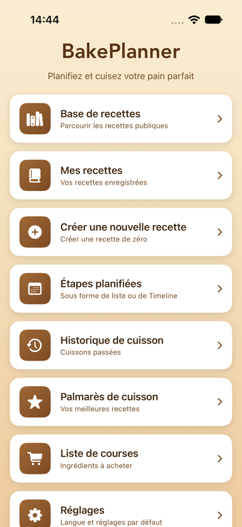
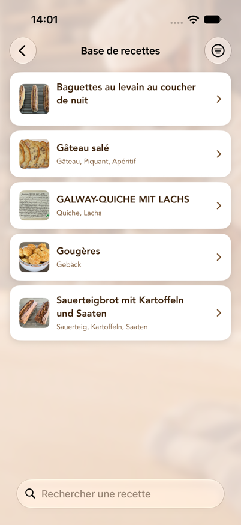
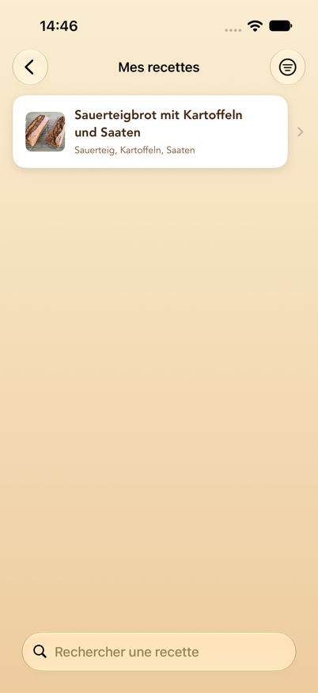
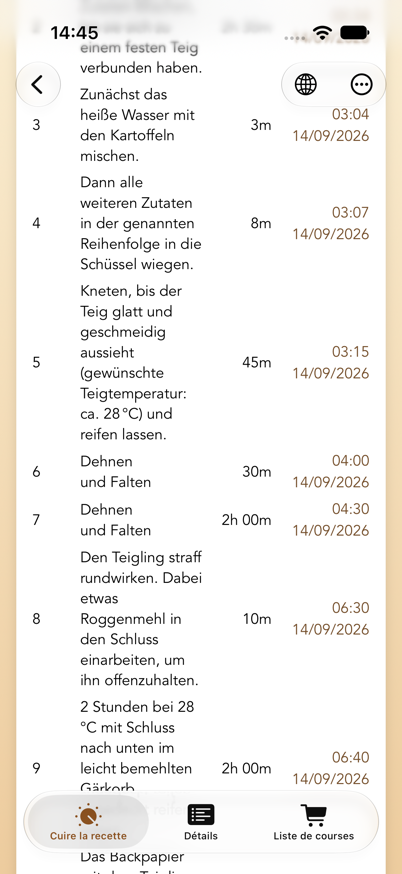
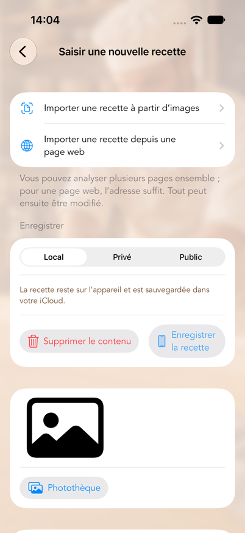
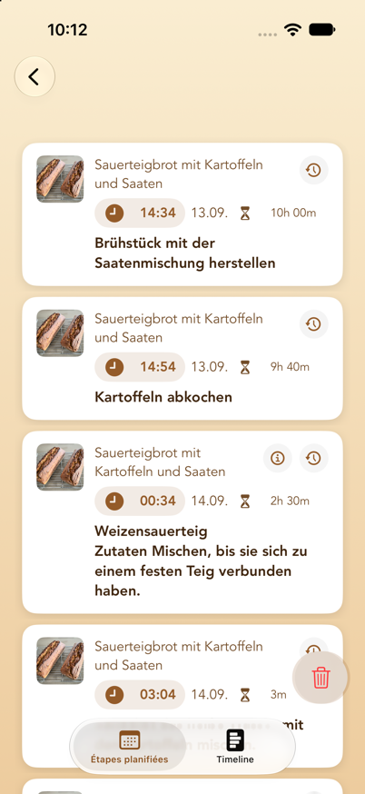
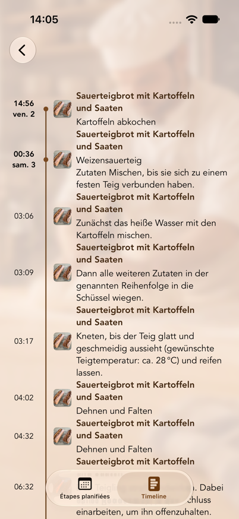

# BakePlanner – Manuel de l’utilisateur

Révision : 2 octobre 2026 · version 1.0 de l’app

> Traduit de l’original allemand, `Benutzerhandbuch.md`. En cas de divergence,
> la version allemande fait foi.

---

## Sommaire

1. [Ce que fait BakePlanner](#1-ce-que-fait-bakeplanner)
2. [Configuration requise](#2-configuration-requise)
3. [Notions de base](#3-notions-de-base)
4. [Le menu principal](#4-le-menu-principal)
5. [Base de recettes (recettes publiques et privées dans le cloud)](#5-base-de-recettes-recettes-publiques-et-privées-dans-le-cloud)
6. [Mes recettes](#6-mes-recettes)
7. [Instructions de cuisson et rappels](#7-instructions-de-cuisson-et-rappels)
8. [Créer une nouvelle recette](#8-créer-une-nouvelle-recette)
9. [Modifier une recette](#9-modifier-une-recette)
10. [Étapes planifiées (liste et timeline)](#10-étapes-planifiées-liste-et-timeline)
11. [Rappels sur l’écran verrouillé](#11-rappels-sur-lécran-verrouillé)
12. [Historique de cuisson et palmarès](#12-historique-de-cuisson-et-palmarès)
13. [Liste de courses](#13-liste-de-courses)
14. [Réglages](#14-réglages)
15. [Unités, quantités et tailles de portion](#15-unités-quantités-et-tailles-de-portion)
16. [Confidentialité, modération et conditions d’utilisation](#16-confidentialité-modération-et-conditions-dutilisation)
17. [Questions fréquentes et dépannage](#17-questions-fréquentes-et-dépannage)
18. [Limitations connues](#18-limitations-connues)

---

## 1. Ce que fait BakePlanner

BakePlanner est une app de planification pour le pain, les petits pains et la pâtisserie. Ce qui la distingue d’un simple recueil de recettes, c’est qu’elle **prend en charge le calcul des horaires** :

- Une recette ne se compose pas seulement d’ingrédients, mais d’**étapes de préparation avec des durées**.
- À partir de ces durées, l’app calcule l’**heure de début de chaque étape**.
- Vous pouvez planifier à rebours : « le pain doit être prêt à 18 h » — et l’app vous dit quand lancer le levain.
- Chaque étape reçoit un **rappel local**, y compris les étapes insérées automatiquement « allumer le four » et « la cuisson est terminée ».

S’y ajoutent : une base de recettes publique commune, vos propres recettes sur l’appareil, des recettes privées dans le cloud, l’import d’ingrédients depuis des photos, des listes de courses, un historique de cuisson avec photos et notes, ainsi que la traduction des recettes publiques sur l’appareil.

### Démarrage rapide : votre premier plan de cuisson en cinq étapes

1. Ouvrez **Base de recettes** et choisissez une recette — ou créez la vôtre sous **Créer une nouvelle recette**.
2. Dans la recette, ouvrez l’onglet **Cuire** ou **Cuire la recette**.
3. Choisissez **Commencer à** ou **Terminé pour** et réglez la date et l’heure.
4. Vérifiez les heures de début calculées, puis touchez **Définir un rappel**.
5. Ouvrez **Étapes planifiées** pour contrôler tous les horaires sous forme de liste ou de timeline.

Les rappels supposent que BakePlanner soit autorisé à envoyer des notifications. Les explications détaillées se trouvent au [chapitre 7](#7-instructions-de-cuisson-et-rappels), au [chapitre 10](#10-étapes-planifiées-liste-et-timeline) et au [chapitre 17](#17-questions-fréquentes-et-dépannage).

---

## 2. Configuration requise

| Élément | Valeur |
|---------|--------|
| Appareils | iPhone et iPad |
| Système d’exploitation | iOS/iPadOS 26.0 ou ultérieur |
| Orientation | iPhone : portrait et paysage · iPad : toutes les orientations |
| Langues | allemand, anglais, français (commutables dans les Réglages) |
| Apparence | mode clair et sombre, tailles de texte dynamiques |
| Internet | Nécessaire pour la base de recettes publique et la synchronisation iCloud. Vos propres recettes, la planification et les rappels fonctionnent entièrement hors ligne ; les modifications se synchronisent plus tard. |
| iCloud | Vos recettes, étapes planifiées, listes de courses et historiques de cuisson se synchronisent via iCloud entre tous les appareils utilisant le même compte Apple, si iCloud est activé. Les rappels eux-mêmes sont locaux à chaque appareil. |
| Autorisations | notifications (pour les rappels), photothèque et appareil photo (pour les images de recettes) |
| Connexion | **Pas** nécessaire pour cuisiner, pour vos propres recettes ni pour la base publique. Seul l’enregistrement de recettes **en privé dans le cloud** exige une connexion avec Apple (voir [chapitre 14](#14-réglages)). |

L’app demande l’autorisation d’envoyer des notifications au premier lancement. Sans elle, les étapes de cuisson sont tout de même calculées et affichées dans « Étapes planifiées », mais **aucun rappel n’apparaît**.

---

## 3. Notions de base

Ces six notions reviennent partout dans l’app :

**Recette**
L’unité de plus haut niveau : nom, description, image, note, tags, lien facultatif vers la source, poids total et durée de travail.

**Composant**
Une préparation partielle au sein d’une recette — « levain », « poolish », « pâte principale », « ébouillantage », par exemple. Chaque composant possède un numéro (son ordre de tri) et sa propre liste d’ingrédients. C’est le cœur du modèle de données : BakePlanner est conçu pour les pâtes à plusieurs étapes.

**Ingrédient**
Appartient toujours à un composant. Il comprend un numéro, une quantité, une unité, un nom et éventuellement une fraction (numérateur/dénominateur, notés **Z / N** dans l’app).

**Étape de préparation**
Une instruction de travail avec un numéro d’étape et une durée en minutes. Le numéro d’étape est un nombre décimal et a une signification particulière :

- **Les nombres entiers (1, 2, 3…) sont les étapes principales.** Elles se succèdent dans le temps.
- **Les décimales (2.1, 2.2, 2.3) sont des étapes parallèles au sein d’une étape principale.** Elles démarrent toutes en même temps ; seule la durée *la plus longue* du groupe compte pour la durée totale.

Exemple : si vous lancez en même temps un levain (12 h) et un ébouillantage (2 h), attribuez-leur les étapes 1.1 et 1.2. L’étape principale suivante, 2, commence après 12 heures et non après 14.

**Taille de portion**
Un facteur d’échelle pour toutes les quantités : 0,5 / 1,0 / 1,5 / 2,0. **1,0 correspond à la recette telle qu’elle est enregistrée.** 2,0 double toutes les quantités et le poids total affiché.

**Emplacement**
L’endroit où se trouve une recette. Il existe trois possibilités, et ce choix détermine qui peut la voir :

| Emplacement | Qui la voit ? | Où se trouve-t-elle ? | Modifiable ? |
|-------------|---------------|-----------------------|--------------|
| **Uniquement sur l’appareil** | vous seul | sur l’appareil, sauvegardée via votre iCloud | oui, à tout moment |
| **Privé dans le cloud** | vous seul | dans la base de recettes, verrouillée pour les autres | non |
| **Public pour tous** | tous les utilisateurs de l’app | dans la base de recettes | non |

« Privé dans le cloud » est prévu pour les recettes que vous **n’avez pas le droit de publier** — tirées d’un livre, par exemple — mais que vous ne voulez pas conserver uniquement sur l’appareil. Une connexion avec Apple est alors nécessaire, car la recette est liée à votre compte ; sans compte, elle serait introuvable après une réinstallation.

---

## 4. Le menu principal

Au lancement, le menu principal apparaît avec huit cartes :

*Le menu principal est le point de départ pour les recettes, la planification, l’historique et les réglages.*

| Carte | Rôle |
|-------|------|
| **Base de recettes** | Parcourir les recettes publiques partagées par tous — ainsi que vos recettes privées dans le cloud si vous êtes connecté |
| **Mes recettes** | Vos recettes enregistrées localement |
| **Créer une nouvelle recette** | Créer une recette de zéro ou l’importer depuis des photos |
| **Étapes planifiées** | Toutes les étapes de cuisson programmées, en liste ou en timeline |
| **Historique de cuisson** | Les cuissons passées avec commentaires et photos |
| **Palmarès de cuisson** | Les recettes classées par nombre de cuissons |
| **Liste de courses** | Toutes les listes de courses créées |
| **Réglages** | Langue, valeurs par défaut, planification, compte |

La flèche de retour en haut à gauche vous ramène au menu principal depuis n’importe quelle section.

---

## 5. Base de recettes (recettes publiques et privées dans le cloud)

La base de recettes est la collection commune : les recettes que vous ou d’autres utilisateurs avez enregistrées publiquement.

Si vous êtes connecté avec Apple, la même liste contient en plus **vos recettes privées dans le cloud**. Elles sont signalées par un **cadenas** devant le nom et restent invisibles pour les autres. Si vous vous déconnectez, elles disparaissent de la liste — elles ne sont pas supprimées et reviennent à la prochaine connexion avec le même compte Apple.

*Dans la base de recettes, vous pouvez rechercher et ouvrir des recettes publiques.*

### Rechercher et filtrer

- **Champ de recherche** en haut : recherche dans les noms de recettes.
- **Changer le périmètre de recherche** : sous le champ, vous pouvez choisir entre **Nom** et **Tags**. Avec « Tags », la recherche porte sur les mots-clés (« seigle », « complet », « levain », par exemple).
- **Icône de filtre** en haut à droite : **Toutes les recettes** ou **Les miennes**. « Les miennes » n’affiche que les recettes provenant de votre compte — vos recettes privées et celles que vous avez publiées. L’icône change lorsque le filtre est actif.
- **Tirer vers le bas** actualise la liste depuis le cloud.

Si « Aucune recette chargée » s’affiche, c’est qu’il n’y avait pas de connexion internet au lancement — tirez la liste vers le bas une fois. Si vous lisez « Aucune recette correspondante », c’est qu’un filtre est actif.

### Ouvrir une recette publique

Une recette s’ouvre avec deux onglets en bas :

- **Cuire la recette** — les instructions de cuisson avec la planification (voir [chapitre 7](#7-instructions-de-cuisson-et-rappels))
- **Détails** — un aperçu des ingrédients, des composants et des étapes

### Traduire une recette

En haut à droite se trouve l’**icône de globe**. Elle vous permet de choisir Deutsch, English ou Français. La traduction s’effectue **entièrement sur l’appareil** (Traduction Apple) et porte sur le nom de la recette, la description, les tags, les noms de composants et d’ingrédients ainsi que les textes des étapes.

Remarques :

- **Les unités ne sont volontairement pas traduites**, afin que le calcul des quantités continue de fonctionner.
- La première traduction dans une langue prend un instant (un indicateur de progression remplace le globe). Elle est ensuite mise en cache et disponible immédiatement.
- À la première ouverture, l’app affiche automatiquement la recette dans votre langue si une traduction existe déjà.
- **L’original n’est jamais écrasé.** L’original est la langue dans laquelle la recette est écrite — et non la langue sur laquelle votre app était réglée. L’app le déduit du texte de la recette : une recette française reste donc un original français même si quelqu’un l’a saisie dans une app en allemand.
- La coche indique dans le menu quelle langue est affichée. Sélectionnez-la de nouveau pour revenir directement à l’original.

### Reprendre une recette

L’onglet **Cuire la recette** propose le bouton **Enregistrer comme ma recette**. Une copie complète — image, composants, ingrédients et étapes comprises — arrive alors dans « Mes recettes ». Seule cette copie est modifiable.

L’app le confirme par **« La recette a été enregistrée »** et précise que vous pouvez modifier la copie sans toucher à la recette publique. Si l’enregistrement échoue, un message d’erreur apparaît à la place — rien ne disparaît en silence.

### Publier une recette privée

Pour vos recettes **privées** dans le cloud, l’onglet **Cuire la recette** propose en plus **Enregistrer comme recette publique**. La recette devient alors visible par tous. Une demande de confirmation rappelle d’abord qu’elle ne pourra plus être modifiée et que seules des recettes ne portant pas atteinte au droit d’auteur peuvent être publiées ; la première fois, vous devez également accepter les conditions d’utilisation.

**Votre version privée est conservée** — la recette figure ensuite deux fois dans la liste, dont une avec un cadenas. Si vous ne le souhaitez pas, supprimez ensuite la version privée via « … » → **Supprimer ma recette**.

Pour les recettes déjà publiques, le bouton n’apparaît pas.

### Signaler, bloquer, supprimer

Via le **menu « … »** en haut à droite :

- **Signaler la recette** — vous choisissez un motif (offensant/insultant, spam, atteinte au droit d’auteur, autre). Le signalement part pour examen chez l’exploitant, et la recette est masquée **immédiatement pour tous les utilisateurs**, et non seulement après l’examen. Elle ne redevient visible que si un administrateur la réaffiche.
- **Bloquer l’auteur** — toutes les recettes de cet auteur disparaissent de votre liste. Cela n’agit **que sur votre appareil** ; les autres utilisateurs continuent de les voir.
- **Supprimer ma recette** — n’apparaît que pour les recettes provenant de *votre* compte. La recette est retirée définitivement de la base.

Pour les recettes **privées**, « Signaler la recette » et « Bloquer l’auteur » sont absents — personne d’autre que vous ne les voit de toute façon. Seul « Supprimer ma recette » y figure.

Les deux diffèrent donc par leur portée : **bloquer agit localement, signaler agit pour tous.** Les deux peuvent être annulés dans *Réglages → Modération* (voir [chapitre 14](#14-réglages)).

### Fonction d’administrateur

Si vous êtes connecté en tant qu’administrateur (voir [chapitre 14](#14-réglages)), l’onglet **Détails** propose en plus **Supprimer la recette (admin)**. Cela permet de retirer n’importe quelle recette publique — prévu pour la modération des contenus signalés. Un administrateur n’a aucun accès aux recettes **privées** des autres utilisateurs ; elles ne sont pas partagées et ne relèvent donc pas de la modération.

---

## 6. Mes recettes

On trouve ici toutes les recettes enregistrées localement sur l’appareil : celles que vous avez créées et celles reprises de la base.

### Rechercher et filtrer

- **Champ de recherche** avec commutation **Nom / Tags**.
- **Icône de filtre** en haut à droite : choisir une note minimale (toutes les notes, 1 à 5 étoiles et plus). Lorsqu’un filtre est actif, l’icône est affichée pleine.

La recherche ignore les majuscules et trouve aussi des fragments de mots : « seigle » trouve « Pain de seigle », et pour les tags une partie du mot-clé suffit. Les filtres de recherche et de note se combinent.

### Supprimer une recette

Balayez la ligne vers la gauche → **Supprimer**. Une demande de confirmation suit, avec le nom de la recette, afin qu’un balayage involontaire ne détruise rien. Supprimer une recette supprime aussi ses composants, ses ingrédients, ses étapes de préparation et ses entrées d’historique.

Les étapes déjà planifiées pour cette recette restent toutefois dans « Étapes planifiées » — supprimez-les séparément si vous n’en avez plus besoin.

### Les cinq onglets d’une de vos recettes

| Onglet | Contenu |
|--------|---------|
| **Cuire** | Instructions de cuisson avec planification et « Définir un rappel » |
| **Détails** | Note, description, total des ingrédients, composants, aperçu des étapes |
| **Modifier** | Modifier la recette (voir [chapitre 9](#9-modifier-une-recette)) |
| **Liste de courses** | Ajouter les ingrédients de cette recette à une liste de courses |
| **+ Historique** | Consigner une cuisson avec date, commentaire et photos |

Dans l’onglet **Détails**, vous pouvez toucher l’image de la recette pour l’afficher en grand.

---

## 7. Instructions de cuisson et rappels

C’est le cœur de l’app. La structure est la même pour vos recettes et pour les recettes publiques.

*La vue de cuisson met en regard la durée et le début calculé de chaque étape.*

### De haut en bas

1. **Image et nom** — toucher l’image l’affiche en grand.
2. **Taille de portion** (0,5 / 1,0 / 1,5 / 2,0), le **poids en grammes** qui en découle et — s’il est renseigné — le **lien vers la recette**.
3. **Total des ingrédients** — tous les ingrédients de tous les composants, additionnés. Cette liste sert aux courses et à la pesée. L’eau est volontairement omise, de même que les ingrédients qui sont eux-mêmes un produit intermédiaire d’un composant (« levain » comme ingrédient de la pâte principale, par exemple) — sinon les quantités seraient comptées deux fois.
4. **Composants** — triés par numéro, chacun avec ses ingrédients à la taille de portion choisie.
5. **Barre de commande** — voir ci-dessous.
6. **Étapes de préparation** — un tableau avec l’étape, la description, la durée et le **début** calculé. La dernière ligne indique « Terminé » avec l’heure de fin.
7. **Commentaires de cuisson** (vos recettes uniquement) — les entrées d’historique antérieures.
8. **Définir un rappel**.

### La barre de commande

| Élément | Fonction |
|---------|----------|
| **Modifier la durée** | Un commutateur. Actif, il fait apparaître un champ « Durée [min] » pour chaque étape. |
| **Commencer à / Terminé pour** | Détermine comment la date ci-dessous est interprétée. Abrégé sur iPhone en portrait. |
| **Date et heure** | Le point de référence de la planification. |

**Commencer à** signifie : je commence à ce moment — quand aurai-je terminé ?
**Terminé pour** signifie : je veux avoir terminé à ce moment — quand dois-je commencer ? La colonne « Début » calcule alors à rebours.

Modifiez l’heure et observez la colonne « Début » s’ajuster immédiatement. Rien n’est encore enregistré.

### Ajuster les durées

1. Activez **Modifier la durée**.
2. Saisissez de nouvelles valeurs en minutes dans les champs de la colonne de droite. Les champs vides et les valeurs inférieures ou égales à 0 sont ignorés, et la valeur précédente est conservée.
3. Touchez **Appliquer la durée**.

L’app recalcule alors toutes les heures de début et la durée de travail totale. Pour vos recettes, les nouvelles durées sont enregistrées durablement ; pour les recettes publiques, elles ne valent que pour la planification en cours.

### Ce que l’app reproche à un plan

Des remarques apparaissent au-dessus du tableau des étapes dès que l’heure choisie aboutit à un plan peu pratique. Elles se mettent à jour à chaque modification de la date, de l’heure ou des durées — avant même que vous ne touchiez « Définir un rappel ».

| Signe | Signification |
|-------|---------------|
| ⚠️ orange | **Remarque.** Le plan fonctionne, mais vous devriez le savoir. |
| ⛔️ rouge | **Erreur.** Deux cuissons se chevaucheraient dans le four. |

Trois points sont vérifiés :

- **Étapes en dehors de votre journée.** Si une étape tombe avant le **début de journée** ou après la **fin de journée** définis dans les Réglages, elle est nommée : « “Rabattre la pâte” commence le 11/09/26 à 03:07, soit avant le début de journée (06:00). » Avec de longues fermentations, c’est normal et il n’y a pas lieu de s’inquiéter — cela vous montre simplement pourquoi il faudrait vous lever la nuit.
- **Temps de cuisson qui se chevauchent.** Si une autre recette occupe le four sur la même période, c’est une erreur : deux pains ne tiennent pas en même temps à deux températures différentes.
- **Pause de cuisson trop courte.** S’il s’écoule entre deux cuissons moins de temps que la **pause de cuisson** réglée, une remarque apparaît. Le four a besoin de ce temps pour changer de température.

Les remarques n’empêchent rien — vous pouvez définir le plan quand même. Elles vous épargnent seulement la surprise à trois heures du matin.

### Définir les rappels

Toucher **Définir un rappel** déclenche plusieurs choses à la fois :

1. Un rappel local est défini pour **chaque étape de préparation**, à l’heure de début calculée.
2. L’étape **« allumer le four »** est insérée automatiquement — le **temps de préchauffage** réglé avant la dernière étape (15 minutes par défaut, modifiable dans les Réglages).
3. **« La cuisson est terminée »** est également planifié pour l’heure de fin.
4. Toutes les étapes arrivent dans **Étapes planifiées**.
5. Pour vos recettes, une **entrée d’historique** est créée avec la date de fin et le commentaire provisoire « aucun commentaire saisi », que vous pourrez compléter plus tard.

Une confirmation apparaît ensuite, par exemple :

> **Les rappels ont été définis**
> 12 rappels définis.
> Allumer le four à 16:45.
> Terminé à 18:10.

Les textes « allumer le four » et « la cuisson est terminée » apparaissent dans la langue active (pour les recettes publiques, dans la langue dans laquelle vous consultez la recette).

> **Une recette n’a jamais qu’un seul plan.** Si vous touchez de nouveau « Définir un rappel » — parce que vous voulez décaler le pain d’un jour, par exemple —, le nouveau plan remplace intégralement l’ancien : les anciennes étapes disparaissent de « Étapes planifiées » et les anciens rappels sont remplacés. Aucun doublon n’apparaît donc. En contrepartie : une même recette ne peut pas être planifiée deux fois en parallèle pour deux dates différentes.

> **Pour l’Apple Watch : définissez les rappels sur l’iPhone.** Les rappels sont créés sur l’appareil où vous touchez « Définir un rappel » et y restent. Seul un iPhone transmet ses notifications à une Apple Watch jumelée — un iPad n’est pas jumelé à la montre et ne peut pas le faire. Si vous planifiez sur l’iPad, les rappels de cuisson n’apparaissent donc que sur l’iPad, même si vous portez une Apple Watch.
>
> Un plan déjà défini ne peut pas être transféré vers un autre appareil — dans ce cas, définissez simplement les rappels une nouvelle fois sur l’iPhone. La recette elle-même se trouve de toute façon sur les deux appareils grâce à iCloud.

---

## 8. Créer une nouvelle recette

Via **Menu principal → Créer une nouvelle recette**. Le formulaire se parcourt de haut en bas.

*Dans le formulaire de recette, vous pouvez importer des images ou tout saisir manuellement.*

### Importer une recette depuis des images

Tout en haut : **Importer une recette à partir d’images**. Cela permet de lire une recette imprimée ou photographiée.

1. **Sélectionner des images** (jusqu’à 10 pages ; l’ordre de sélection est conservé) ou **Prendre une photo** pour un nouveau cliché.
2. Les pages choisies apparaissent dans la liste « Pages sélectionnées » ; on peut en retirer individuellement avec l’icône de corbeille.
3. **« Analyser … image(s) »** lance la reconnaissance de texte. Elle s’exécute sur l’appareil, affiche « Lecture de l’image x sur y… » et peut être interrompue à tout moment.
4. L’app affiche ensuite un **récapitulatif** : nom reconnu, nombre de composants, d’ingrédients et d’étapes, ainsi que les composants reconnus avec leurs ingrédients et la planification détectée.
5. **Vérifier les données dans le formulaire de recette** reprend le tout dans le formulaire habituel. **Sélectionner d’autres images** recommence.

L’app lit les images avec chacun des types de source qu’elle connaît et retient le résultat qui correspond aux indications de la page ; via **Type de source**, vous pouvez aussi en imposer un. Des photos droites et bien lisibles donnent les meilleurs résultats.

#### Choisir le nom vous-même

Quelle ligne constitue le titre ne se devine pas toujours : un logo, un en-tête d’impression et un intertitre ressemblent tous à un titre. Si le nom reconnu est incorrect, **touchez la ligne « Nom » dans le récapitulatif**. La page apparaît alors telle que vous l’avez photographiée, avec un cadre autour de chaque ligne reconnue :

- **Toucher** choisit une ligne comme nom de la recette.
- **Écarter deux doigts** agrandit la page jusqu’à six fois, si les lignes sont serrées.
- Pour les recettes de plusieurs pages, une barre en haut permet de passer d’une **page** à l’autre.
- Si le nom ne figure pas du tout sur la page, saisissez-le en bas dans le champ **Nom de la recette**.

**Soignez le cadrage.** Coupez tout ce qui ne fait pas partie de la recette : logos, en-têtes et pieds de page, numéros de page, adresses web et fragments de texte d’articles voisins. Cela vous évite la correction d’emblée. Les **recettes manuscrites** ne peuvent pas être lues de façon fiable par la reconnaissance de texte.

Vérifiez ensuite impérativement **les quantités, les unités, les températures et les durées** — rien n’est enregistré avant que vous ne choisissiez « Enregistrer la recette » dans le formulaire.

### Emplacement : local, privé dans le cloud ou public

Dans la section **Enregistrer**, vous choisissez entre les trois emplacements (voir aussi le tableau du [chapitre 3](#3-notions-de-base)). Une phrase sous chaque choix explique ce qu’il implique. La valeur par défaut vient des Réglages (Emplacement par défaut).

- **Local** — la recette reste sur l’appareil, est sauvegardée via votre iCloud et reste modifiable à tout moment.
- **Privé** — la recette est enregistrée dans la base de recettes mais n’est visible que par vous. Cela exige une **connexion avec Apple** ; si vous n’êtes pas connecté, la feuille « Connexion requise » apparaît d’abord, puis l’enregistrement se poursuit. Avant cela, l’app signale qu’une recette dans la base ne pourra plus être modifiée après l’enregistrement.
- **Public** — la recette devient visible par tous. Auparavant apparaît l’avertissement : **« Une recette publique ne peut plus être modifiée après son enregistrement. »** La première fois, vous devez en outre accepter les conditions d’utilisation (voir [chapitre 16](#16-confidentialité-modération-et-conditions-dutilisation)). Pour les recettes privées, elles ne sont pas exigées — vous ne partagez rien.

Lors d’un import depuis des images, l’emplacement est toujours réglé sur « Local » au départ. L’icône du bouton « Enregistrer la recette » change avec le choix.

### Image de la recette

**Photothèque** ou **appareil photo** (le bouton d’appareil photo uniquement sur les appareils qui en ont un).

> **Une image est obligatoire.** Sans image de recette, l’enregistrement affiche le message « Image requise ».

### Données de base et tags

- **Nom** — champ obligatoire. Tant qu’il est vide, « Enregistrer la recette » reste désactivé.
- **Description** — champ de texte multiligne.
- **Lien URL** — lien facultatif vers la source ; apparaît ensuite sous « Lien vers la recette ».
- **Tags** — saisir un mot-clé, toucher **+**. Les tags sont ensuite consultables par la recherche.

### Composants et ingrédients

D’abord le composant, puis ses ingrédients :

1. Saisissez le numéro et le nom du composant (`1` / `Levain`, par exemple) et touchez **+**. Le numéro s’incrémente automatiquement.
2. Sous chaque composant apparaît la ligne de saisie des ingrédients, avec ces colonnes :

| Colonne | Signification |
|---------|---------------|
| **N°** | Ordre de tri au sein du composant |
| **Quantité / Poids** | La valeur numérique de la quantité |
| **Unité** | Un menu ; voir [chapitre 15](#15-unités-quantités-et-tailles-de-portion) |
| **Ingrédient** | Le nom de l’ingrédient |
| **Z / N** | La fraction — numérateur et dénominateur, 1 / 2 pour « ½ » |

3. **+** ajoute l’ingrédient, l’icône de corbeille le retire. Les lignes déjà saisies sont directement modifiables.

Seul le **nom** est obligatoire — un ingrédient sans quantité ni unité est permis (« sel selon le goût »). Utilisez soit la quantité/le poids, **soit** les champs de fraction, pas les deux pour la même indication.

### Étapes de préparation

Colonnes **Étape**, **Description**, **Durée** (minutes). Après un ajout, le numéro d’étape se poursuit automatiquement : d’un nombre entier au suivant, d’une décimale par pas de 0,1. Vous saisissez ainsi commodément des sous-étapes parallèles en 2.1, 2.2, 2.3.

Souvenez-vous de la règle du [chapitre 3](#3-notions-de-base) : les étapes décimales se déroulent en parallèle, les nombres entiers se succèdent.

### Enregistrer

- **Enregistrer la recette** — enregistre localement ou téléverse dans la base. Lors d’un téléversement, « La recette est en cours de téléversement... » apparaît ; ensuite soit « La recette a été enregistrée », soit un message d’erreur précis.
- **Supprimer le contenu** — vide entièrement le formulaire (sans demander confirmation).

---

## 9. Modifier une recette

Accessible via **Mes recettes → recette → onglet « Modifier »**.

### Enregistrement automatique

Les modifications du **nom, de la description, du lien URL, des tags et de la note** sont enregistrées automatiquement — peu après la saisie et au plus tard en quittant l’écran. Aucun message de confirmation n’apparaît pour cela.

Une nouvelle **image de recette** est enregistrée dès que vous la choisissez.

### Note

Touchez les étoiles en haut à droite : de 1 à 5 étoiles. Toucher de nouveau la première étoile remet la note à 0. La note est ce sur quoi s’appuie le filtre de note dans les listes.

### Modifier les composants

- **Ajouter** : saisir un numéro et un nom, **+**.
- **Modifier** : toucher la ligne du composant. « Modifier le composant » s’ouvre avec le numéro, le nom et la liste complète des ingrédients. Vous pouvez y ajouter des ingrédients (**+**), les supprimer (corbeille) et en modifier un en le touchant, dans la boîte de dialogue « Modifier l’ingrédient ». **Terminé** applique, **Annuler** abandonne.
- **Supprimer** : la corbeille à côté du composant. Le poids total de la recette est ensuite recalculé.

### Modifier les étapes de préparation

- **Ajouter** : saisir l’étape, la description, la durée, **+**. Les heures de début sont recalculées automatiquement.
- **Modifier** : toucher la ligne de l’étape → « Modifier l’étape de préparation ». Après **Terminé**, l’app recalcule toutes les heures de début et la durée de travail.
- **Supprimer** : la corbeille à côté de la ligne.

### Enregistrer manuellement

La section **Enregistrer** comporte trois boutons — les trois mêmes emplacements que lors de la création. Vous les retrouvez également en haut à droite de la barre de navigation, dans le menu derrière l’icône d’enregistrement.

- **Local** — enregistre tout, image comprise, recalcule le poids total et confirme par « La recette a été enregistrée ».
- **Privé** — dépose la recette en privé dans la base de recettes ; une connexion avec Apple est nécessaire. Visible par vous seul et non modifiable ensuite.
- **Public** — téléverse la recette pour la rendre visible par tous. L’avertissement qu’elle ne pourra plus être modifiée apparaît ici aussi.
- **Supprimer** (en haut à gauche) — vide le contenu de la recette.

Après un téléversement réussi, **les deux boutons cloud sont désactivés**, car la recette possède désormais une copie dans la base — une recette ne peut être téléversée qu’une seule fois, en privé *ou* en public.

Si cette copie est supprimée plus tard (par vous ou par la modération), l’app le détecte à la prochaine ouverture et réactive les boutons. Cela suppose que vous soyez connecté — déconnecté, l’app ne peut pas vérifier s’il existe encore une copie privée et laisse les boutons verrouillés par précaution.

---

## 10. Étapes planifiées (liste et timeline)

**Menu principal → Étapes planifiées.** On trouve ici toutes les étapes de cuisson de toutes les recettes pour lesquelles vous avez défini des rappels — dans l’ordre chronologique, toutes recettes confondues. En bas, vous passez d’une vue à l’autre.

*Dans son état vide, la vue en liste indique aussi où se créent les nouvelles planifications.*

### La vue « Étapes planifiées » (liste)

Chaque étape est une carte avec l’image de la recette, son nom, l’heure de début, la date, la durée et l’instruction. La toucher ouvre la vue détaillée avec la recette, le début, le numéro d’étape, la durée et la description complète.

**Consulter les ingrédients d’un composant** — via le **symbole i** sur la carte. Il n’apparaît que sur les étapes qui mélangent un composant de la recette, par exemple « Préparer le pré-ferment A » ou « Préparer la pâte finale ». Le toucher ouvre les ingrédients de ce composant précis avec leurs quantités, pour peser directement depuis le plan sans ouvrir la recette. Les quantités se rapportent au nombre de portions par défaut défini dans les réglages.

L’app reconnaît une telle étape de mélange au fait que le nom d’un composant de la recette figure dans le texte de l’étape. Les étapes issues de l’import d’image savent de toute façon à quel composant elles appartiennent. Une étape comme « Rabattre la pâte », sans nom de composant, n’a pas de symbole i.

**Décaler une étape dans le temps** — via l’icône d’horloge sur la carte :

1. Saisissez des minutes (1440 au maximum, soit 24 heures).
2. Choisissez le sens : **Plus tôt** ou **Plus tard**.
3. Choisissez la portée : **Uniquement cette étape** ou **Toutes les suivantes** (toutes les étapes ultérieures de la même recette se décalent d’autant).
4. **Appliquer**.

Les rappels correspondants se décalent automatiquement. Si le nouveau moment est dans le passé, l’app refuse avec « Décalage impossible ».

**Supprimer :**

- **Une seule étape** : balayez la ligne vers la gauche. Le rappel associé est supprimé avec elle.
- **Toutes les étapes** : le bouton corbeille en bas à droite, puis « Tout supprimer ». Cela retire toutes les étapes planifiées **et** tous les rappels en attente — y compris ceux de recettes que vous ne voulez plus cuire.

### La vue « Timeline »

Les mêmes étapes sur un axe temporel vertical. L’horodatage figure à gauche — avec le jour de la semaine et la date pour la première étape d’une journée, seulement l’heure pour les suivantes. Les points et les traits de liaison rendent visibles les étapes regroupées sur une même journée et les pauses plus longues. Pratique pour avoir une vue d’ensemble d’une fermentation sur plusieurs jours.

*L’onglet du bas permet de passer de la liste à la timeline.*

Si aucune étape n’est planifiée, les deux vues indiquent : « Aucune étape planifiée — Définissez un rappel dans les instructions de cuisson d’une recette. »

---

## 11. Rappels sur l’écran verrouillé

Chaque rappel apparaît comme une notification intitulée **« Rappel de cuisson »**, avec le sous-titre « Maintenez pour Terminé ou Décaler » et le texte de l’étape comme contenu.

**Les ingrédients dans le rappel.** Si l’étape mélange un composant, les ingrédients de ce composant avec leurs quantités suivent sous le texte de l’étape — les mêmes que derrière le symbole i dans « Étapes planifiées » :

> **Rappel de cuisson**
> Préparer le pré-ferment A
>
> Ingrédients pour « Pré-ferment A » :
> • 200 g de farine de blé T55
> • 200 g d’eau
> • 2 g de levure

La bannière ne montre que les premières lignes. Maintenez la notification ou dépliez-la dans le centre de notifications pour voir toute la liste. Les quantités correspondent au nombre de portions choisi dans les instructions de cuisson au moment où les rappels ont été définis.

**Maintenez la notification appuyée** pour obtenir deux actions :

- **Marquer comme terminé** — l’étape est retirée de « Étapes planifiées ».
- **Décaler de…** — saisissez les minutes directement dans la notification. Une question suit alors : **« Toutes les étapes suivantes de cette recette doivent-elles également être décalées ? »**, avec les options **Uniquement cette étape** et **Toutes les suivantes**.

Le décalage est toujours compté à partir de **maintenant** : « 30 minutes » signifie « dans 30 minutes ». Avec « Toutes les suivantes », toutes les étapes ultérieures de la même recette se décalent du même écart — une fermentation reste ainsi cohérente, même si vous êtes en retard.

Les notifications s’affichent aussi lorsque l’app est au premier plan.

**Apple Watch.** Les rappels de cuisson apparaissent sur la montre si vous les avez définis sur l’**iPhone** — les notifications de l’iPhone sont transmises à la montre jumelée. Les rappels définis sur l’iPad restent sur l’iPad. Plus de détails au [chapitre 7](#7-instructions-de-cuisson-et-rappels).

---

## 12. Historique de cuisson et palmarès

### Historique de cuisson

**Menu principal → Historique de cuisson.** Une liste chronologique de toutes les cuissons (la plus récente en premier) avec la date, le nom de la recette, le commentaire et les photos.

- **Toucher une entrée** → les notes de cuisson : modifier le commentaire et ajouter des photos via la **photothèque**. Les photos se touchent et se parcourent en grand. **Enregistrer** confirme par « L’historique a été enregistré ».
- **Supprimer une entrée** : balayez la ligne vers la gauche.
- **Rechercher et filtrer** : le champ de recherche (Nom/Tags) et le filtre de note en haut à droite.

### Consigner une cuisson après coup

**Mes recettes → recette → onglet « + Historique ».** Choisissez la date de cuisson (jusqu’à 10 ans en arrière), écrivez un commentaire, ajoutez des photos depuis la photothèque, **Enregistrer**.

Une entrée est en outre créée automatiquement lorsque vous définissez des rappels dans les instructions de cuisson — d’abord avec le texte provisoire « aucun commentaire saisi », que vous pourrez remplacer plus tard.

### Palmarès de cuisson

**Menu principal → Palmarès de cuisson.** Affiche toutes les recettes déjà cuites au moins une fois, classées par nombre de cuissons — vos classiques en tête. Pour chaque recette figurent le nom, le nombre et les photos des historiques. La recherche et le filtre de note fonctionnent comme dans les autres listes.

---

## 13. Liste de courses

### Mettre des ingrédients sur une liste

**Mes recettes → recette → onglet « Liste de courses ».**

- **Nouvelle liste** : choisissez une date, **Créer**. S’il existe déjà une liste pour cette date, les ingrédients y sont ajoutés.
- **Liste existante** : basculez sur « Liste existante » et touchez **+** en face de la liste voulue. Pour en supprimer une, balayez la ligne vers la gauche.

La confirmation indique « Les ingrédients ont été ajoutés à la liste de courses ». Le renvoi **Afficher les listes de courses** apparaît ensuite.

### Ce qui arrive sur la liste — et ce qui n’y arrive pas

L’app filtre volontairement :

- **Ne sont pas reprises** les ingrédients dont le nom contient **eau, sel, chef** ou **levain** — on en a chez soi, ou bien c’est un produit intermédiaire.
- **Ne sont pas reprises** les ingrédients sans unité ou sans quantité exploitable.
- **Les ingrédients identiques sont regroupés.** Les indications de température sont alors retirées du nom : « eau (tiède) », « lait 30 °C » et « lait » comptent pour le même ingrédient. Les majuscules et les trémas n’ont aucune importance.
- **Les unités sont converties** lorsqu’elles partagent la même unité de base : 0,5 kg + 200 g s’additionnent, les cuillerées à soupe et les millilitres également. Les grammes et les millilitres restent séparés.

### Consulter les listes de courses

**Menu principal → Liste de courses.** Chaque liste indique sa date, les recettes qu’elle contient et, en dessous, tous les ingrédients avec quantité et unité. **Supprimer** retire la liste après confirmation.

---

## 14. Réglages

**Menu principal → Réglages.**

*Les Réglages rassemblent la langue, les valeurs par défaut et les paramètres de la planification. Les sections Modération et Compte suivent plus bas.*

### Général

| Réglage | Description |
|---------|-------------|
| **Langue** | Langue du système, allemand, anglais ou français. Agit sur l’interface ainsi que sur les formats de date et d’heure. |
| **Emplacement par défaut** | La valeur par défaut des nouvelles recettes : **Uniquement sur l’appareil**, **Privé dans le cloud** ou **Public pour tous**. Par défaut : uniquement sur l’appareil. |

### Recettes

| Réglage | Description |
|---------|-------------|
| **Taille de portion par défaut** | La valeur avec laquelle les recettes s’ouvrent : 0,5 / 1,0 / 1,5 / 2,0. Par défaut : 1,0. |
| **Utiliser la vue détaillée** | Activé : les composants et les étapes de toutes les recettes publiques sont chargés avec la liste — les recettes s’ouvrent plus vite, mais le premier chargement est plus long et consomme plus de données. Désactivé : les détails ne sont chargés qu’à l’ouverture d’une recette. Par défaut : activé. |
| **Unités personnalisées** | Indique combien vous en avez créées et mène à leur gestion. Voir [chapitre 15](#15-unités-quantités-et-tailles-de-portion). |

### Planification de cuisson

| Réglage | Description |
|---------|-------------|
| **Temps de préchauffage** | 0 à 120 minutes par pas de 5. Utilisé lors de la définition des rappels, pour placer l’étape automatique « allumer le four » avant la dernière étape. Par défaut : 15 minutes. |
| **Pause de cuisson** | 0 à 120 minutes. Écart minimal entre deux cuissons dans le même four. Par défaut : 10 minutes. |
| **Début de journée** | 0 à 23 h. À partir de quand vous êtes disponible le matin. Par défaut : 6 h. |
| **Fin de journée** | Entre le début de journée et 23 h. Par défaut : 23 h. |

> **Remarque :** seul le **temps de préchauffage** décale réellement des étapes. La **pause de cuisson, le début et la fin de journée** ne modifient pas le plan — l’app le contrôle toutefois par rapport à eux et vous avertit dans la vue de cuisson si une étape tombe pendant votre nuit ou si deux cuissons se télescopent (voir [chapitre 7](#7-instructions-de-cuisson-et-rappels)).

### Compte

C’est ici que vous vous connectez avec Apple. La connexion sert à deux choses :

- **Les recettes privées dans le cloud.** Elles sont liées à votre compte Apple. C’est le seul moyen qu’elles restent accessibles après une réinstallation ou sur un deuxième appareil — un identifiant anonyme disparaît avec l’app.
- **Les droits de modération.** Si votre identifiant y a été autorisé, la mention **Administrateur** apparaît en plus, et les recettes publiques affichent le bouton « Supprimer la recette (admin) ».

**Ni votre nom ni votre adresse e-mail ne sont demandés** — l’app n’a besoin que de l’identifiant lui-même. Si votre utilisation était anonyme jusque-là, elle est conservée à la connexion : les recettes déjà publiées depuis cet appareil vous appartiennent toujours ensuite.

| Bouton | Effet |
|--------|-------|
| **Se connecter avec Apple** | Crée ou associe votre compte. |
| **Se déconnecter** | Retour à l’utilisation anonyme. Les recettes privées dans le cloud disparaissent de la liste, restent enregistrées et réapparaissent à la prochaine connexion. L’app confirme par **« Déconnexion effectuée »** ; elle ne demande **pas** de vous reconnecter pour confirmer — cela ne concerne que la suppression du compte. |
| **Supprimer le compte** | Supprime le compte définitivement (voir ci-dessous). |

**Supprimer le compte** demande d’abord confirmation. Ensuite, voici ce qui se passe :

- Vos recettes **privées** dans le cloud sont supprimées avec leurs images.
- La connexion est dissociée ; l’app continue de fonctionner de façon anonyme.
- **Les recettes publiées restent** visibles par tous. Elles n’appartiennent plus à aucun compte, vous ne pouvez donc plus les supprimer vous-même — faites-le avant si vous ne voulez pas les laisser dans la base.
- **Les recettes présentes sur l’appareil sont conservées.** Elles appartiennent à l’appareil et à votre iCloud, pas au compte.

Cette action est irréversible. Si votre dernière connexion est ancienne, Apple exige par sécurité une nouvelle connexion — la feuille « Se reconnecter » apparaît, puis la suppression se poursuit d’elle-même.

Pour cuisiner normalement, pour vos propres recettes et pour parcourir la base publique, **aucune connexion n’est nécessaire**.

### Modération

C’est ici que vous annulez ce que vous avez masqué dans la base de recettes.

| Entrée | Effet |
|--------|-------|
| **Auteurs bloqués** | Le nombre d’auteurs que vous avez bloqués. |
| **Débloquer tous les auteurs** | Lève tous les blocages. Les recettes de ces auteurs réapparaissent **immédiatement** dans la liste. |
| **Recettes que vous avez signalées** | Le nombre de recettes que vous avez signalées. |
| **Effacer les signalements sur cet appareil** | Retire le masquage que votre appareil a mémorisé. |

**La différence est importante :** bloquer est un simple réglage de l’appareil, c’est pourquoi la levée prend effet aussitôt. Un signalement masque en revanche la recette pour tous les utilisateurs — et seul un administrateur peut l’annuler. Votre effacement ici ne prend donc effet qu’*après* que la recette a été réaffichée ; jusque-là elle reste invisible, pour vous aussi.

Les deux listes ne valent que pour cet appareil et ne sont pas synchronisées via iCloud.

---

## 15. Unités, quantités et tailles de portion

### Unités disponibles

L’unité se choisit dans un **menu** (abréviation – forme longue). Vous ne pouvez pas la saisir au clavier : une unité porte une conversion et pas seulement un nom, et l’app doit la connaître. S’il vous en manque une, vous la créez comme **unité personnalisée** (voir ci-dessous).

Si une recette importée ou reprise de la base contient une unité que l’app ne connaît pas, le champ affiche un **triangle d’avertissement** et un cadre rouge. La conversion manque alors, et cet ingrédient n’entre pas dans le poids total.

> **Les noms d’unités sont en allemand dans toutes les langues.** Ils proviennent d’un fichier de données fourni avec l’app et non de ses traductions ; le menu affiche donc « TL – Teelöffel » même en français. Les tableaux ci-dessous donnent par conséquent l’abréviation et le nom tels qu’ils apparaissent à l’écran, avec la signification française en regard.

**Basé sur le poids (base : gramme)**

| Abrév. | Unité à l’écran | Signification | Équivaut à |
|--------|-----------------|---------------|------------|
| g | Gramm | gramme | 1 g |
| kg | Kilogramm | kilogramme | 1000 g |
| mg | Milligramm | milligramme | 0,001 g |
| pfd | Pfund | livre (métrique, 500 g) | 500 g |
| Pr | Prise | pincée | 1 g |
| Msp | Messerspitze | pointe de couteau | 0,05 g |
| Bd | Bund | botte | 10 g |
| Sc | Scheibe | tranche | 25 g |
| ei | Ei | œuf | 50 g |
| ei(s) / ei(m) / ei(l) / ei(xl) | Ei (S/M/L/XL) | œuf, par calibre | 50 / 60 / 70 / 80 g |

**Basé sur le volume (base : millilitre)**

| Abrév. | Unité à l’écran | Signification | Équivaut à |
|--------|-----------------|---------------|------------|
| ml | Milliliter | millilitre | 1 ml |
| cl | Zentiliter | centilitre | 10 ml |
| dl | Deziliter | décilitre | 100 ml |
| l | Liter | litre | 1000 ml |
| mass | Mass | chope bavaroise d’un litre | 1000 ml |
| TL | Teelöffel | cuillère à café | 5 ml |
| EL | Esslöffel | cuillère à soupe | 15 ml |
| Tas | Tasse | tasse | 200 ml |
| Ss | Schuss | trait | 10 ml |
| Sp | Spritzer | giclée | 0,27 ml |
| Tr | Tropfen | goutte | 0,067 ml |

### Unités personnalisées

S’il vous manque une unité — « Becher », ou les « cups » qu’une recette anglaise apporte via l’import d’images —, vous la créez vous-même : **Réglages → Recettes → Unités personnalisées**.

| Champ | Signification |
|-------|---------------|
| **Nom** | La forme longue, « tasse » par exemple. |
| **Abréviation** | Ce qui figure dans le menu et dans les listes d’ingrédients, « Tas » par exemple. Elle doit être encore libre. |
| **Mesurée en** | **grammes**, **millilitres** ou **comptée**. |
| **Conversion** | Ce que contient une unité — environ 250 millilitres pour une tasse. Avec « comptée », le champ disparaît. |

Pourquoi la conversion est obligatoire : le total des ingrédients, les pourcentages boulangers et la liste de courses en dépendent. Sans elle, « 2 tasses de farine » compterait pour 2 grammes.

Vos unités personnalisées figurent ensuite dans le menu à côté de celles fournies. Pour en retirer une, balayez l’entrée vers la gauche ou touchez **Modifier** en haut à droite. Elles ne valent que sur cet appareil et ne sont pas synchronisées via iCloud.

> **Prudence à la suppression :** les recettes qui utilisent une unité supprimée la conservent sous forme de texte — mais l’app ne la connaît plus et affiche le triangle d’avertissement. Il suffit alors de la recréer.

### Conversion en poids

Pour le **poids total** de la recette, l’app convertit les volumes en grammes en tenant compte de la densité des ingrédients de boulangerie courants — par exemple farine 0,66, eau 1,0, huile 0,8, miel 1,3, sucre 1,0, sucre glace 0,6, beurre 1,0, cacao 0,6, amidon 0,6, noix et amandes 0,5, semoule 0,5, lait 1,0, jus 1,0, confiture 1,33. Le facteur est reconnu d’après le nom de l’ingrédient : « Weizenmehl 550 » est traité comme de la farine.

Une tasse de farine compte donc pour 200 ml × 0,66 = 132 g, une tasse d’eau pour 200 g.

### Fractions (Z / N)

Pour des indications comme « ½ œuf » ou « ¾ de cube de levure », utilisez les champs **Z** (numérateur) et **N** (dénominateur). L’app met les fractions à l’échelle avec la taille de portion et les simplifie automatiquement ; 2/2 devient 1, et le reste s’affiche sous forme de fraction (« 1 1/2 »).

### Mise à l’échelle

La taille de portion agit sur le total des ingrédients, sur les listes d’ingrédients des composants et sur le poids total affiché. Elle n’agit **pas** sur les durées — une pâte ne lève pas plus vite parce qu’on en fait moins.

**1,0 correspond toujours à la recette enregistrée.** La taille de portion est une pure option d’affichage : elle ne modifie pas la recette.

---

## 16. Confidentialité, modération et conditions d’utilisation

### Où se trouvent vos données

- **Vos recettes, étapes planifiées, listes de courses et historiques de cuisson** se trouvent sur l’appareil et dans votre base iCloud privée. Ils ne sont visibles que par vous et vos propres appareils, pas par les autres utilisateurs de l’app.
- **Les recettes publiques** se trouvent dans la base cloud commune et sont visibles par tous les utilisateurs de l’app.
- **Les recettes privées dans le cloud** se trouvent également dans le cloud, mais dans un espace séparé que seul leur auteur peut lire — c’est imposé côté serveur et non simplement masqué dans l’app. Les images sont stockées séparément elles aussi et ne peuvent être récupérées que par vous.
- **Les traductions** sont produites sur l’appareil.
- L’app utilise un identifiant anonyme afin que vous puissiez supprimer vos propres recettes publiques et que d’autres utilisateurs puissent bloquer des auteurs. Un compte utilisateur n’est pas nécessaire pour cuisiner. Une connexion avec Apple n’est requise que pour les recettes privées dans le cloud et pour les droits de modération ; ni votre nom ni votre adresse e-mail ne sont demandés à cette occasion.
- **Vous pouvez supprimer votre compte vous-même à tout moment** — Réglages → Compte → « Supprimer le compte ». Détails au [chapitre 14](#14-réglages).

### Conditions d’utilisation des recettes publiques

Avant d’enregistrer une recette publiquement pour la première fois, vous devez accepter les conditions. L’essentiel :

- Une recette partagée publiquement est visible par tous les utilisateurs de la base de recettes.
- Une politique de **tolérance zéro** s’applique aux contenus offensants, insultants, illégaux ou portant atteinte au droit d’auteur.
- Vous êtes seul responsable des contenus que vous partagez.
- Les contenus signalés sont examinés et supprimés **dans un délai de 24 heures**.
- Les auteurs qui enfreignent ces règles de manière répétée peuvent être exclus.

Avec **Refuser**, rien n’est téléversé ; la recette reste dans le formulaire et peut être enregistrée en privé.

### Ce que vous pouvez faire contre les contenus indésirables

Via le menu « … » d’une recette publique : **Signaler la recette** (avec un motif) ou **Bloquer l’auteur**. Les deux prennent effet aussitôt — le signalement masque la recette **pour tous les utilisateurs**, le blocage uniquement sur votre appareil. Vous pouvez annuler les deux dans *Réglages → Modération*. Détails aux [chapitre 5](#5-base-de-recettes-recettes-publiques-et-privées-dans-le-cloud) et [chapitre 14](#14-réglages).

---

## 17. Questions fréquentes et dépannage

**Aucun rappel n’arrive.**
Vérifiez dans *Réglages → Notifications → BakePlanner* que les notifications sont autorisées. Vérifiez également s’il y a bien des étapes dans « Étapes planifiées » — seul un appui sur « Définir un rappel » crée des rappels. Et notez que les rappels dont l’heure est passée ne se déclenchent pas.

**Rien n’arrive sur l’Apple Watch.**
Les rappels restent sur l’appareil où vous les avez définis. Seules les notifications de l’**iPhone** jumelé sont transmises à la montre — si vous avez planifié sur l’iPad, les rappels de cuisson n’apparaissent que là. Dans ce cas, définissez de nouveau les rappels sur l’iPhone.

**La base de recettes est vide (« Aucune recette chargée »).**
Il n’y avait pas de connexion internet au lancement. Tirez la liste vers le bas pour recharger.

**J’ai téléversé ma recette dans la base et je veux la corriger.**
Ce n’est pas possible — les recettes de la base sont immuables, les privées comme les publiques. Supprimez-la via « … » → **Supprimer ma recette** et téléversez la version corrigée. La version sur l’appareil est conservée et redevient téléversable.

**Mes recettes privées ne sont pas dans la liste.**
Elles n’apparaissent que si vous êtes connecté : *Réglages → Compte → Se connecter avec Apple*. Veillez à utiliser le même compte Apple qu’à l’enregistrement — les recettes y sont liées. Tirez ensuite la liste vers le bas une fois.

**« Une connexion avec Apple est nécessaire pour les recettes privées dans le cloud. »**
Vous avez choisi « Privé » comme emplacement sans être connecté. Connectez-vous via la feuille qui apparaît, et l’enregistrement se poursuit. Sans compte, la recette serait introuvable après une réinstallation — c’est pourquoi l’app ne procède pas autrement.

**J’ai touché « Définir un rappel » deux fois par erreur.**
Ce n’est pas un problème : le second plan remplace le premier, et les étapes comme les rappels restent sans ambiguïté. Si vous voulez annuler la planification entièrement, supprimez les étapes de la recette dans « Étapes planifiées » (balayage vers la gauche).

**Je veux planifier la même recette pour deux dates différentes.**
Ce n’est pas possible — chaque recette a un plan, et le second remplace le premier. Comme contournement, vous pouvez dupliquer la recette sous un autre nom et planifier les deux séparément : l’enregistrer **en privé dans le cloud**, la récupérer avec « Enregistrer comme ma recette », la renommer. Le doublon reste ainsi hors de la base publique.

**Le poids total ne correspond pas.**
En général, c’est une unité que l’app ne connaît pas — le champ d’unité affiche alors un **triangle d’avertissement** — ou un ingrédient sans unité. Vérifiez les ingrédients dans l’onglet « Modifier » et choisissez l’unité dans le menu. Si elle n’y figure pas, créez-la dans *Réglages → Recettes → Unités personnalisées* (voir [chapitre 15](#15-unités-quantités-et-tailles-de-portion)).

**Un ingrédient manque sur la liste de courses.**
L’eau, le sel, le chef et le levain sont volontairement omis, de même que les ingrédients sans unité ou sans quantité. Voir [chapitre 13](#13-liste-de-courses).

**Un ingrédient manque dans « Total des ingrédients ».**
L’eau n’y figure pas, ni les ingrédients qui sont eux-mêmes le produit d’un composant (« levain » comme ingrédient de la pâte principale, par exemple), afin que les quantités ne soient pas comptées deux fois. Ils figurent au complet dans la liste des composants en dessous.

**Une étape commence à un moment invraisemblable.**
Vérifiez les numéros d’étape : les étapes décimales (2.1, 2.2) se déroulent en parallèle, les nombres entiers se succèdent. Un « 3 » saisi par erreur au lieu de « 2.2 » allonge considérablement la durée totale.

**L’import depuis des images ne reconnaît presque rien.**
Photographiez droit, avec un bon éclairage, une page par image et sans ombres marquées. La reconnaissance est optimisée pour une mise en page à deux colonnes avec exemple de planification. Avec une source inadaptée, la saisie manuelle est plus rapide.

**La traduction échoue.**
La traduction utilise la traduction sur appareil d’Apple. La première fois, iOS doit fournir le pack linguistique — une connexion internet peut être nécessaire. Réessayez plus tard ou revenez à la langue d’origine.

---

## 18. Limitations connues

- **Les recettes de la base sont immuables une fois téléversées** — les privées comme les publiques. Toute correction impose de supprimer et de téléverser à nouveau.
- **Une recette ne peut être téléversée qu’une seule fois**, en privé ou en public. Une recette privée peut être publiée ensuite, mais cela crée une deuxième version ; la privée n’est pas retirée automatiquement.
- **Les recettes privées dans le cloud exigent une connexion avec Apple** et sont liées à ce compte. Elles ne sont pas visibles sans connexion, ni avec un autre compte Apple.
- **La suppression du compte laisse les recettes publiées dans la base.** Elles n’appartiennent plus à aucun compte et ne peuvent être retirées que par un administrateur.
- **La pause de cuisson, le début et la fin de journée** ne décalent aucune étape. L’app contrôle le plan par rapport à eux et vous avertit, mais ne le recalcule pas — sortir une étape de la nuit pour la placer le matin reste votre travail.
- **Une recette ne peut avoir qu’un seul plan.** Définir de nouveau les rappels remplace le plan précédent ; deux dates simultanées pour la même recette sont impossibles.
- **Si vous modifiez une recette après l’avoir planifiée** (étapes, durées), le plan déjà défini reste inchangé — les étapes planifiées sont un instantané. Définissez de nouveau les rappels pour que la modification prenne effet.
- **Les ingrédients d’un rappel** sont figés au moment où les rappels sont définis. Si vous modifiez ensuite les ingrédients ou le nombre de portions, le rappel continue d’afficher les anciennes quantités ; le symbole i dans « Étapes planifiées », lui, lit toujours l’état actuel de la recette. Les rappels définis avant cette mise à jour ne contiennent pas encore d’ingrédients — il suffit de planifier une nouvelle fois.
- Les étapes planifiées sont rattachées aux recettes par le **nom de la recette**. Deux de vos recettes portant un nom identique ou très proche peuvent se mélanger pour l’image et le décalage — donnez-leur des noms distincts.
- **Les rappels n’atteignent l’Apple Watch que depuis un iPhone.** Ils sont créés sur l’appareil où vous touchez « Définir un rappel », et un iPad n’est pas jumelé à la montre. Un plan existant ne peut pas être déplacé vers un autre appareil — il faut le redéfinir sur place.
- **L’import depuis des images** lit des pages de livres de cuisine, des fiches recettes, des impressions web et des pages de blogs de boulangerie à deux colonnes avec exemple de planification. Ce qui en ressort dépend toutefois de la reconnaissance de texte de l’appareil : le même fichier peut donner moins de lignes sur un iPhone que sur un Mac, et avec les recettes web utilisant des puces numérotées gris clair, des paragraphes entiers manquent parfois. Vérifiez donc toujours les étapes dans le formulaire avant d’enregistrer.
- **Ce sont les textes qui sont traduits, pas les unités** — c’est voulu, afin que le calcul des quantités reste valable.
- **Les noms d’unités n’existent qu’en allemand.** Ils proviennent d’un fichier de données fourni avec l’app et non de ses traductions ; le menu des unités affiche donc des noms et des abréviations allemands dans toutes les langues.
- **Il n’existe pas d’export.** Vos recettes se synchronisent certes via iCloud (voir [chapitre 2](#2-configuration-requise)), mais elles ne peuvent pas être sauvegardées sous forme de fichier ni transmises à quelqu’un d’autre. Au-delà d’iCloud, la seule voie de sauvegarde reste la base de recettes — en privé, si vous ne voulez pas partager.
- **Les auteurs bloqués** ne sont masqués que sur l’appareil concerné ; sur un deuxième appareil, ils réapparaissent. Une recette **signalée** est en revanche invisible pour tous jusqu’à ce qu’un administrateur la réaffiche — pour vous aussi, et même si vous effacez le signalement dans *Réglages → Modération*.
- **Les unités personnalisées ne valent que sur l’appareil où vous les avez créées.** Elles ne sont pas synchronisées via iCloud. Une recette utilisant une telle unité affiche le triangle d’avertissement sur un autre appareil jusqu’à ce que vous l’y créiez également.
