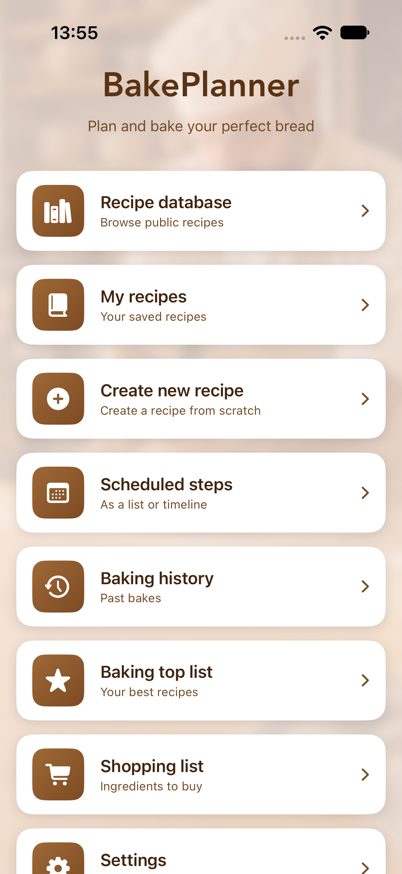
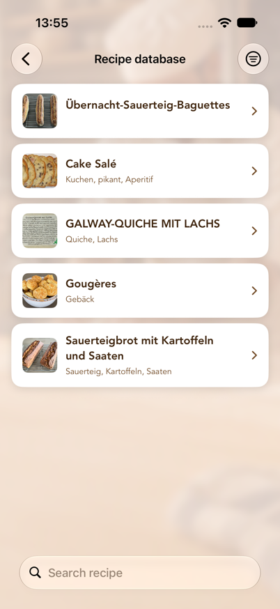
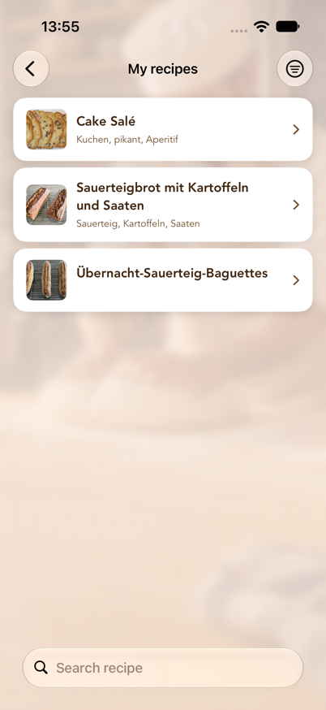
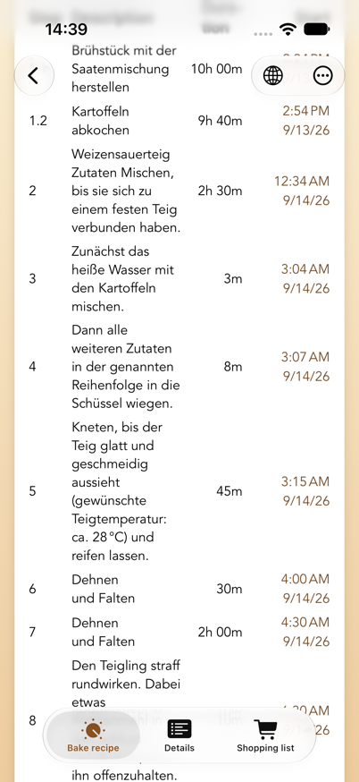
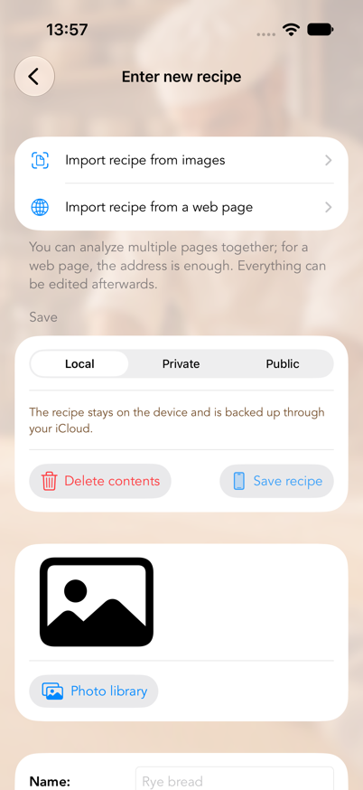
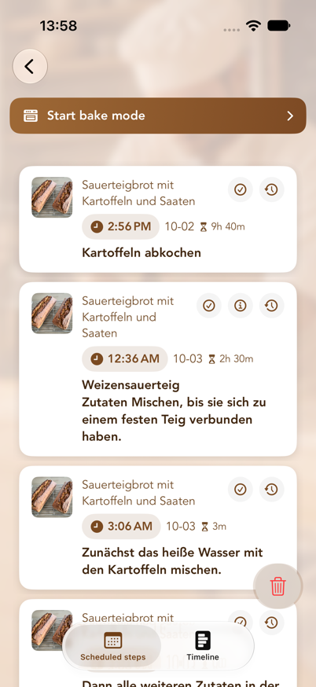
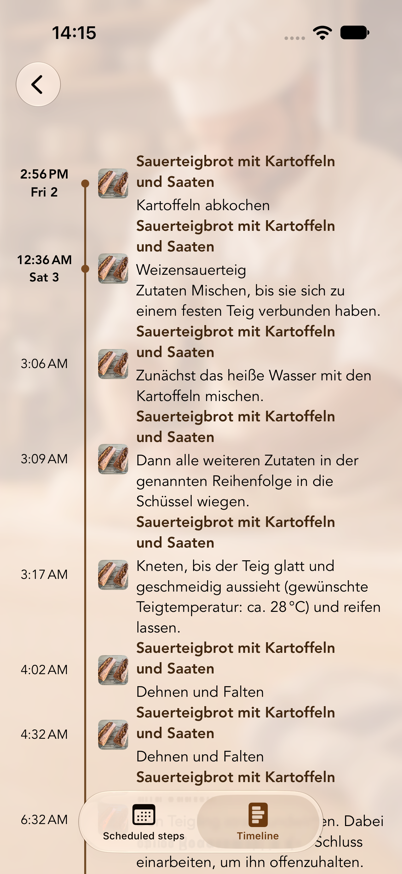
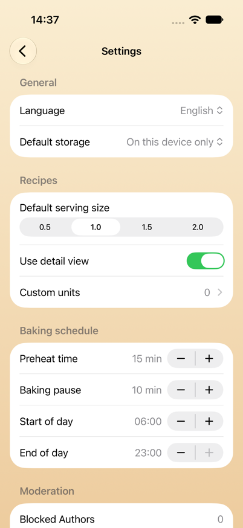

# BakePlanner – User Manual

Revised: 5 October 2026 · App version 1.2

> Translated from the German original, `Benutzerhandbuch.md`. Where the two
> differ, the German version is authoritative.

---

## Contents

1. [What BakePlanner does](#1-what-bakeplanner-does)
2. [System requirements](#2-system-requirements)
3. [Key concepts](#3-key-concepts)
4. [The main menu](#4-the-main-menu)
5. [Recipe database (public and private cloud recipes)](#5-recipe-database-public-and-private-cloud-recipes)
6. [My recipes](#6-my-recipes)
7. [Baking instructions and reminders](#7-baking-instructions-and-reminders)
8. [Creating a new recipe](#8-creating-a-new-recipe)
9. [Editing a recipe](#9-editing-a-recipe)
10. [Scheduled steps (list and timeline)](#10-scheduled-steps-list-and-timeline)
11. [Reminders on the Lock Screen](#11-reminders-on-the-lock-screen)
12. [Baking history and Baking top list](#12-baking-history-and-baking-top-list)
13. [Shopping list](#13-shopping-list)
14. [Settings](#14-settings)
15. [Units, amounts, and serving sizes](#15-units-amounts-and-serving-sizes)
16. [Privacy, moderation, and terms of use](#16-privacy-moderation-and-terms-of-use)
17. [Frequently asked questions and troubleshooting](#17-frequently-asked-questions-and-troubleshooting)
18. [Known limitations](#18-known-limitations)

---

## 1. What BakePlanner does

BakePlanner is a baking scheduler for bread, rolls, and pastry. What sets it apart from a plain recipe collection is that **it works out the timing for you**:

- A recipe isn't just a list of ingredients; it's a series of **processing steps with durations**.
- From those durations the app calculates the **start time of every single step**.
- You can plan backwards: "the bread should be ready at 6:00 p.m." — and the app tells you when to start the sourdough.
- Every step gets a **local reminder**, including the automatically inserted steps "turn on the oven" and "baking is finished".

On top of that: a shared public recipe database, your own recipes on the device, private recipes in the cloud, ingredient import from photos, shopping lists, a baking history with photos and ratings, and on-device translation of public recipes.

### Quick start: your first baking plan in five steps

1. Open **Recipe database** and pick a recipe — or create one of your own under **Create new recipe**.
2. In the recipe, open the **Bake** or **Bake recipe** tab.
3. Choose **Start from** or **Done by** and set the date and time.
4. Check the calculated start times and tap **Set reminder**.
5. Open **Scheduled steps** to review every appointment as a list or a timeline.

Reminders require BakePlanner to be allowed to send notifications. The full explanations are in [chapter 7](#7-baking-instructions-and-reminders), [chapter 10](#10-scheduled-steps-list-and-timeline), and [chapter 17](#17-frequently-asked-questions-and-troubleshooting).

---

## 2. System requirements

| Item | Value |
|------|-------|
| Devices | iPhone and iPad |
| Operating system | iOS/iPadOS 26.0 or later |
| Orientation | iPhone: portrait and landscape · iPad: all orientations |
| Languages | German, English, French (switchable in Settings) |
| Appearance | Light and dark mode, Dynamic Type |
| Internet | Needed for the public recipe database and iCloud sync. Your own recipes, planning, and reminders work entirely offline; changes sync later. |
| iCloud | Your own recipes, scheduled steps, shopping lists, and baking histories sync through iCloud across all devices using the same Apple Account, provided iCloud is on. The reminders themselves are local to each device. |
| Permissions | Notifications (for reminders), photo library and camera (for recipe images) |
| Sign-in | **Not** required for baking, for your own recipes, or for the public database. Only storing recipes **privately in the cloud** requires signing in with Apple (see [chapter 14](#14-settings)). |

The app asks for notification permission on first launch. Without it, baking steps are still calculated and listed under "Scheduled steps", but **no reminders appear**.

---

## 3. Key concepts

These six terms turn up throughout the app:

**Recipe**
The top-level unit: name, description, image, rating, tags, an optional link to the source, total weight, and working time.

**Component**
A sub-preparation within a recipe — "sourdough", "preferment", "main dough", "scald", for instance. Each component has a number (its sort order) and its own ingredient list. This is the heart of the data model: BakePlanner is built for multi-stage doughs.

**Ingredient**
Always belongs to a component. Consists of a number, an amount, a unit, a name, and optionally a fraction (numerator/denominator, labelled **Z / N** in the app).

**Processing step**
A work instruction with a step number and a duration in minutes. The step number is a decimal and carries a special meaning:

- **Whole numbers (1, 2, 3 …) are main steps.** They run one after another.
- **Decimals (2.1, 2.2, 2.3) are parallel steps within a main step.** They run at the same time, and only the *longest* duration in the group counts towards the total. Steps that make a component (sourdough, pre-dough, soaker …) start 5 minutes apart, in the order of their step numbers: nobody weighs out four pre-doughs in the same minute, and the reminders arrive staggered accordingly. All other parallel steps finish together with their group.

Example: if you start a sourdough (12 h) and a scald (2 h) at the same time, give them steps 1.1 and 1.2. The next main step, 2, begins after a little over 12 hours — not after 14.

**Serving size**
A scaling factor for every amount: 0.5 / 1.0 / 1.5 / 2.0. **1.0 is the recipe exactly as stored.** 2.0 doubles every amount and the displayed total weight.

**Storage**
Where a recipe lives. There are three options, and the choice decides who can see it:

| Storage | Who sees it? | Where does it live? | Editable? |
|---------|--------------|---------------------|-----------|
| **On this device only** | only you | on the device, backed up through your iCloud | yes, any time |
| **Private in the cloud** | only you | in the recipe database, locked to others | no |
| **Public for everyone** | every user of the app | in the recipe database | no |

"Private in the cloud" is meant for recipes you're **not allowed to publish** — out of a book, say — but that you still don't want to keep only on the device. It requires signing in with Apple, because the recipe is tied to your account; without one it would be unreachable after a reinstall.

---

## 4. The main menu

After launch the main menu appears with eight cards:

*The main menu is the starting point for recipes, planning, history, and settings.*

| Card | Purpose |
|------|---------|
| **Recipe database** | Browse public recipes shared by all users — plus your private cloud recipes when you're signed in |
| **My recipes** | Your locally stored recipes |
| **Create new recipe** | Build a recipe from scratch or import one from photos |
| **Scheduled steps** | Every scheduled baking step as a list or a timeline |
| **Baking history** | Past bakes with comments and photos |
| **Baking top list** | Recipes sorted by how often you've baked them |
| **Shopping list** | All the shopping lists you've created |
| **Settings** | Language, defaults, baking plan, account |

**The "Up next" card.** As soon as a baking plan is running, an extra card appears above the eight cards with the step that is coming up: the step text, the recipe name, the time, and a countdown in minutes ("in 42 min"). When a step's time has come, the card switches to **"Due now"** with the elapsed time ("5 min ago") for an hour — until you mark the step as done in the notification or the next step falls due. Tapping the card opens "Scheduled steps". With no step ahead the card stays hidden and the menu looks as pictured above.

The back arrow at the top left returns you to the main menu from anywhere.

---

## 5. Recipe database (public and private cloud recipes)

The recipe database is the shared collection: recipes that you or other users have saved publicly.

When you're signed in with Apple, the same list also holds **your private cloud recipes**. They're marked with a **lock symbol** before the name and are invisible to other users. Sign out and they disappear from the list — they're not deleted, and they come back the next time you sign in with the same Apple Account.

*In the recipe database you can search for and open public recipes.*

### Searching and filtering

- **Search field** at the top: searches recipe names.
- **Switch the search scope**: below the search field you can choose between **Name** and **Tags**. With "Tags", the search runs over keywords ("rye", "wholemeal", "sourdough", for example).
- **Filter symbol** at the top right: **All recipes** or **Mine only**. "Mine only" shows exclusively recipes that came from your account — your private ones and the ones you've published. The symbol changes while the filter is active.
- **Pull down** to refresh the list from the cloud.

"No recipes loaded" means there was no internet connection at launch — pull the list down once. "No matching recipes" means a filter is active.

### Opening a public recipe

A recipe opens on the **Details** tab. Three tabs run along the bottom:

- **Bake recipe** — the baking instructions with the schedule (see [chapter 7](#7-baking-instructions-and-reminders)). The schedule is only worked out once you choose this tab.
- **Details** — an overview of ingredients, components, and steps
- **Shopping list** — put the ingredients on a shopping list

### Translating a recipe

At the top right you'll find the **globe symbol**. Through it you choose Deutsch, English, or Français. The translation runs **entirely on the device** (Apple Translation) and covers the recipe name, description, tags, component and ingredient names, and step texts.

Notes:

- **Units** aren't touched by the recipe translation. The app shows them in its own language anyway (see [chapter 15](#15-units-amounts-and-serving-sizes)).
- The first translation into a language takes a moment (a progress indicator replaces the globe). After that it's cached and available instantly.
- On first opening, the app shows the recipe in your language automatically if a translation already exists.
- **The original is never overwritten.** The original is the language the recipe is written in — not the language your app happened to be set to. The app reads that off the recipe text, so a French recipe is kept as a French original even if someone entered it in a German-language app.
- The checkmark in the menu shows which language is currently displayed. Choose it again to go straight back to the original.

### Taking a copy of a recipe

The **Bake recipe** tab has a **Save as my own recipe** button. It puts a complete copy — image, components, ingredients, and steps included — into "My recipes". Only that copy can be edited.

The app confirms with **"Recipe was saved"** and a note that you can edit the copy without changing the public recipe. If saving fails, an error message appears instead — nothing disappears silently.

### Publishing a private recipe

For your **private** cloud recipes, the **Bake recipe** tab also offers **Save as a public recipe**. That makes the recipe visible to every user. First you're asked to confirm that it can't be changed afterwards and that only recipes free of copyright infringement may be published; the first time round you also have to accept the terms of use.

**Your private version stays in place** — the recipe then appears twice in the list, once with a lock. If you don't want that, delete the private version afterwards via "…" → **Delete my recipe**.

For recipes that are already public, the button doesn't appear.

### Reporting, blocking, deleting

Through the **"…" menu** at the top right:

- **Report recipe** — you choose a reason (objectionable/offensive, spam, copyright infringement, other). The report goes to the operator for review, and the recipe is hidden **from every user immediately**, not only after the review. It becomes visible again only if an administrator releases it.
- **Block author** — every recipe by that author disappears from your list. This applies **on your device only**; other users still see them.
- **Delete my recipe** — appears only for recipes that came from *your* account. The recipe is removed from the database for good.

For **private** recipes, "Report recipe" and "Block author" are absent — nobody but you sees them anyway. Only "Delete my recipe" is there.

So the two differ in reach: **blocking is local, reporting affects everyone.** Both can be undone under *Settings → Moderation* (see [chapter 14](#14-settings)).

### Administrator function

If you're signed in as an administrator (see [chapter 14](#14-settings)), you can remove any public recipe — intended for moderating reported content. There are three ways to do it: the **Delete recipe (admin)** entry in the recipe's ⋯ menu, the button of the same name at the bottom of the **Details** tab, and in the recipe database a swipe to the left across the row. Each asks for confirmation first; in the list the question names the recipe. The recipe's image is removed from storage along with it. An administrator has no access to other users' **private** recipes; they aren't shared, so they aren't a moderation matter either.

**Reported recipes** stay visible in the list for administrators while they're hidden from everyone else. At the bottom of the **Details** tab it then says "This recipe has been reported and is hidden from all other users." If the report is justified, delete the recipe. If it isn't, **Unhide recipe** makes it visible to everyone again at once.

---

## 6. My recipes

This is where every recipe stored locally on the device lives: the ones you created and the ones you copied from the database.

While the list is empty, it offers the two ways to a first recipe right there: **Open the recipe database** and **Create new recipe**.

### Searching and filtering

- **Search field** with a **Name / Tags** switch.
- **Filter symbol** at the top right: pick a minimum rating (All ratings, 1–5 stars and up). While a filter is active, the symbol is shown filled.

The search ignores capitalisation and matches partial words: "rye" finds "Rye bread", and for tags a fragment of the keyword is enough. Search and rating filters can be combined.

### Deleting a recipe

Swipe the row left → **Delete**. A confirmation follows, naming the recipe, so that an accidental swipe can't destroy one. Deleting a recipe also deletes its components, ingredients, processing steps, and baking-history entries.

Steps already scheduled for that recipe do stay in "Scheduled steps", though — delete them separately there if you no longer need them.

### The five tabs of your own recipe

| Tab | Contents |
|-----|----------|
| **Bake** | Baking instructions with the schedule and "Set reminder" |
| **Details** | Rating, description, total ingredients, components, step overview, **Share recipe** as PDF |
| **Edit** | Edit the recipe (see [chapter 9](#9-editing-a-recipe)) |
| **Shopping list** | Put this recipe's ingredients on a shopping list |
| **+ History** | Record a bake with date, comment, and photos |

A recipe opens on the **Details** tab. The schedule in the **Bake** tab is only worked out once you choose it; only **Plan again** in Scheduled steps takes you straight there.

In the **Details** tab you can tap the recipe image to see it full size.

---

## 7. Baking instructions and reminders

This is the heart of the app. The layout is the same for your own and for public recipes.

*The baking view puts each processing step's duration next to its calculated start.*

### From top to bottom

1. **Image and name** — tap the image to enlarge it.
2. **Serving size** (0.5 / 1.0 / 1.5 / 2.0) or **dough weight**, the **weight in grams** calculated from it, — if one is stored — the **Recipe link**, and **Share recipe**: the latter produces a PDF with the picture, the components and their ingredients, the total ingredients and the processing steps at the serving size currently chosen, and offers it in the share sheet — Messages, Mail, printing or "Save to Files". The same exists for your own recipes on the "Details" tab.
3. **Total ingredients** — every ingredient across all components, added up. This list is meant for shopping and weighing. Water is deliberately left out, as are ingredients that are themselves an intermediate product of a component ("sourdough" as an ingredient of the main dough, say) — otherwise amounts would be counted twice.
4. **Components** — sorted by number, each with its ingredients at the chosen serving size.
5. **Control bar** — see below.
6. **Processing steps** — a table of step, description, duration, and calculated **Start**. The last row reads "Done", with the finishing time.
7. **Baking comments** (your own recipes only) — earlier baking-history entries.
8. **Set reminder**.

### The control bar

| Element | Function |
|---------|----------|
| **Change duration** | A switch. When active, a "Duration [min]" field appears for each step. |
| **Start from / Done by** | Decides how the date below is interpreted. Abbreviated on iPhone in portrait. |
| **Date and time** | The reference point for the plan, selectable from today up to one year ahead. |

**Start from** means: I'm starting at this moment — when will I be done?
**Done by** means: I want to be finished at this moment — when do I have to start? The "Start" column then counts backwards.

Change the time and watch the "Start" column adjust immediately. Nothing is saved yet.

### Adjusting durations

1. Turn on **Change duration**.
2. Enter new minute values in the fields in the right-hand column. Empty fields and values of 0 or less are ignored, and the previous value stays.
3. Tap **Apply duration**.

The app then recalculates every start time and the total working time. For your own recipes the new durations are saved permanently; for public recipes they apply only to the current plan.

### What the app objects to in a plan

Notes appear above the step table as soon as the time you've set produces an impractical plan. They refresh with every change to date, time, or durations — before you tap "Set reminder".

| Sign | Meaning |
|------|---------|
| ⚠️ orange | **A note.** The plan works, but you should know about it. |
| ⛔️ red | **An error.** More bakes would run at the same time than you have ovens. |

Three things are checked:

- **Steps outside your day.** If a step falls before **Start of day** or after **End of day** from Settings, it gets named: "'Stretch and fold' starts on 11/09/26 at 3:07 a.m., which is before the start of day (6:00 a.m.)." With long fermentations that's normal and no cause for concern — it just shows you what you'd have to get up for.
- **Overlapping baking times.** Each oven takes one bake at a time. With one oven (the default), any overlap with another planned recipe is an error: two loaves don't fit in at two different temperatures. If you've entered several **Ovens** in Settings, that many bakes may run in parallel. An overlap that still fits into a free oven is then only reported as a note ("… and therefore needs another oven"); only the bake for which no oven is left is an error.
- **Too short a baking pause.** If less time than the configured **Baking pause** falls between two bakes in the same oven, you get a note. The oven needs that time to change temperature. With several ovens the note is dropped as long as another oven is free during that time — the loaf simply goes into the cold one.

The notes don't prevent anything — you can still set the plan. They only spare you the surprise at three in the morning.

**Suggestions to keep out of the night.** If a step begins before the start of day or after the end of day, the app looks for the nearest earlier and the nearest later time at which every step falls inside your day, and shows them below the notes, for example:

> **Done by Sat, 10 Oct, 1:45 PM**
> 1 hr, 45 min later · Starts Fri, 9 Oct, 6:05 PM · done Sat, 10 Oct, 1:45 PM

**Apply** sets the date and time above accordingly; the recipe stays as it is. The search goes in quarter-hour steps up to a day earlier or later, never before now, and never so that the bake would need more ovens than you have. If there is no such time — say, because the dough takes longer than your day — the app tells you so.

### Setting reminders

Tapping **Set reminder** does several things at once:

1. A local reminder is set for **every processing step** at its calculated start time.
2. The step **"turn on the oven"** is inserted automatically — the configured **Preheat time** before the **baking step** (15 minutes by default, adjustable in Settings). The baking step is the one that describes the bake, not necessarily the last one: if "let it cool" follows, the oven is still preheated before the bake.
   - If the recipe names an **oven temperature**, it is added, for example "Turn on the oven (250 °C)". With "bake at 250 °C falling to 220 °C" it is the first one. The temperature may also stand in the step before ("load the bread, oven at 250 °C").
   - If the recipe already has **its own preheating step**, no second one is added. The recipe's own step then serves as the preheating reminder and gets the temperature appended if it doesn't name one yet.
   - If the bake starts in a **cold oven** ("place in the cold oven"), there is no preheat time.
3. **"Baking is finished"** is likewise scheduled for the finishing time.
4. Every step lands in **Scheduled steps**.
5. For your own recipes a **baking-history entry** is created with the end date and the placeholder comment "no comment recorded", which you can fill in later.

A confirmation then appears, for example:

> **Reminders were set**
> 12 reminders set.
> Turn on the oven at 4:45 p.m. (250 °C).
> Done at 6:10 p.m.

The texts "turn on the oven" and "baking is finished" appear in whichever language is currently active (for public recipes, in the language you're viewing the recipe in).

> **One recipe, one plan — or several.** Tap "Set reminder" while a plan for this recipe is already running and the app asks: **Replace existing plan** discards the old steps together with their reminders and puts the new plan in their place — the way to go when you want to move the bread to another day. **Add as a second plan** keeps the existing plan and sets the new one beside it, for Saturday and Sunday, say. In "Scheduled steps" each plan then gets its own filter chip with its start time, and "Reschedule" and "Delete" only ever act on the selected plan.

> **For Apple Watch: set the reminders on the iPhone.** Reminders are created on the device where you tap "Set reminder", and they stay there. Only an iPhone passes its notifications on to a paired Apple Watch — an iPad isn't paired with the watch and can't do it. So if you plan on the iPad, the baking reminders appear on the iPad alone, even if you're wearing an Apple Watch.
>
> A plan that has already been set can't be moved to another device afterwards — in that case simply set the reminders again on the iPhone. The recipe itself is on both devices through iCloud anyway.

---

## 8. Creating a new recipe

Through **Main menu → Create new recipe**. The form is laid out from top to bottom.

*In the recipe form you can import images or enter everything by hand.*

### Importing a recipe from images

Right at the top: **Import recipe from images**. It reads in a printed or photographed recipe.

1. **Select images** (up to 10 pages; the order you pick them in is kept) or **Take photo** for a new shot.
2. The chosen pages appear as a list, "Selected pages"; individual ones can be removed with the bin symbol.
3. **"Analyse … image(s)"** starts the text recognition. It runs on the device, shows "Reading image x of y …", and can be cancelled at any time.
4. The app then shows a **summary**: the recognised name, the number of components, ingredients, and steps, plus the recognised components with their ingredients and the recognised schedule.
5. **Check data in the recipe form** transfers everything into the normal recipe form. **Select different images** starts over.

The app reads the images with every source type it knows and keeps the result that fits what's on the page. Straight, legible photos give the best results.

#### Choosing the name yourself

Which line is the heading isn't always visible from a page: a logo, a printed header, and a column heading all look like a title. If the recognised name is wrong, **tap the "Name" row in the summary**. The page then appears exactly as you photographed it, with a frame around every recognised line:

- **Tap** to choose a line as the recipe name.
- **Pinch out with two fingers** to magnify the page up to six times, in case the lines are close together.
- For multi-page recipes, a bar at the top switches between **pages**.
- If the name isn't on the page at all, type it into the **Recipe name** field below.

**Mind the crop.** Cut away everything that isn't part of the recipe: logos, headers and footers, page numbers, web addresses, and stray text from neighbouring articles. That saves you the corrections in the first place. **Handwritten recipes** can't be read reliably by text recognition.

Afterwards be sure to check **amounts, units, temperatures, and times** — nothing is saved until you choose "Save recipe" in the form.

#### Analysis mode: protected cloud AI or on this device only

Above the image selection you choose how the pages are evaluated:

- **Protected cloud AI** — the images are sent in encrypted form through the BackPlaner server to Google Vertex AI (Gemini) and structured there. That usually gives the most complete results, including components such as pre-dough and sourdough. Before the first use the app explains the data transfer and asks for your consent; you can withdraw it under Settings › Privacy & AI.
- **On this device only** — nothing leaves the device. Depending on availability the app uses Apple Intelligence or the on-device text recognition; recognition may be less accurate.

The app remembers the choice for both import routes.

### Importing a recipe from a web page

Below that: **Import recipe from a web page**. It reads a recipe straight from a recipe page on the internet, a baking blog for instance.

1. **Paste the address**: copy the address of the recipe page in Safari and paste it with the paste button next to the field, or type it in. "https://" may be left out; the app adds it.

   **It's quicker straight from Safari:** on the recipe page tap **Share** and choose **BakePlanner**. A small sheet shows the page; **Import** switches to BakePlanner, where the address is already filled in and the analysis starts on its own. That works from any browser and from any app that shares a web address. If BakePlanner doesn't appear in the row of apps, tap **More** and switch BakePlanner on there.
2. Choose the **Analysis mode** as for the image import. With "On this device only" the page text isn't transmitted; without Apple Intelligence the app then takes only the structured recipe data the page itself provides.
3. **Load and analyze page** loads the page on the device, reads out the recipe data and the visible text, and hands them to the chosen analysis. The page's recipe photo comes along.
4. Then the same **summary** appears as for the image import; instead of the recognised source type it shows the source (the web address). **Load a different page** starts over.
5. **Check data in the recipe form** transfers everything into the recipe form. The page's address goes into the recipe's "URL link" field automatically.

**What works well:** most recipe pages and baking blogs provide structured recipe data; then ingredients and steps are almost always right. The cloud AI also separates pre-dough, sourdough, and main dough into components of their own.

**Step numbers:** components that go into the main dough (sourdough, pre-doughs, soakers, and scalds) are each combined by the import into one parallel step 1.1, 1.2, 1.3 … covering mixing and maturing. The main dough's steps follow as 2, 3, 4 …. That way a recipe with four overnight pre-doughs takes twelve hours, not two days. The pre-doughs are started five minutes apart in the plan; the earlier ones get correspondingly more duration so that all are ready together for the main dough. Steps without a recognised duration get one minute.

**What doesn't work:** pages behind a login, a paywall, or nothing but a cookie notice deliver no readable text, and some sites block retrieval by apps. BakePlanner then reports "Unable to import" with the reason. In such cases the image import of a screenshot of the page helps.

> **Copyright:** for your own use you may import any recipe. That's why storage starts out as "Local". Only publish other people's recipes with the author's permission.

### Storage: local, private in the cloud, or public

In the **Save** section you choose between the three storage options (see also the overview in [chapter 3](#3-key-concepts)). A sentence below each choice explains what it means. The default comes from Settings (Default storage).

- **Local** — the recipe stays on the device, is backed up through your iCloud, and can be changed at any time.
- **Private** — the recipe is stored in the recipe database but visible only to you. That requires **signing in with Apple**; if you're not signed in, the "Sign-in required" sheet appears first and saving continues afterwards. Before that, the app points out that a recipe in the database can't be changed once saved.
- **Public** — the recipe becomes visible to every user. First comes the note: **"A public recipe can no longer be changed after it has been saved."** The first time round you also have to accept the terms of use (see [chapter 16](#16-privacy-moderation-and-terms-of-use)). For private recipes they aren't required — you aren't sharing anything.

When importing from images or a web page, storage always starts out as "Local". The symbol on the "Save recipe" button changes along with the choice.

### Recipe image

**Photo library** or **camera** (the camera button only on devices that have one).

> **An image is mandatory.** Without a recipe image, saving produces the message "Image required".

### Master data and tags

- **Name** — required. As long as it's empty, "Save recipe" stays disabled.
- **Description** — a multi-line text field.
- **URL link** — an optional link to the source; appears later as "Recipe link".
- **Tags** — type a keyword, tap **+**. Tags are searchable later.

### Components and ingredients

The component first, then its ingredients:

1. Enter the component's number and name (`1` / `Sourdough`, for example) and tap **+**. The number counts up automatically.
2. Below each component the ingredient entry row appears, with these columns:

| Column | Meaning |
|--------|---------|
| **No.** | Sort order within the component |
| **Amount / Weight** | The numeric value of the amount |
| **Unit** | A menu; see [chapter 15](#15-units-amounts-and-serving-sizes) |
| **Ingredient** | The ingredient's name |
| **Z / N** | The fraction — numerator and denominator, 1 / 2 for "½" |

3. **+** adds the ingredient, the bin symbol removes it again. Rows already entered are directly editable.

Only the **name** is mandatory — an ingredient without an amount and unit is allowed ("salt to taste"). Use either amount/weight **or** the fraction fields, not both for the same figure.

### Processing steps

Columns **Step**, **Description**, **Duration** (minutes). After you add one, the step number continues automatically: from a whole number to the next whole number, from a decimal in steps of 0.1. That makes it easy to enter parallel sub-steps as 2.1, 2.2, 2.3.

Remember the rule from [chapter 3](#3-key-concepts): decimal steps run in parallel, whole numbers one after another.

### Saving

- **Save recipe** — saves locally or uploads to the database. During an upload, "Recipe is uploading ..." appears; then either "Recipe was saved" or a specific error message.
- **Delete contents** — clears the whole form (without asking).

---

## 9. Editing a recipe

Reachable through **My recipes → recipe → "Edit" tab**.

### Automatic saving

Changes to **name, description, URL link, tags, and rating** are saved automatically — shortly after you type and at the latest when you leave the screen. There's no confirmation message for it.

A new **recipe image** is saved the moment you choose it.

### Rating

Tap the stars at the top right: 1 to 5 stars. Tapping the first star again resets the rating to 0. The rating is what the rating filter in the lists works on.

### Changing components

- **Adding**: enter a number and name, **+**.
- **Editing**: tap the component's row. "Edit component" opens with the number, the name, and the full ingredient list. There you can add ingredients (**+**), delete them (bin), and edit one by tapping it in the "Edit ingredient" dialogue. **Done** applies, **Cancel** discards.
- **Deleting**: the bin next to the component. The recipe's total weight is recalculated afterwards.

### Changing processing steps

- **Adding**: enter step, description, duration, **+**. Start times are recalculated automatically.
- **Editing**: tap the step's row → "Edit processing step". After **Done** the app recalculates every start time and the working time.
- **Deleting**: the bin next to the row.

### Saving manually

The **Save** section holds three buttons — the same three storage options as when creating. You'll also find them at the top right of the navigation bar, in the menu behind the save symbol.

- **Local** — saves everything including the image, recalculates the total weight, and confirms with "Recipe was saved".
- **Private** — stores the recipe privately in the recipe database; that requires signing in with Apple. Visible only to you and not editable afterwards.
- **Public** — uploads the recipe so it's visible to every user. The note that it can't be changed afterwards appears here too.
- **Delete** (top left) — clears the recipe's contents.

After a successful upload, **both cloud buttons are disabled**, because the recipe now has a copy in the database — a recipe can only be uploaded once, privately *or* publicly.

If that copy is later deleted (by you or by moderation), the app notices the next time you open the recipe and releases the buttons again. This requires you to be signed in — when signed out, the app can't check whether a private copy still exists and leaves the buttons locked to be safe.

---

## 10. Scheduled steps (list and timeline)

**Main menu → Scheduled steps.** This is every baking step from every recipe you've set reminders for — in chronological order, across recipes. You switch between two views at the bottom.

*In its empty state, the list view also shows where new plans are created.*

### The "Scheduled steps" view (list)

Every step is a card with the recipe image, recipe name, start time, date, duration, and instruction. Tapping one opens the detail view with the recipe, the start, the step number, the duration, and the full description.

**Looking up a component's ingredients** — through the **i symbol** on the card. It only appears on steps that mix one of the recipe's components, such as "Make preferment A" or "Make the final dough". Tapping it opens the ingredients of exactly that component with their amounts, so you can weigh out straight from the plan without opening the recipe. The amounts refer to the default serving size set in Settings.

The app recognises such a mixing step by the name of a recipe component occurring in the step text. Steps from the image import know which component they belong to anyway. A step like "Fold the dough" with no component name gets no i symbol.

**Rescheduling a step** — through the clock symbol on the card:

1. Enter minutes (1440 at most, that is 24 hours).
2. Choose a direction: **Earlier** or **Later**.
3. Choose a scope: **This step only** or **All following steps** (every later step of the same recipe moves by the same amount).
4. **Apply**.

The matching reminders move along automatically. If the new time would be in the past, the app refuses with "Unable to reschedule".

**Ticking a step off as done** — through the **checkmark symbol** on the card, or by swiping the row to the **right** and tapping "Done". The step leaves the plan, its reminder is removed with it, and the "Up next" card in the main menu and the widget move on to the next step. It is the same action as "Done" in the notification, just right in the list.

**Deleting:**

- **A single step**: swipe the row left. Its reminder is removed with it.
- **All steps**: the bin button at the bottom right, then "Delete all". That removes every scheduled step **and** every pending reminder — including those for recipes you no longer want to bake.

### The "Timeline" view

The same steps as a vertical time axis. The timestamp is on the left — with weekday and date for the first step of a day, only the time for the ones that follow. Dots and connecting lines make it visible which steps fall together on one day and where the longer gaps are. Handy for getting an overview of a multi-day fermentation.

*The tab at the bottom switches between list and timeline.*

With no steps scheduled, both views read: "No scheduled steps — Set a reminder in a recipe's baking instructions."

### Bake mode

For working in the kitchen there is a **Start bake mode** button above the list. It opens the current step full-screen in large type: the recipe name and "Step 3 of 12" at the top, below that the time with a countdown ("in 42 min") or "5 min ago" once the step is due, then the step text. If the step mixes a component, that component's ingredients and amounts follow right beneath — the same ones as behind the i symbol.

At the bottom sit large buttons that can be hit with flour on your hands:

- **Back** and **Next** page through every step of the plan.
- **Read aloud** speaks the step and, where present, the ingredients through the speaker in the app language you have set. A second tap (**Stop**) cancels. Speech also plays while the device is muted. If you do not want it, switch off *Settings → Baking plan → Speech in bake mode*; the button then disappears.
- **Done** removes the step together with its reminder and jumps to the next one.

Bake mode opens on the step that is up right now and respects the list's recipe filter. While it is open, the screen stays on. **Close** at the top right returns to the list.

### The "Next baking step" widget

You can see the next step without opening the app: BakePlanner comes with a widget for the Home Screen and the Lock Screen. It shows the same information as the "Up next" card in the main menu — the upcoming step with its time and a running countdown ("in 1:42:10"), or, once the time has come, **"Due now"** with the elapsed time. Tapping it opens "Scheduled steps" directly.

- **Small**: step text, day and time, countdown.
- **Medium**: additionally the recipe name.
- **Lock Screen**: as a rectangular widget with step text and countdown, or as a one-line display next to the clock.

To add it: press and hold the Home Screen → **Edit** → **Add Widget** → choose **BakePlanner** → pick a size → **Add Widget**. The widget updates by itself whenever a step starts or falls due, and whenever the plan changes in the app. With no planned steps it reads "No step planned".

The widget uses the device's **system language**, not the app language chosen in Settings.

---

## 11. Reminders on the Lock Screen

Every reminder appears as a notification titled **"Baking reminder"**, with the subtitle "Press and hold for Done or Reschedule" and the step text as its content.

**Ingredients in the reminder.** If the step mixes a component, the ingredients of that component with their amounts follow below the step text — the same ones that sit behind the i symbol in "Scheduled steps":

> **Baking reminder**
> Make preferment A
>
> Ingredients for "Preferment A":
> • 200 g wheat flour 550
> • 200 g water
> • 2 g yeast

The banner shows only the first lines. Press and hold the notification, or expand it in Notification Centre, to see the whole list. The amounts match the serving size that was selected in the baking instructions when the reminders were set.

**Press and hold the notification** to get two actions:

- **Mark as done** — the step is removed from "Scheduled steps".
- **Reschedule by …** — enter the minutes directly in the notification. A follow-up question then appears: **"Should all following steps of this recipe be moved as well?"** with the options **Only this step** and **All following steps**.

Rescheduling is always counted from **now**: "30 minutes" means "30 minutes from now". With "All following steps", every later step of the same recipe moves by the same difference — so a fermentation stays coherent even when you're running late.

Notifications are shown while the app is in the foreground too.

### Live Activity

While a plan is running, BakePlanner also shows the upcoming step as a **Live Activity**: as its own tile on the Lock Screen, and at the top of the display on iPhones with a Dynamic Island. It shows the step text, the recipe name, the time, the step after it ("Then 00:36 · Weizensauerteig …") and a running countdown. When the time has come, the tile switches to **"Due now"** and counts the elapsed time up. A tap opens "Scheduled steps"; on the Dynamic Island a long press expands the view.

The Live Activity appears as soon as a step is less than eight hours away — iOS ends Live Activities after eight hours at the latest, so not earlier. It is updated when you open the app, mark a step as done or reschedule it, and it ends when no step is within reach any more. The first time, iOS asks whether BakePlanner may show Live Activities. Under *Settings → Baking plan → Live Activity on the Lock Screen* it can be switched off altogether.

**Apple Watch.** The baking reminders appear on the watch if you set them on the **iPhone** — the iPhone's notifications are passed on to the paired watch. Reminders set on the iPad stay on the iPad. More on this in [chapter 7](#7-baking-instructions-and-reminders).

---

## 12. Baking history and Baking top list

### Baking history

**Main menu → Baking history.** Every bake, newest first, either as a **list** with date, recipe name, comment and photos — or as a **gallery**: tiles with the bake's first photo (or the recipe picture as a stand-in), recipe name, date, rating and comment, two across on an iPhone and more on an iPad. Switch between the two with the symbol at the top right; the choice is remembered. While there is no bake yet, the empty screen explains where entries come from and leads to your recipes.

- **Tap an entry** (row or tile) → baking notes: edit the comment and add photos through **Photo library**. Photos can be tapped and browsed full size. **Save** confirms with "History was saved".
- **Delete an entry**: swipe the row left.
- **Searching and filtering**: the search field (Name/Tags) and the rating filter at the top right.

### Recording a bake after the fact

**My recipes → recipe → "+ History" tab.** Choose the baking date (up to 10 years back), write a comment, add photos from the library, **Save**.

An entry is also created automatically when you set reminders in the baking instructions — initially with the placeholder "no comment recorded", which you can replace later.

### Baking top list

**Main menu → Baking top list.** Shows every recipe you've baked at least once, sorted by the number of bakes — your classics at the top. Each recipe shows its name, the count, and the photos from the baking histories. Search and rating filters work as they do in the other lists.

---

## 13. Shopping list

### Putting ingredients on a list

If there is no list yet, the empty screen under "Shopping list" explains the way and leads straight to the recipes with **Open my recipes**.

**My recipes → recipe → "Shopping list" tab.**

- **New list**: choose a date, **Create**. If a list already exists for that date, the ingredients are added to it.
- **Existing list**: switch to "Existing list" and tap **+** next to the list you want. To delete one, swipe the row left.

The confirmation reads "Ingredients were added to the shopping list". A link to **Show shopping lists** appears afterwards.

### What makes it onto the list — and what doesn't

The app filters deliberately:

- **Left out** are ingredients whose name contains **water, salt, starter,** or **sourdough** — you have those in the house, or they're an intermediate product.
- **Left out** are ingredients with no unit or no usable amount.
- **Identical ingredients are combined.** Temperature details are stripped from the name in the process: "water (lukewarm)", "milk 30 °C", and "milk" count as the same ingredient. Capitalisation and umlauts make no difference.
- **Units are converted** when they share the same base unit: 0.5 kg + 200 g are added together, and so are tablespoons and millilitres. Grams and millilitres stay separate.

### Viewing shopping lists

**Main menu → Shopping list.** Each list shows its date, the recipes it contains, and below them every ingredient with its amount and unit. **Delete** removes the list after a confirmation.

---

## 14. Settings

**Main menu → Settings.**

*Settings bring together language, defaults, and the parameters for the baking plan. The Privacy & AI, Moderation, and Account sections follow further down.*

### General

| Setting | Description |
|---------|-------------|
| **Language** | System language, German, English, or French. Affects the interface as well as date and time formats. |
| **Default storage** | The default for new recipes: **On this device only**, **Private in the cloud**, or **Public for everyone**. Default: on this device only. |

### Recipes

| Setting | Description |
|---------|-------------|
| **Default serving size** | The value recipes open with: 0.5 / 1.0 / 1.5 / 2.0. Default: 1.0. |
| **Use detail view** | On: the components and steps of every public recipe are loaded along with the list — recipes open faster, but the first load takes longer and uses more data. Off: details are loaded only when you open a recipe. Default: on. |
| **Show baker's percentages** | Adds each weighed ingredient's share of the component's flour in the component view (see [chapter 15](#15-units-amounts-and-serving-sizes)). Default: off. |
| **Custom units** | Shows how many you've created and leads to managing them. See [chapter 15](#15-units-amounts-and-serving-sizes). |

### Baking schedule

| Setting | Description |
|---------|-------------|
| **Preheat time** | 0–120 minutes in steps of 5. Used when setting reminders, to place the automatic "turn on the oven" step before the final step. Default: 15 minutes. |
| **Baking pause** | 0–120 minutes. The minimum gap between two bakes in the same oven. Default: 10 minutes. |
| **Ovens** | 1–6. How many bakes may run at the same time. The plan check reports an error only when more recipes bake at the same time than there are ovens; the baking pause applies per oven. Default: 1. |
| **Start of day** | 0–23. From when you're available in the morning. Default: 6. |
| **End of day** | Between start of day and 23. Default: 23. |
| **Speech in bake mode** | Shows or hides the "Read aloud" button in bake mode. Default: on. |
| **Live Activity on the Lock Screen** | Shows the upcoming step as a Live Activity on the Lock Screen and in the Dynamic Island. Off ends a running one immediately. Default: on. |

> **Note:** Only **Preheat time** actually moves steps. **Baking pause, ovens, start of day, and end of day** don't change the plan — the app checks it against them and warns you in the baking view when a step falls into your night's sleep or more bakes coincide than you have ovens (see [chapter 7](#7-baking-instructions-and-reminders)).

### Privacy & AI

This shows whether the **protected cloud AI** may be used for recipe imports (see [chapter 8](#8-creating-a-new-recipe)).

| Entry | Effect |
|-------|--------|
| **AI analysis for recipe import** | **Allowed** if you've consented to the cloud AI, otherwise **Local only**. Tapping it opens the **AI privacy** page. |
| **Withdraw consent to cloud AI** | Appears only after you've consented. Withdraws the consent and sets the analysis mode to "On this device only". |

The **AI privacy** page explains which data a cloud analysis transmits, to whom, for what purpose, and what of it remains stored (summary in [chapter 16](#16-privacy-moderation-and-terms-of-use)). You can withdraw your consent there too. It is only ever given during an import itself, after the app has explained the transfer. Withdrawal applies to all future analyses; analyses already completed are unaffected.

### Account

This is where you sign in with Apple. Signing in serves two purposes:

- **Private cloud recipes.** They're tied to your Apple Account. That's the only way they remain reachable after a reinstall or on a second device — an anonymous identifier is lost with the app.
- **Moderation rights.** If your identifier has been enabled for it, the label **Administrator** appears as well, and public recipes can be deleted — through the ⋯ menu, the Details tab, or a swipe in the recipe database.

**Neither your name nor your email address is requested** — the app only needs the identifier itself. If your use has been anonymous so far, it carries over when you sign in: recipes already published from this device still belong to you afterwards.

| Button | Effect |
|--------|--------|
| **Sign in with Apple** | Creates or connects your account. |
| **Sign out** | Back to anonymous use. Private cloud recipes disappear from the list but stay stored and are back after the next sign-in. The app confirms with **"You're signed out"**; it does **not** ask you to sign in again to confirm — that belongs to deleting the account alone. |
| **Delete account** | Removes the account for good (see below). |

**Delete account** asks first. Then this happens:

- Your **private** cloud recipes are deleted along with their images.
- The sign-in is undone; the app carries on anonymously.
- **Published recipes stay** visible to every user. They no longer belong to any account, so you can't delete them yourself any more — do that beforehand if you don't want to leave them in the database.
- **Recipes on the device stay.** They belong to the device and your iCloud, not to the account.

This can't be undone. If your last sign-in was a while ago, Apple requires you to sign in again for security — the "Sign in again" sheet appears, and the deletion then continues by itself.

For ordinary baking, for your own recipes, and for browsing the public database, **no sign-in is required**.

### Moderation

This is where you take back what you've hidden in the recipe database.

| Entry | Effect |
|-------|--------|
| **Blocked authors** | How many authors you've blocked. |
| **Unblock all authors** | Lifts every block. Those authors' recipes reappear in the list **immediately**. |
| **Recipes you reported** | How many recipes you've reported. |
| **Clear reports on this device** | Removes the hiding your device has remembered. |

**The difference matters:** blocking is purely a device setting, which is why lifting it takes effect at once. A report, on the other hand, hides the recipe from every user — and only an administrator can undo that. So clearing it here only takes effect *after* the recipe has been released; until then it stays invisible, to you as well.

Both lists apply to this device only and aren't synced through iCloud.

### Help

From here you open the **User manual** (this document) and the **Help and contact** page with the e-mail address for questions and bug reports in your browser. Both pages appear in the language the app is set to.

---

## 15. Units, amounts, and serving sizes

### Serving size or dough weight

Every recipe screen scales the amounts in two ways:

- **Serving size** — the factor 0.5 / 1.0 / 1.5 / 2.0 as before; 1.0 is the recipe as stored.
- **Dough weight** — next to it sits a field showing the current total weight as a placeholder. Type a target weight in grams, say 2000, and the app scales every ingredient to that dough weight; the serving-size picker then shows no selection. Tapping a factor clears the field again.

Scaled amounts are rounded the way you weigh them: whole grams from 10 g upwards, one decimal below that ("2.7 g yeast"). Fractions such as "1/2 cube" stay fractions at the factors 0.5 to 2.0 ("3/4 cube") and become decimals at a free dough weight ("0.7 cube"). The dough weight applies to the display and to the ingredients in the reminders you set afterwards.

### Baker's percentages

Under *Settings → Recipes → Show baker's percentages* the component view adds each weighed ingredient's share of the component's flour, for instance "319 g water · 62 %". Anything with "Mehl", "Schrot", "flour" or "farine" in its name counts as flour. A component without flour shows no percentages; neither do pieces or whole components used as an ingredient ("1 whole scald"). The percentages do not change with the serving size.

### Available units

You choose the unit from a **menu** (abbreviation – full form). You can't type one in: a unit carries a conversion and not just a name, and the app has to know it. If one is missing, you create it as a **custom unit** (see below).

If a recipe you imported or copied from the database holds a unit the app doesn't know, the field shows a **warning triangle** and a red border. The conversion is then missing, and that ingredient doesn't count towards the total weight.

**On screen and in the recipe.** A recipe always stores the German abbreviation (the "Stored as" column); the app shows it in its own language, with plurals ("2 cups"). Recipes don't change when you switch the language, so the switch applies to every recipe at once, including public recipes by other authors.

**On import** from images or a web page, the app turns English and French units into its own: "tsp", "teaspoon", and "c. à c." become tsp, "tbsp" and "c. à s." become tbsp, "cup" becomes cup, "pinch" and "pincée" become pinch, and so on. Pounds and ounces (lb, oz) are converted to grams straight away, because the German pound in the table (500 g) isn't the imperial one (454 g). Units it doesn't know are kept as they are; they then carry the warning triangle.

**Weight-based (base: grams)**

| Abbrev. | Unit | Stored as | Equals |
|---|---|---|---|
| g | gram | g | 1 g |
| kg | kilogram | kg | 1000 g |
| mg | milligram | mg | 0.001 g |
| pfd | German pound (500 g) | pfd | 500 g |
| pinch | pinch | Pr | 1 g |
| knife tip | knife tip | Msp | 0.05 g |
| bunch | bunch | Bd | 10 g |
| slice | slice | Sc | 25 g |
| roll | roll | Rolle | 275 g |
| pkt | packet | Pck | 11 g |
| handful | handful | Handvoll | 25 g |
| egg | egg | ei | 60 g |
| egg (S) | egg, size S | ei(s) | 50 g |
| egg (M) | egg, size M | ei(m) | 60 g |
| egg (L) | egg, size L | ei(l) | 70 g |
| egg (XL) | egg, size XL | ei(xl) | 80 g |

**Volume-based (base: milliliters)**

| Abbrev. | Unit | Stored as | Equals |
|---|---|---|---|
| ml | milliliter | ml | 1 ml |
| cl | centiliter | cl | 10 ml |
| dl | deciliter | dl | 100 ml |
| l | liter | l | 1000 ml |
| Mass | Mass (1 l) | mass | 1000 ml |
| tsp | teaspoon | TL | 5 ml |
| tbsp | tablespoon | EL | 15 ml |
| cup | cup | Tas | 200 ml |
| splash | splash | Ss | 10 ml |
| dash | dash | Sp | 0.27 ml |
| drop | drop | Tr | 0.067 ml |

**Counted**

| Abbrev. | Unit | Stored as | Equals |
|---|---|---|---|
| pc | piece | St | counted |

### Custom units

If a unit is missing — a "mug", say, or a cube of yeast — you create it yourself: **Settings → Recipes → Custom units**.

| Field | Meaning |
|-------|---------|
| **Name** | The full form, "mug" for instance. |
| **Abbreviation** | What appears in the menu and in the ingredient lists, "mug" for instance. It has to be unused. |
| **Measured in** | **grams**, **millilitres**, or **counted**. |
| **Conversion** | How much one of them holds — around 250 millilitres for a mug. With "counted" the field is dropped. |

Why the conversion is mandatory: the total ingredients, the baker's percentages, and the shopping list all depend on it. Without it, "2 mugs of flour" would count as 2 grams.

Your custom units then sit in the menu alongside the bundled ones. To remove one, swipe the entry left or tap **Edit** at the top right. They apply to this device only and aren't synced through iCloud.

> **Careful when deleting:** recipes that use a deleted unit keep it as text — but the app no longer knows it and shows the warning triangle. Simply create it again in that case.

### Conversion to weight

For the recipe's **total weight**, the app converts volume figures into grams and takes the density of common baking ingredients into account — flour 0.66, water 1.0, oil 0.8, honey 1.3, sugar 1.0, icing sugar 0.6, butter 1.0, cocoa 0.6, starch 0.6, nuts and almonds 0.5, semolina 0.5, milk 1.0, juice 1.0, jam 1.33, for example. The factor is recognised from the ingredient's name: "Weizenmehl 550" is treated as flour.

A cup of flour is therefore counted as 200 ml × 0.66 = 132 g, a cup of water as 200 g.

### Fractions (Z / N)

For figures like "½ egg" or "¾ cube of yeast", use the **Z** (numerator) and **N** (denominator) fields. The app scales fractions with the serving size and reduces them automatically; 2/2 becomes 1, and the remainder is shown as a fraction ("1 1/2").

### Scaling

The serving size affects the total ingredients, the components' ingredient lists, and the displayed total weight. It does **not** affect durations — dough doesn't rise faster just because you make less of it.

**1.0 is always the recipe as stored.** The serving size is purely a display option: it doesn't change the recipe.

---

## 16. Privacy, moderation, and terms of use

### Where your data lives

- **Your own recipes, scheduled steps, shopping lists, and baking histories** live on the device and in your private iCloud database. They're visible only to you and your own devices, not to other users of the app.
- **Public recipes** live in the shared cloud database and are visible to every user of the app.
- **Private cloud recipes** also live in the cloud, but in a separate area that only their author may read — this is enforced on the server, not merely hidden in the app. The images are stored separately too and retrievable only by you.
- **Translations** are produced on the device.
- **Recipe import:** with "On this device only", images and page text stay on the device. Only if you've consented to the **protected cloud AI** are the chosen images, or the recipe text and address of a web page, sent in encrypted form through a BackPlaner Firebase function (region europe-west1) to Google Vertex AI (Gemini, EU location). There they're processed only to create the recipe draft and aren't stored. All that remains stored is a counter for the hourly usage limit, kept with your pseudonymous identifier. You can withdraw your consent under *Settings → Privacy & AI*.
- The app uses an anonymous identifier so that you can delete your own public recipes and other users can block authors. A user account isn't required for baking. You only need to sign in with Apple for private cloud recipes and for moderation rights; neither your name nor your email address is requested in the process.
- **You can delete your account yourself at any time** — Settings → Account → "Delete account". Details in [chapter 14](#14-settings).

### Terms of use for public recipes

Before you save a recipe publicly for the first time, you have to accept the terms. The gist:

- A publicly shared recipe is visible to every user of the recipe database.
- There is **zero tolerance** for objectionable, offensive, unlawful, or copyright-infringing content.
- You are solely responsible for the content you share.
- Reported content is reviewed and removed **within 24 hours**.
- Authors who breach the rules repeatedly can be excluded.

Choose **Decline** and nothing is uploaded; the recipe stays in the form and can be saved privately.

### What you can do about unwanted content

Through the "…" menu in a public recipe: **Report recipe** (with a reason) or **Block author**. Both take effect at once — the report hides the recipe **from every user**, the block only on your device. You can undo both under *Settings → Moderation*. Details in [chapter 5](#5-recipe-database-public-and-private-cloud-recipes) and [chapter 14](#14-settings).

---

## 17. Frequently asked questions and troubleshooting

**No reminders arrive.**
Check in *Settings → Notifications → BakePlanner* whether notifications are allowed. Check as well whether there are any steps under "Scheduled steps" at all — only tapping "Set reminder" creates reminders. And note: reminders for times in the past aren't triggered.

**Nothing arrives on the Apple Watch.**
Reminders stay on the device where you set them. Only a paired **iPhone's** notifications are passed on to the watch — if you planned on the iPad, the baking reminders appear there and nowhere else. Set the reminders again on the iPhone in that case.

**The recipe database is empty ("No recipes loaded").**
There was no internet connection at launch. Pull the list down to load it again.

**I uploaded my recipe to the database and want to correct it.**
That isn't possible — recipes in the database are immutable, private ones as much as public ones. Delete it via "…" → **Delete my recipe** and upload the corrected version again. The version on the device stays and is recognised as uploadable again afterwards.

**My private recipes aren't in the list.**
They only appear when you're signed in: *Settings → Account → Sign in with Apple*. Make sure to use the same Apple Account you saved them with — the recipes are tied to it. Then pull the list down once.

**"Signing in with Apple is required for private cloud recipes."**
You chose "Private" as the storage without being signed in. Sign in through the sheet that appears, and saving continues. Without an account the recipe would be unreachable after a reinstall — which is why the app doesn't allow it otherwise.

**I tapped "Set reminder" twice by mistake.**
On the second tap the app asks whether the new plan should replace the existing one or be added beside it. If you chose "Add as a second plan" although you only wanted one, select the surplus plan under "Scheduled steps" via its chip and delete it with the bin button via "Delete only '…'".

**I want to schedule the same recipe for two different dates.**
That isn't possible — each recipe has one plan, and the second replaces the first. As a workaround you can duplicate the recipe under a different name and plan both separately: save it **privately in the cloud**, fetch it back with "Save as my own recipe", and rename it. That keeps the duplicate out of the public database.

**The total weight is wrong.**
Usually it's a unit the app doesn't know — the unit field then shows a **warning triangle** — or an ingredient without a unit. Check the ingredients in the "Edit" tab and choose the unit from the menu. If it isn't there, create it under *Settings → Recipes → Custom units* (see [chapter 15](#15-units-amounts-and-serving-sizes)).

**An ingredient is missing from the shopping list.**
Water, salt, starter, and sourdough are left out deliberately, as are ingredients without a unit or without an amount. See [chapter 13](#13-shopping-list).

**An ingredient is missing from "Total ingredients".**
Water isn't listed there, and neither are ingredients that are themselves the product of a component ("sourdough" as an ingredient of the main dough, say), so that amounts aren't counted twice. They appear in full in the component list below.

**A step starts at an implausible time.**
Check the step numbers: decimal steps (2.1, 2.2) run in parallel, whole numbers one after another. An accidental "3" instead of "2.2" lengthens the total considerably.

**The image import barely recognises anything.**
Photograph straight, well lit, one page per image, and without strong shadows. Recognition is optimised for a two-column layout with a planning example. With an unsuitable source, entering it by hand is quicker.

**Translation fails.**
Translation uses Apple's on-device translation. The first time, iOS has to provide the language pack — that may need an internet connection. Try again later or switch back to the original language.

---

## 18. Known limitations

- **Recipes in the database are immutable once uploaded** — private ones as much as public ones. Corrections mean deleting and uploading again.
- **A recipe can only be uploaded once**, either privately or publicly. A private recipe can be published afterwards, but that creates a second version; the private one isn't removed automatically.
- **Private cloud recipes require signing in with Apple** and are tied to that account. They aren't visible without signing in, nor with a different Apple Account.
- **Deleting your account leaves published recipes in the database.** They no longer belong to any account and can only be removed by an administrator.
- **Baking pause, start of day, and end of day** don't move any steps. The app checks the plan against them and warns you. If a step falls into the night, it suggests a different time for the whole plan (see [chapter 7](#7-baking-instructions-and-reminders)); it doesn't lengthen or shorten individual steps.
- **Plans set before this update** carry no plan identifier yet and count together as one plan per recipe. The next "Set reminder" with "Replace existing plan" cleans that up.
- **If you change a recipe after planning it** (steps, durations), the plan already set stays as it is — scheduled steps are a snapshot. "Scheduled steps" then shows a notice at the top, "… has changed since it was planned", with a **Plan again** button that opens the recipe. Only steps added to the recipe afterwards go undetected.
- **The ingredients in a reminder** are fixed when the reminders are set. If you change ingredients or the serving size afterwards, the reminder keeps showing the old amounts; the i symbol in "Scheduled steps", by contrast, always reads the recipe's current state. Reminders set before this update contain no ingredients yet — planning once more is enough.
- Scheduled steps are matched to recipes by **recipe name**. Two of your own recipes with identical or very similar names can get mixed up over the image and over rescheduling — give them distinct names.
- **Reminders only reach the Apple Watch from an iPhone.** They're created on the device where you tap "Set reminder", and an iPad isn't paired with the watch. An existing plan can't be moved to another device — set it again there.
- **The image import** reads cookbook pages, recipe cards, web printouts, and two-column baking-blog pages with a planning example. How much of it arrives depends on the device's text recognition, though: the same file can yield fewer lines on an iPhone than on a Mac, and with web recipes that use pale grey numbered circles, whole paragraphs are sometimes missing. So always check the steps in the recipe form before you save.
- **The web page import** only reads what a page delivers to an app without signing in. Pages behind a paywall, a login, or a mandatory cookie consent, and sites that block retrieval by apps, can't be read. Without the cloud AI and without Apple Intelligence only the page's structured recipe data is taken; pre-dough and main dough then often end up in one shared component.
- **Custom units appear in every language as you created them.** Only the bundled ones are translated.
- **There's no export.** Your own recipes do sync through iCloud (see [chapter 2](#2-system-requirements)), but they can't be saved as a file or passed on to anyone else. Beyond iCloud, the only backup route is the recipe database — privately, if you don't want to share.
- **Blocked authors** are hidden on the device in question only; on a second device they still appear. A **reported** recipe, by contrast, is invisible to everyone until an administrator releases it — to you as well, and even if you clear the report under *Settings → Moderation*.
- **Custom units only apply on the device where you created them.** They aren't synced through iCloud. A recipe using such a unit shows the warning triangle on another device until you create it there too.
